# YanQue-Admin 后端教程

> 本教程系统讲解 YanQue-Admin 项目的架构设计和实现原理，帮助你理解"为什么这样写"而不仅仅是"怎么写"。
>
> 共 20 章：前 8 章讲解基础架构，第 9 章深入分析排课模块，第 10 章讲解订单与支付，第 11 章讲解值班管理，第 12 章讲解学生端业务，第 13 章讲解作业系统，第 14 章讲解退款流程，第 15 章讲解 Docker 部署，第 16-20 章讲解考试系统、学生标签、回访管理、枚举校验、学生前台等功能。
>
> 每个核心功能都附带流程图，便于理解整体逻辑。

---

## 目录

- [第 1 章：项目概览与技术选型](#第-1-章项目概览与技术选型)
- [第 2 章：分层架构与包结构设计](#第-2-章分层架构与包结构设计)
- [第 3 章：统一响应与异常处理](#第-3-章统一响应与异常处理)
- [第 4 章：认证体系 — JWT + 签名双重验证](#第-4-章认证体系--jwt--签名双重验证)
- [第 5 章：RBAC 权限模型](#第-5-章rbac-权限模型)
- [第 6 章：业务模块 CRUD 实现模式](#第-6-章业务模块-crud-实现模式)
- [第 7 章：横切关注点 — AOP 日志与请求追踪](#第-7-章横切关注点--aop-日志与请求追踪)
- [第 8 章：系统配置与本地缓存](#第-8-章系统配置与本地缓存)
- [第 9 章：排课系统 — 算法驱动的业务模块](#第-9-章排课系统--算法驱动的业务模块)
- [第 10 章：订单与支付 — 第三方支付集成](#第-10-章订单与支付--第三方支付集成)
- [第 11 章：值班管理 — 教师排班系统](#第-11-章值班管理--教师排班系统)
- [第 12 章：学生端 — 学生管理与前台业务](#第-12-章学生端--学生管理与前台业务)
- [第 13 章：作业系统 — 教师发布与学生提交](#第-13-章作业系统--教师发布与学生提交)
- [第 14 章：退款流程 — 易宝退款集成](#第-14-章退款流程--易宝退款集成)
- [第 15 章：Docker 部署 — 容器化构建与运行](#第-15-章docker-部署--容器化构建与运行)
- [第 16 章：考试系统 — 题库、组卷与在线考试](#第-16-章考试系统--题库组卷与在线考试)
- [第 17 章：学生 SOP 与学习计划 — 标准化流程与个性化规划](#第-17-章学生-sop-与学习计划--标准化流程与个性化规划)
- [第 18 章：学生回访系统 — 自动化跟进与标签驱动](#第-18-章学生回访系统--自动化跟进与标签驱动)
- [第 19 章：请求字段枚举验证 — 自定义校验注解](#第-19-章请求字段枚举验证--自定义校验注解)
- [第 20 章：学生端学习计划 — 前台接口设计](#第-20-章学生端学习计划--前台接口设计)

---

## 第 1 章：项目概览与技术选型

### 1.1 项目定位

YanQue-Admin 是一个**教学管理系统**的后端 API 服务，主要管理：
- **系统管理**：用户、角色、权限、系统配置
- **教学管理**：校区、班级、课程（含课程明细/Excel 导入）
- **排课管理**：课表生成、老师分配、加课、冲突检测
- **订单管理**：产品管理、预支付订单、支付订单、易宝支付回调
- **值班管理**：晚自习值班、自习日值班、校区统一值班
- **学生管理**：学生信息、SOP 入学流程、学习计划、回访管理
- **考试管理**：题库、试卷、在线考试、自动批改
- **作业管理**：作业发布、作业提交、作业批改
- **退款管理**：退款申请、退款审核、易宝退款集成

### 1.2 技术栈总览

| 技术 | 版本 | 作用 |
|------|------|------|
| Spring Boot | 3.2.0 | 应用框架，自动配置、依赖注入 |
| Java | 17 | LTS 版本，支持 records、sealed classes 等新特性 |
| MyBatis | 3.0.3 | ORM 框架，SQL 与 Java 解耦 |
| MySQL | - | 关系型数据库 |
| Redis | - | 缓存、签名密钥存储、nonce 去重 |
| PageHelper | 2.0.0 | MyBatis 分页插件，自动追加 LIMIT/OFFSET |
| EasyExcel | 3.3.2 | 阿里开源 Excel 读写库 |
| Hutool | 5.8.23 | Java 工具库（JWT、集合、字符串等） |
| Guava | 33.3.0 | Google 工具库（本地缓存 Cache） |
| FastJSON2 | 2.0.43 | 阿里 JSON 序列化库 |
| SpringDoc | 2.1.0 | Swagger/OpenAPI 3 文档自动生成 |
| Lombok | - | 注解生成 getter/setter/构造器 |
| Spring Validation | - | 请求参数校验（@Valid） |
| Spring AOP | - | 面向切面编程（日志切面） |
| XXL-Job | - | 分布式定时任务调度平台 |
| TOS SDK | - | 火山引擎对象存储（文件上传） |

### 1.3 为什么选这些技术？

**Spring Boot 3.2 而非 2.x：**
- 使用 Jakarta EE 命名空间（`jakarta.servlet.*` 而非 `javax.servlet.*`），这是 Java 生态的未来方向
- 原生支持 GraalVM Native Image（虽然本项目未使用）
- 性能更好，启动更快

**MyBatis 而非 JPA/Hibernate：**
- SQL 完全可控，复杂查询（多表 JOIN、动态条件）写起来更直观
- XML 映射文件与 Java 代码分离，SQL 集中管理
- 学习曲线更平缓，适合初学者理解底层 SQL

**PageHelper 而非手写分页：**
- 自动拦截 SQL 并追加 `LIMIT ?, ?`，无需在每个 Mapper 方法里写分页逻辑
- 配合 `PageInfo` 自动计算 total、pageNum、pageSize

**Hutool 而非自己造轮子：**
- `JWTUtil.createToken()` 一行代码生成 JWT
- `CollectionUtil.isEmpty()` 判空更简洁
- `StrUtil` 字符串工具减少 `StringUtils` 的依赖

**Guava Cache 而非 Caffeine：**
- Spring Boot 内置 Guava 依赖管理，无需额外引入
- 10 秒过期 + 最大 10000 条，适合配置项这种读多写少的场景

### 1.4 启动类分析

```java
@SpringBootApplication
@MapperScans({
    @MapperScan("cn.yanque.models.users.mapper"),
    @MapperScan("cn.yanque.common.dataConfig.mapper"),
    @MapperScan("cn.yanque.models.teaching.campus.mapper"),
    @MapperScan("cn.yanque.models.teaching.course.mapper"),
    @MapperScan("cn.yanque.models.teaching.clazz.mapper"),
    @MapperScan("cn.yanque.models.teaching.schedule.mapper"),
    @MapperScan("cn.yanque.models.teaching.duty.mapper"),
    @MapperScan("cn.yanque.models.teaching.homework.mapper"),
    @MapperScan("cn.yanque.models.order.prepay.mapper"),
    @MapperScan("cn.yanque.models.order.product.mapper"),
    @MapperScan("cn.yanque.models.order.refund.mapper"),
    @MapperScan("cn.yanque.models.exam.question.mapper"),
    @MapperScan("cn.yanque.models.exam.paper.mapper"),
    @MapperScan("cn.yanque.models.exam.exam.mapper"),
    @MapperScan("cn.yanque.models.student.mapper")
})
@EnableScheduling
public class YanqueApplication {
    public static void main(String[] args) {
        SpringApplication.run(YanqueApplication.class);
    }
}
```

**为什么用 `@MapperScans` 而非单个 `@MapperScan`？**
- 因为 Mapper 接口分布在不同的包下（users、dataConfig、campus、course、clazz、schedule、duty、homework、order、exam、student）
- `@MapperScans` 允许声明多个 `@MapperScan`，每个指向一个 Mapper 包
- 如果所有 Mapper 都在一个包下，单个 `@MapperScan("cn.yanque")` 就够了

**Mapper 包分布说明：**

| 模块 | Mapper 包路径 | 作用 |
|------|--------------|------|
| 用户 | `cn.yanque.models.users.mapper` | 用户、角色、权限 |
| 配置 | `cn.yanque.common.dataConfig.mapper` | 系统配置 |
| 校区 | `cn.yanque.models.teaching.campus.mapper` | 校区管理 |
| 课程 | `cn.yanque.models.teaching.course.mapper` | 课程、课程详情 |
| 班级 | `cn.yanque.models.teaching.clazz.mapper` | 班级管理 |
| 排课 | `cn.yanque.models.teaching.schedule.mapper` | 课表生成 |
| 值班 | `cn.yanque.models.teaching.duty.mapper` | 值班管理 |
| 作业 | `cn.yanque.models.teaching.homework.mapper` | 作业模块 |
| 预支付 | `cn.yanque.models.order.prepay.mapper` | 预支付订单 |
| 产品 | `cn.yanque.models.order.product.mapper` | 产品管理 |
| 退款 | `cn.yanque.models.order.refund.mapper` | 退款模块 |
| 题库 | `cn.yanque.models.exam.question.mapper` | 题库管理 |
| 试卷 | `cn.yanque.models.exam.paper.mapper` | 试卷管理 |
| 考试 | `cn.yanque.models.exam.exam.mapper` | 考试管理 |
| 学生 | `cn.yanque.models.student.mapper` | 学生、SOP、学习计划、回访 |

**为什么需要 `@EnableScheduling`？**
- 启用 Spring 的定时任务功能
- 用于自动生成回访记录等定时任务
- 配合 XXL-Job 实现分布式定时任务

### 1.5 配置文件

**application.yaml 主配置：**

```yaml
# ==================== 服务器配置 ====================
server:
  port: 8080                                    # 应用端口
  servlet:
    context-path: /yq-admin                     # URL 前缀，所有接口都以 /yq-admin 开头

# ==================== Spring 配置 ====================
spring:
  profiles:
    active: ${SPRING_PROFILES_ACTIVE:dev}       # 激活的环境：dev(开发) / prod(生产)
                                                # 优先使用环境变量，没有则默认 dev

  # Redis 配置（使用 Lettuce 连接池）
  data:
    redis:
      lettuce:
        pool:
          max-active: 8                         # 最大连接数（并发上限）
          max-idle: 8                           # 最大空闲连接（空闲时保留的连接数）
          min-idle: 0                           # 最小空闲连接（空闲时不保留连接）
          max-wait: 2000ms                      # 获取连接最大等待时间（超时抛异常）

# ==================== MyBatis 配置 ====================
mybatis:
  configuration:
    log-impl: org.apache.ibatis.logging.slf4j.Slf4jImpl   # SQL 日志输出到 SLF4J
    map-underscore-to-camel-case: true                     # 下划线转驼峰：student_name → studentName
  mapper-locations: classpath*:/mapper/**/*.xml            # Mapper XML 文件路径（支持多模块）

# ==================== 易宝支付配置 ====================
yeepay:
  parent-merchant-no: ${YQ_YEEPAY_PARENT_MERCHANT_NO:10093003553}  # 父商户号
  merchant-no: ${YQ_YEEPAY_MERCHANT_NO:10093003553}                # 商户号
  pay-success-notify-url: "http://xxx.vicp.fun:8878/yq-admin/yop-callback/paySuccess"
                                                                   # 支付成功回调地址（易宝通知）
  pay-success-return-url: "xxxxx"                                  # 支付成功页面跳转地址
  refund-notify-url: "http://xxx.vicp.fun:8878/yq-admin/yop-callback/refund"
                                                                   # 退款成功回调地址

# ==================== TOS 对象存储配置 ====================
# TOS 是火山引擎的对象存储服务（类似阿里云 OSS）
# 用于存储文件：作业附件、视频、图片等
tos:
  endpoint: ${YQ_TOS_ENDPOINT:tos-cn-shanghai.volces.com}  # 服务端点（上海区域）
  region: ${YQ_TOS_REGION:cn-shanghai}                      # 区域
  bucket: ${YQ_TOS_BUCKET:yq-admin-11-dev}                  # 存储桶名称
  access-key: ${YQ_TOS_ACCESS_KEY:}                         # 访问密钥（通过环境变量注入）
  secret-key: ${YQ_TOS_SECRET_KEY:}                         # 私密密钥（通过环境变量注入）

# ==================== XXL-Job 定时任务配置 ====================
# XXL-Job 是分布式定时任务调度平台
# 用于：自动生成回访记录等定时任务
xxl:
  job:
    enabled: ${YQ_XXL_JOB_ENABLED:false}                           # 是否启用（默认关闭）
    admin-addresses: ${YQ_XXL_JOB_ADMIN_ADDRESSES:http://xxx.xxx.xxx.xxx:9000/xxl-job-admin}
                                                                   # 调度中心地址
    access-token: ${YQ_XXL_JOB_ACCESS_TOKEN:default_token}        # 访问令牌（与调度中心一致）
    app-name: ${YQ_XXL_JOB_APP_NAME:yanque-admin}                 # 应用名称（在调度中心注册）
    address: ${YQ_XXL_JOB_ADDRESS:}                                # 执行器地址（自动获取）
    ip: ${YQ_XXL_JOB_IP:}                                          # 执行器 IP（自动获取）
    port: ${YQ_XXL_JOB_PORT:9999}                                  # 执行器端口（调度中心通过此端口触发任务）
    log-path: ${YQ_XXL_JOB_LOG_PATH:/tmp/yanque-admin/xxl-job}    # 任务日志路径
    log-retention-days: ${YQ_XXL_JOB_LOG_RETENTION_DAYS:30}        # 日志保留天数

# ==================== 配置优先级说明 ====================
# 环境变量 > 配置文件默认值
#
# 示例：
#   export YQ_XXL_JOB_ENABLED=true    → 覆盖默认的 false
#   export YQ_TOS_ACCESS_KEY=xxx      → 设置 TOS 访问密钥
#
# 好处：
#   1. 安全：敏感信息（密钥、密码）不提交到代码仓库
#   2. 灵活：不同环境使用不同配置
#   3. 方便：本地开发有默认值，生产环境通过环境变量覆盖
```

**配置文件结构说明：**

| 配置块 | 作用 | 关键配置项 |
|--------|------|-----------|
| `server` | 服务器配置 | 端口、上下文路径 |
| `spring.data.redis` | Redis 连接池 | 最大连接数、等待时间 |
| `mybatis` | MyBatis 配置 | 日志、驼峰转换、Mapper 路径 |
| `yeepay` | 易宝支付配置 | 商户号、回调地址 |
| `tos` | 对象存储配置 | 端点、桶、密钥 |
| `xxl.job` | 定时任务配置 | 调度中心地址、执行器配置 |

**为什么使用环境变量？**
- 敏感信息（密钥、密码）不硬编码在配置文件中
- 不同环境（dev/prod）使用不同配置值
- 通过 `${VAR:default}` 语法设置默认值

**为什么 Redis 连接池配置 max-active=8？**
- 默认值通常是 8，适合大多数场景
- 过大浪费连接，过小导致等待
- 根据实际并发量调整

**为什么 MyBatis 开启 map-underscore-to-camel-case？**
- 数据库字段使用下划线命名：`student_name`
- Java 实体使用驼峰命名：`studentName`
- 开启后自动转换，无需手动写 `@Result` 注解

**配置块详细说明：**

**1. 服务器配置（server）**
```yaml
server:
  port: 8080                    # 应用端口
  servlet:
    context-path: /yq-admin     # URL 前缀
```
- 所有接口都以 `/yq-admin` 开头
- 例如：`http://localhost:8080/yq-admin/api/students`

**2. Spring 配置（spring）**
```yaml
spring:
  profiles:
    active: ${SPRING_PROFILES_ACTIVE:dev}  # 环境选择
```
- `${SPRING_PROFILES_ACTIVE:dev}`：优先使用环境变量，没有则默认 `dev`
- 会加载对应的 `application-dev.yaml` 或 `application-prod.yaml`

**3. Redis 连接池配置**
```yaml
spring:
  data:
    redis:
      lettuce:
        pool:
          max-active: 8         # 最大连接数（并发上限）
          max-idle: 8           # 最大空闲连接
          min-idle: 0           # 最小空闲连接
          max-wait: 2000ms      # 获取连接最大等待时间
```
- `max-active=8`：最多同时 8 个连接，超过则等待
- `max-wait=2000ms`：等待超过 2 秒抛异常

**4. MyBatis 配置**
```yaml
mybatis:
  configuration:
    log-impl: org.apache.ibatis.logging.slf4j.Slf4jImpl   # SQL 日志
    map-underscore-to-camel-case: true                     # 下划线转驼峰
  mapper-locations: classpath*:/mapper/**/*.xml            # Mapper 路径
```
- `log-impl`：使用 SLF4J 打印 SQL 日志
- `map-underscore-to-camel-case`：`student_name` → `studentName`
- `mapper-locations`：扫描所有 mapper XML 文件

**5. 易宝支付配置（yeepay）**
```yaml
yeepay:
  parent-merchant-no: ${YQ_YEEPAY_PARENT_MERCHANT_NO:10093003553}  # 父商户号
  merchant-no: ${YQ_YEEPAY_MERCHANT_NO:10093003553}                # 商户号
  pay-success-notify-url: "http://xxx.vicp.fun:8878/yq-admin/yop-callback/paySuccess"
                                                                   # 支付成功回调地址
  pay-success-return-url: "xxxxx"                                  # 支付成功跳转页
  refund-notify-url: "http://xxx.vicp.fun:8878/yq-admin/yop-callback/refund"
                                                                   # 退款成功回调地址
```
- `parent-merchant-no` / `merchant-no`：易宝支付的商户标识
- `pay-success-notify-url`：支付成功后易宝回调的地址（内网穿透地址）
- `refund-notify-url`：退款成功后易宝回调的地址

**6. TOS 对象存储配置（tos）**
```yaml
tos:
  endpoint: ${YQ_TOS_ENDPOINT:tos-cn-shanghai.volces.com}  # 服务端点
  region: ${YQ_TOS_REGION:cn-shanghai}                      # 区域
  bucket: ${YQ_TOS_BUCKET:yq-admin-11-dev}                  # 存储桶名称
  access-key: ${YQ_TOS_ACCESS_KEY:}                         # 访问密钥
  secret-key: ${YQ_TOS_SECRET_KEY:}                         # 私密密钥
```
- TOS 是火山引擎的对象存储服务（类似阿里云 OSS）
- 用于存储文件（作业、视频、图片等）
- `access-key` 和 `secret-key` 通过环境变量注入，不硬编码

**7. XXL-Job 定时任务配置（xxl.job）**
```yaml
xxl:
  job:
    enabled: ${YQ_XXL_JOB_ENABLED:false}                           # 是否启用
    admin-addresses: ${YQ_XXL_JOB_ADMIN_ADDRESSES:http://xxx.xxx.xxx.xxx:9000/xxl-job-admin}
                                                                   # 调度中心地址
    access-token: ${YQ_XXL_JOB_ACCESS_TOKEN:default_token}        # 访问令牌
    app-name: ${YQ_XXL_JOB_APP_NAME:yanque-admin}                 # 应用名称
    address: ${YQ_XXL_JOB_ADDRESS:}                                # 执行器地址
    ip: ${YQ_XXL_JOB_IP:}                                          # 执行器 IP
    port: ${YQ_XXL_JOB_PORT:9999}                                  # 执行器端口
    log-path: ${YQ_XXL_JOB_LOG_PATH:/tmp/yanque-admin/xxl-job}    # 日志路径
    log-retention-days: ${YQ_XXL_JOB_LOG_RETENTION_DAYS:30}        # 日志保留天数
```
- XXL-Job 是分布式定时任务调度平台
- `admin-addresses`：调度中心地址
- `app-name`：本应用在调度中心的名称
- `port: 9999`：执行器监听端口，调度中心通过这个端口触发任务
- 用于自动生成回访记录等定时任务

**配置优先级说明：**
```
环境变量 > 配置文件默认值

示例：
  export YQ_XXL_JOB_ENABLED=true    → 覆盖默认的 false
  export YQ_TOS_ACCESS_KEY=xxx      → 设置 TOS 访问密钥
```

这种设计的好处：
1. **安全**：敏感信息（密钥、密码）不提交到代码仓库
2. **灵活**：不同环境使用不同配置
3. **方便**：本地开发有默认值，生产环境通过环境变量覆盖

**application-dev.yaml 开发环境配置：**

```yaml
spring:
  data:
    redis:
      host: redis-xxx.redis.volces.com
      port: 6379
      password: QWer1234!!!
      database: 3
  datasource:
    url: jdbc:mysql://mysql-xxx.rds.volces.com:3306/yanque-shiyi?useUnicode=true&characterEncoding=utf-8&useSSL=false&serverTimezone=Asia/Shanghai
    username: root
    password: QWer1234!!!

logging:
  level:
    cn.yanque: INFO

yeepay:
  pay-success-notify-url: "http://xxx.vicp.fun:8878/yq-admin/yop-callback/paySuccess"
  pay-success-return-url: "http://127.0.0.1:5174/payment-return"
  refund-notify-url: "http://xxx.vicp.fun:8878/yq-admin/yop-callback/refund"
```

**application-prod.yaml 生产环境配置：**

```yaml
spring:
  datasource:
    driver-class-name: com.mysql.cj.jdbc.Driver
    url: jdbc:mysql://${YQ_DB_HOST:127.0.0.1}:${YQ_DB_PORT:3306}/${YQ_DB_NAME:yanque}?useUnicode=true&characterEncoding=utf-8&useSSL=false&allowPublicKeyRetrieval=true&serverTimezone=Asia/Shanghai
    username: ${YQ_DB_USERNAME:root}
    password: ${YQ_DB_PASSWORD:}
    hikari:
      minimum-idle: ${YQ_DB_POOL_MIN_IDLE:5}
      maximum-pool-size: ${YQ_DB_POOL_MAX_SIZE:20}
      connection-timeout: ${YQ_DB_CONNECTION_TIMEOUT:30000}
      idle-timeout: ${YQ_DB_IDLE_TIMEOUT:600000}
      max-lifetime: ${YQ_DB_MAX_LIFETIME:1800000}

  data:
    redis:
      host: ${YQ_REDIS_HOST:127.0.0.1}
      port: ${YQ_REDIS_PORT:6379}
      password: ${YQ_REDIS_PASSWORD:}
      database: ${YQ_REDIS_DATABASE:0}
      timeout: ${YQ_REDIS_TIMEOUT:3000ms}

logging:
  level:
    root: INFO
    cn.yanque: ${YQ_LOG_LEVEL:INFO}

yeepay:
  parent-merchant-no: ${YQ_YEEPAY_PARENT_MERCHANT_NO:}
  merchant-no: ${YQ_YEEPAY_MERCHANT_NO:}
  pay-success-notify-url: ${YQ_YEEPAY_PAY_SUCCESS_NOTIFY_URL:http://127.0.0.1:8080/yq-admin/yop-callback/paySuccess}
  pay-success-return-url: ${YQ_YEEPAY_PAY_SUCCESS_RETURN_URL:http://127.0.0.1:5174/payment-return}
  refund-notify-url: ${YQ_YEEPAY_REFUND_NOTIFY_URL:http://127.0.0.1:8080/yq-admin/yop-callback/refund}

tos:
  endpoint: ${YQ_TOS_ENDPOINT:tos-cn-shanghai.volces.com}
  region: ${YQ_TOS_REGION:cn-shanghai}
  bucket: ${YQ_TOS_BUCKET:}
  access-key: ${YQ_TOS_ACCESS_KEY:}
  secret-key: ${YQ_TOS_SECRET_KEY:}
```

**环境配置对比：**

| 配置项 | 开发环境（dev） | 生产环境（prod） |
|--------|----------------|-----------------|
| 数据库连接 | 硬编码具体地址 | 环境变量，默认 127.0.0.1 |
| Redis 连接 | 硬编码具体地址 | 环境变量，默认 127.0.0.1 |
| 连接池配置 | 默认值 | 自定义 HikariCP 参数 |
| 日志级别 | INFO | 可配置，默认 INFO |
| 易宝回调地址 | 内网穿透地址 | 环境变量，默认 127.0.0.1 |

**为什么生产环境用环境变量？**
- 敏感信息（密码、密钥）不提交到代码仓库
- 不同部署环境（Docker、K8s）使用不同配置值
- 通过 `${VAR:default}` 语法设置默认值，方便本地开发

**为什么生产环境配置 HikariCP 连接池？**
- `minimum-idle=5`：最小空闲连接，避免频繁创建连接
- `maximum-pool-size=20`：最大连接数，防止数据库连接耗尽
- `connection-timeout=30000`：获取连接超时时间，避免长时间等待
- `idle-timeout=600000`：空闲连接超时时间，释放不用的连接
- `max-lifetime=1800000`：连接最大生命周期，避免使用过期连接

**如何切换环境？**
```bash
# 开发环境（默认）
java -jar app.jar

# 生产环境
java -jar app.jar --spring.profiles.active=prod

# 或通过环境变量
export SPRING_PROFILES_ACTIVE=prod
java -jar app.jar
```

---

## 第 2 章：分层架构与包结构设计

### 2.1 四层架构

**系统整体架构图：**

```mermaid
graph TB
    subgraph 前端
        BF[后台管理前端]
        SF[学生端前端]
    end

    subgraph Spring Boot 应用
        subgraph Filter 层
            GF[RequestGuidFilter<br/>分配请求唯一ID]
        end

        subgraph 管理端拦截器链 /admin/**
            JI[JwtAuthInterceptor<br/>JWT 身份认证]
            SI[SignInterceptor<br/>签名校验]
            PI[PermissionInterceptor<br/>RBAC 权限校验]
        end

        subgraph 学生端拦截器链 /student/**
            SJI[StudentJwtAuthInterceptor<br/>学生 JWT 认证]
        end

        subgraph Controller 层 — 按业务域分组
            subgraph 系统管理
                UC[UserController]
                DCC[DataConfigController]
            end
            subgraph 教学管理
                CC[CampusController]
                CLC[ClazzController]
                CRC[CourseController]
                SC[ScheduleController]
                DC[DutyController]
                HC[HomeworkController]
            end
            subgraph 订单管理
                OC[OrderController]
                RFC[RefundController]
            end
            subgraph 考试管理
                QC[QuestionController]
                PC[PaperController]
                EC[ExamController]
            end
            subgraph 学生管理（后台）
                STC[StudentController]
                SFC[StudentFollowupController]
                SLC[StudentLearningPlanController]
            end
            subgraph 学生前台 /studentFront/**
                SFB[StudentFrontBiz]
            end
            subgraph 文件服务
                UPC[UploadController]
            end
        end

        subgraph Service 层
            SVC[各模块 ServiceImpl<br/>业务逻辑 · 事务 · VO 转换]
        end

        subgraph Mapper 层
            MAP[各模块 Mapper + XML<br/>SQL 执行 · 结果映射]
        end

        subgraph 定时任务
            XXL[XXL-Job 执行器<br/>回访记录自动生成]
        end
    end

    subgraph 数据存储
        DB[(MySQL<br/>业务数据)]
        RD[(Redis<br/>缓存 / 签名密钥)]
        TOS[(TOS 对象存储<br/>文件 / 视频 / 图片)]
    end

    subgraph 第三方服务
        YEEPAY[易宝支付<br/>支付 · 退款 · 回调]
    end

    BF --> GF
    SF --> GF
    GF --> JI
    GF --> SJI
    JI --> SI --> PI

    PI --> UC & DCC
    PI --> CC & CLC & CRC & SC & DC & HC
    PI --> OC & RFC
    PI --> QC & PC & EC
    PI --> STC & SFC & SLC
    PI --> UPC
    SJI --> SFB

    UC & DCC --> SVC
    CC & CLC & CRC & SC & DC & HC --> SVC
    OC & RFC --> SVC
    QC & PC & EC --> SVC
    STC & SFC & SLC --> SVC
    SFB --> SVC
    UPC --> SVC

    SVC --> MAP
    MAP --> DB
    JI & SI --> RD
    SVC --> RD
    SVC --> TOS
    SVC --> YEEPAY
    XXL --> SVC
```

**请求处理流程图：**

```
                          ┌─────────────────┐
                          │     前端请求      │
                          └────────┬────────┘
                                   │
                    ┌──────────────┴──────────────┐
                    ▼                              ▼
           /yq-admin/**                    /yq-admin/studentFront/**
                    │                              │
                    ▼                              ▼
          ┌─────────────────┐            ┌─────────────────┐
          │ RequestGuidFilter│            │ RequestGuidFilter│
          │  分配请求唯一ID  │            │  分配请求唯一ID  │
          └────────┬────────┘            └────────┬────────┘
                   │                              │
                   ▼                              ▼
          ┌─────────────────┐            ┌─────────────────┐
          │  JwtAuth        │            │ StudentJwtAuth  │
          │  管理员身份认证  │            │ 学生身份认证     │
          └────────┬────────┘            └────────┬────────┘
                   │                              │
                   ▼                              │
          ┌─────────────────┐                     │
          │  Sign           │                     │
          │  签名校验       │                     │
          └────────┬────────┘                     │
                   │                              │
                   ▼                              │
          ┌─────────────────┐                     │
          │  Permission     │                     │
          │  RBAC 权限校验  │                     │
          └────────┬────────┘                     │
                   │                              │
                   ▼                              ▼
    ┌──────────────────────────────────────────────────────┐
    │                    Controller 层                      │
    │  系统：User / DataConfig                              │
    │  教学：Campus / Clazz / Course / Schedule / Duty / HW │
    │  订单：Order / Refund                                │
    │  考试：Question / Paper / Exam                        │
    │  学生：Student / Followup / LearningPlan              │
    │  文件：Upload                                         │
    │  前台：StudentFront                                   │
    └────────────────────────┬─────────────────────────────┘
                             │
                             ▼
    ┌──────────────────────────────────────────────────────┐
    │                    Service 层                         │
    │  业务逻辑 · 事务管理 · Entity ↔ VO 转换              │
    └────────────────────────┬─────────────────────────────┘
                             │
                             ▼
    ┌──────────────────────────────────────────────────────┐
    │                    Mapper 层                          │
    │  SQL 执行 · 结果映射（MyBatis XML）                   │
    └────────────────────────┬─────────────────────────────┘
                             │
           ┌─────────────────┼─────────────────┐
           ▼                 ▼                 ▼
    ┌────────────┐    ┌────────────┐    ┌────────────┐
    │   MySQL    │    │   Redis    │    │ TOS 对象存储│
    │  业务数据  │    │ 缓存/密钥  │    │ 文件/视频  │
    └────────────┘    └────────────┘    └────────────┘
```

```
请求 → Controller → Service → Mapper → 数据库
       (接收参数)   (业务逻辑)  (数据访问)
```

| 层 | 职责 | 示例 |
|----|------|------|
| Controller | 接收 HTTP 请求，参数校验，调用 Service，返回 ApiResponse | `CampusController.addCampus()` |
| Service | 业务逻辑，事务管理，Entity↔VO 转换 | `CampusServiceImpl.addCampus()` |
| Mapper | 数据访问，SQL 执行 | `CampusMapper.insert()` |
| Entity | 数据库表映射，字段与列一一对应 | `CampusEntity` |

### 2.2 包结构：按业务模块划分

```
cn.yanque
├── common/                        ← 公共组件（所有模块共享）
│   ├── annotations/               ← 自定义注解（@EnumValue 等）
│   ├── api/                       ← ApiResponse、PageResult
│   ├── aop/                       ← AOP 切面（日志）
│   ├── dataConfig/                ← 系统配置模块（含 CRUD 全套）
│   ├── enums/                     ← 枚举类（ActiveEnum、TeachingModeEnum 等）
│   ├── exception/                 ← 异常体系
│   ├── filter/                    ← Servlet 过滤器
│   ├── threadlocal/               ← ThreadLocal（AdminThreadLocal、StudentThreadLocal）
│   ├── validator/                 ← 自定义校验器（EnumValueValidator）
│   └── utils/                     ← 工具类
├── config/                        ← Spring 配置
│   ├── WebMvcConfig.java          ← 拦截器注册
│   └── XxlJobConfig.java          ← XXL-Job 定时任务配置
├── integration/                   ← 第三方集成
│   └── yeepay/                    ← 易宝支付集成
│       ├── callback/              ← 支付回调处理
│       ├── handle/                ← 签名/验签处理器
│       ├── pojo/                  ← 请求/响应对象
│       └── service/               ← 支付服务
├── models/                        ← 业务模块
│   ├── auth/                      ← 认证模块
│   │   └── interceptor/           ← JWT 拦截器（Admin + Student）
│   ├── users/                     ← 用户模块
│   │   ├── controller/            ← 用户管理接口
│   │   ├── mapper/                ← 用户数据访问
│   │   ├── pojo/                  ← Entity / VO / BO / Info
│   │   └── service/
│   ├── teaching/                  ← 教学模块
│   │   ├── campus/                ← 校区管理（CRUD）
│   │   ├── clazz/                 ← 班级管理（CRUD）
│   │   ├── course/                ← 课程管理（含课程明细/Excel 导入）
│   │   ├── schedule/              ← 排课系统（课表生成/老师分配/冲突检测）
│   │   ├── duty/                  ← 值班管理（晚自习/自习日排班）
│   │   └── homework/              ← 作业系统（发布/提交/批改）
│   ├── order/                     ← 订单模块
│   │   ├── prepay/                ← 预支付订单
│   │   ├── product/               ← 产品管理
│   │   └── refund/                ← 退款管理（含退款审批流程）
│   ├── exam/                      ← 考试模块
│   │   ├── question/              ← 题库管理
│   │   ├── paper/                 ← 试卷管理
│   │   └── exam/                  ← 在线考试（含自动批改）
│   ├── student/                   ← 学生模块
│   │   ├── controller/            ← 学生管理接口
│   │   ├── mapper/                ← 学生数据访问（含回访/学习计划 Mapper）
│   │   ├── pojo/                  ← Entity / VO / BO
│   │   ├── service/               ← 学生服务
│   │   └── followup/              ← 回访管理（标签配置 + 自动生成回访记录）
│   └── upload/                    ← 文件上传模块（TOS 对象存储）
└── studentFront/                  ← 学生前台模块（独立于管理后台）
    ├── biz/                       ← 业务逻辑层
    ├── controller/                ← 学生端接口
    ├── pojo/                      ← 请求/响应对象
    └── service/                   ← 学生端服务（SOP/学习计划/课程作业）
```

**为什么按业务模块分包而非按技术层分包？**

按技术层分包（不推荐）：
```
controller/
  CampusController.java
  ClazzController.java
  CourseController.java
service/
  CampusService.java
  ...
mapper/
  CampusMapper.java
  ...
```

按业务模块分包（本项目采用）：
```
campus/
  controller/CampusController.java
  mapper/CampusMapper.java
  pojo/entity/CampusEntity.java
  service/CampusServiceImpl.java
```

**优势：**
- **高内聚**：一个模块的所有代码在同一目录下，新增功能时不用在多个目录间跳转
- **独立性**：删除一个模块只需删除整个目录，不会影响其他模块
- **团队协作**：不同人负责不同模块，代码冲突少

### 2.3 VO 模式：为什么 Entity 和 VO 要分离？

```
前端请求 JSON → Request VO（@Valid 校验）→ Entity（数据库操作）→ Response VO → 前端响应 JSON
```

**Entity（实体类）：**
```java
@Data
public class CampusEntity {
    private Long id;
    private String campusLocation;
    private String managerName;
    private String managerPhone;
    private Date createdAt;
    private Date updatedAt;
}
```

**Request VO（请求对象）：**
```java
@Data
public class CampusCreateReq {
    @NotBlank(message = "校区地点不能为空")
    private String campusLocation;
    @NotBlank(message = "负责人姓名不能为空")
    private String managerName;
    private String managerPhone;
}
```

**Response VO（响应对象）：**
```java
@Data
public class CampusDetailRes {
    private Long id;
    private String campusLocation;
    private String managerName;
    private String managerPhone;
    private Date createdAt;
    private Date updatedAt;
}
```

**为什么分离？**

1. **安全性**：Entity 可能包含 `password`、`salt` 等敏感字段，直接返回给前端会泄露
2. **灵活性**：新增接口可能只返回部分字段，修改接口可能只接收部分字段
3. **校验**：Request VO 可以加 `@NotBlank`、`@Size` 等校验注解，Entity 不需要
4. **文档**：Swagger 根据 VO 生成接口文档，字段更精确

**为什么每个操作一个 VO？**

```
CampusCreateReq    ← 新增校区的入参
CampusUpdateReq    ← 修改校区的入参
CampusPageReq      ← 分页查询的入参
CampusCreateRes    ← 新增校区的返回
CampusPageRes      ← 分页查询的返回
CampusDetailRes    ← 详情查询的返回
```

虽然类多，但好处是：
- 每个 VO 只包含该操作需要的字段，职责单一
- 新增操作不会影响已有 VO
- 接口文档更清晰（每个接口的参数和返回值一目了然）

### 2.4 VO 转换方式

```java
// 方式 1：手动 set（本项目的 add/update 方法）
CampusEntity campus = new CampusEntity();
campus.setCampusLocation(req.getCampusLocation());
campus.setManagerName(req.getManagerName());

// 方式 2：BeanUtils.copyProperties（本项目的 detail/page 方法）
CampusDetailRes res = new CampusDetailRes();
BeanUtils.copyProperties(campus, res);
```

**为什么新增/修改用手动 set，查询用 BeanUtils？**

- 新增时需要额外设 `createdAt`、`updatedAt`，手动 set 更清晰
- 查询时字段基本一致，`BeanUtils.copyProperties` 减少样板代码
- `BeanUtils.copyProperties` 是浅拷贝，性能可接受，复杂场景可换 MapStruct

### 2.5 聚合对象 vs 响应对象：以登录为例

登录接口涉及三种不同层级的对象：

```
UserInfo（聚合对象 — Service 内部使用，含 password）
    ├── SysUserEntity
    ├── List<SysRoleEntity>
    └── List<SysPermissionEntity>

LoginRes（响应对象 — 返回给前端，脱敏）
    ├── token + signSecret
    ├── UserDetailRes（无 password）
    ├── List<RoleDetailRes>
    └── List<PermissionDetailRes>
```

- **UserInfo**：聚合多表数据，含敏感字段，只在 Service 内部传递，不返回前端
- **UserDetailRes**：通过 `BeanUtils.copyProperties` 从 Entity 转换，天然过滤掉 password 等敏感字段
- **分离目的**：Entity 负责持久化，聚合对象负责组装，VO 负责安全传输

### 2.6 对象分层总览

| 对象 | 包 | 作用 | 示例 |
|------|-----|------|------|
| Entity | pojo/entity/ | 数据库表映射 | SysUserEntity |
| VO/Req | pojo/vo/req/ | 前端请求参数（@Valid 校验） | UserCreateReq |
| VO/Res | pojo/vo/res/ | 前端响应结果（脱敏） | UserDetailRes |
| BO | pojo/bo/ | Service→Mapper 查询条件 | QueryUserBo |
| Info | pojo/info/ | Service 内部聚合数据 | UserInfo |

**BO（Business Object）**：Service 层传给 Mapper 层的查询参数封装。
```java
@Data
public class QueryUserBo {
    private List<Long> ids;
    // 以后扩展：private String status; private String keyword;
}
```
- 直接传 `List<Long>` 也能用，但查询条件变多时就要改方法签名，所有调用方都要改
- 用 BO 封装，加条件只需加字段，Mapper 方法签名不变

---

## 第 3 章：统一响应与异常处理

### 3.1 ApiResponse 统一响应格式

```java
@Data
@NoArgsConstructor
@AllArgsConstructor
public class ApiResponse<T> {
    private Integer code;
    private String message;
    private T data;

    public static <T> ApiResponse<T> success(T data) {
        return new ApiResponse<>(200, "success", data);
    }

    public static <T> ApiResponse<T> fail(Integer code, String message) {
        return new ApiResponse<>(code, message, null);
    }
}
```

**前端收到的 JSON：**
```json
// 成功
{"code": 200, "message": "success", data: {...}}

// 失败
{"code": 10002, "message": "用户不存在", data: null}
```

**为什么这样设计？**
- 前端只需判断 `code === 200` 就知道请求是否成功
- `message` 给用户看的提示，`code` 给程序判断的标识
- `data` 泛型支持任意返回类型

### 3.2 PageResult 分页响应

```java
@Data
public class PageResult<T> {
    private Long total;
    private Integer pageNum;
    private Integer pageSize;
    private List<T> records;
}
```

**为什么不直接用 `ApiResponse<List<T>>`？**
- 分页需要 `total`（总记录数）来计算总页数
- 前端需要 `pageNum`、`pageSize` 来渲染分页组件
- 单独封装分页结果，语义更清晰

### 3.3 BusinessException 业务异常体系

```java
@Getter
public class BusinessException extends RuntimeException {
    private final Integer code;

    // 预定义静态实例
    public static final BusinessException UserExist = new BusinessException(10001, "用户已存在");
    public static final BusinessException UserNotExist = new BusinessException(10002, "用户不存在");
    public static final BusinessException CampusNotExist = new BusinessException(14001, "校区不存在");

    // 复用错误码，自定义消息
    public BusinessException newInstance(String message) {
        return new BusinessException(this.getCode(), message);
    }
}
```

**错误码分段设计：**
| 范围 | 模块 |
|------|------|
| 10xxx | 用户 |
| 11xxx | 权限 |
| 12xxx | 角色 |
| 13xxx | 系统配置 |
| 14xxx | 校区 |
| 15xxx | 课程 |
| 16xxx | 班级 |

**为什么用静态实例而非每次 new？**
- 错误码和消息是固定的，静态实例避免重复创建对象
- 语义更清晰：`throw BusinessException.UserNotExist` 比 `throw new BusinessException(10002, "用户不存在")` 更易读
- 错误码集中管理，不会出现散落的魔法数字

**为什么需要 `newInstance()` 方法？**
```java
// 同一个错误码，不同场景需要不同消息
throw BusinessException.DateError.newInstance("第3行数据有字段为空");
throw BusinessException.DateError.newInstance("导入文件不能为空");
```

### 3.4 GlobalExceptionHandler 全局异常捕获

**异常处理流程图：**

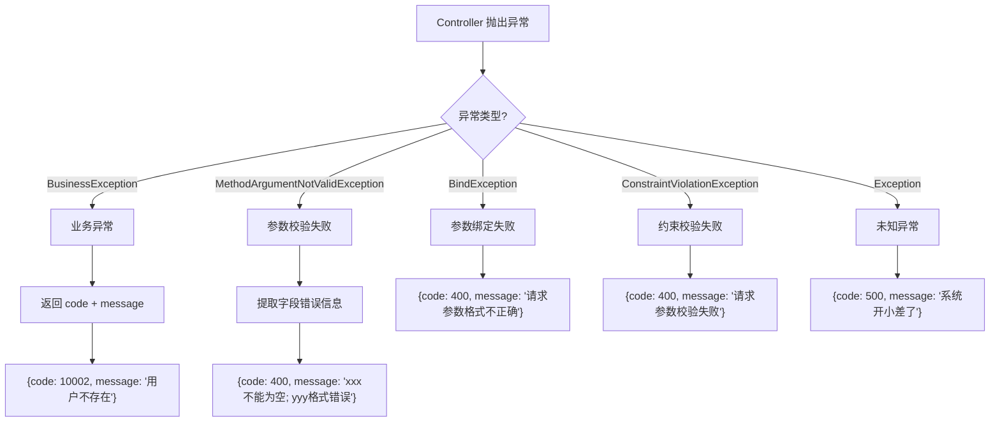

**文字流程图：**

```
┌─────────────────────────────────────────────────────────────────┐
│                      异常处理流程                                 │
└─────────────────────────────────────────────────────────────────┘
                              │
                              ▼
                   ┌─────────────────────┐
                   │  Controller 抛异常  │
                   └─────────────────────┘
                              │
                              ▼
         ┌────────────────────┴────────────────────┐
         │                                         │
         ▼                                         │
┌─────────────────────┐                            │
│  @RestControllerAdvice │                         │
│  全局异常处理器      │                            │
└─────────────────────┘                            │
         │                                         │
         ▼                                         │
┌─────────────────────────────────────────────────────────────────┐
│                      异常类型匹配                                │
├─────────────────────────────────────────────────────────────────┤
│                                                                 │
│  ┌─────────────────┐    ┌─────────────────┐                    │
│  │ BusinessException │    │ MethodArgument  │                    │
│  │ 业务异常         │    │ NotValidException│                    │
│  │                  │    │ 参数校验异常     │                    │
│  └────────┬────────┘    └────────┬────────┘                    │
│           │                      │                              │
│           ▼                      ▼                              │
│  ┌─────────────────┐    ┌─────────────────┐                    │
│  │ code: 自定义    │    │ code: 400       │                    │
│  │ message: 业务消息│    │ message: 字段错误│                    │
│  └─────────────────┘    └─────────────────┘                    │
│                                                                 │
│  ┌─────────────────┐    ┌─────────────────┐                    │
│  │ BindException   │    │ Constraint      │                    │
│  │ 参数绑定异常     │    │ Violation       │                    │
│  │                  │    │ 约束校验异常     │                    │
│  └────────┬────────┘    └────────┬────────┘                    │
│           │                      │                              │
│           ▼                      ▼                              │
│  ┌─────────────────┐    ┌─────────────────┐                    │
│  │ code: 400       │    │ code: 400       │                    │
│  │ message: 格式错误│    │ message: 校验失败│                    │
│  └─────────────────┘    └─────────────────┘                    │
│                                                                 │
│  ┌─────────────────┐                                           │
│  │ Exception        │                                           │
│  │ 兜底异常         │                                           │
│  └────────┬────────┘                                           │
│           │                                                     │
│           ▼                                                     │
│  ┌─────────────────┐                                           │
│  │ code: 500       │                                           │
│  │ message: 系统错误│                                           │
│  └─────────────────┘                                           │
└─────────────────────────────────────────────────────────────────┘
                              │
                              ▼
                   ┌─────────────────────┐
                   │  返回 ApiResponse   │
                   │  统一 JSON 格式     │
                   └─────────────────────┘
```

```java
@RestControllerAdvice
public class GlobalExceptionHandler {

    @ExceptionHandler(BusinessException.class)
    public ApiResponse<Void> handleBusinessException(BusinessException ex) {
        return ApiResponse.fail(ex.getCode(), ex.getMessage());
    }

    @ExceptionHandler(MethodArgumentNotValidException.class)
    public ApiResponse<Void> handleValidation(MethodArgumentNotValidException ex) {
        String message = ex.getBindingResult().getFieldErrors().stream()
                .map(FieldError::getDefaultMessage)
                .collect(Collectors.joining("; "));
        return ApiResponse.fail(400, message);
    }

    @ExceptionHandler(Exception.class)
    public ApiResponse<Void> handleException(Exception ex) {
        return ApiResponse.fail(500, "系统开小差了，请稍后重试");
    }
}
```

**异常处理优先级：**
1. `BusinessException` → 返回业务错误码和消息
2. `MethodArgumentNotValidException` → 参数校验失败，返回 400
3. `BindException` → 参数绑定失败，返回 400
4. `ConstraintViolationException` → 约束校验失败，返回 400
5. `Exception` → 兜底，返回 500，不暴露内部错误

**为什么最后要兜底 `Exception`？**
- 防止未预期的异常导致前端收到 500 但没有 message
- 兜底返回通用提示"系统开小差了"，用户体验更好
- 生产环境不应该暴露堆栈信息给前端

---

## 第 4 章：认证体系 — JWT + 签名双重验证

### 4.1 登录流程

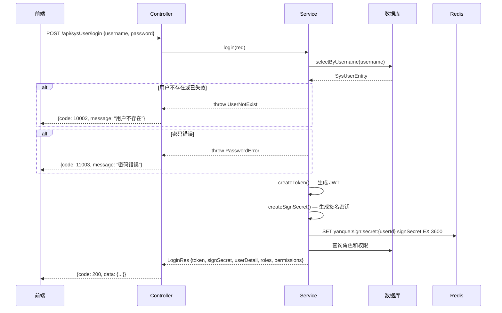

**文字流程图：**

```
┌─────────────────────────────────────────────────────────────────┐
│                         登录流程                                  │
└─────────────────────────────────────────────────────────────────┘
                              │
                              ▼
                   ┌─────────────────────┐
                   │  前端发送登录请求     │
                   │  {username, password} │
                   └─────────────────────┘
                              │
                              ▼
                   ┌─────────────────────┐
                   │  查询用户信息        │
                   │  selectByUsername()  │
                   └─────────────────────┘
                              │
                              ▼
                   ┌─────────────────────┐
                   │  校验用户状态和密码   │
                   └─────────────────────┘
                          │         │
                      失败│         │成功
                          ▼         ▼
              ┌──────────────┐  ┌─────────────────────┐
              │  返回错误     │  │  生成 JWT Token      │
              │  BusinessException │  │  uid + expire_time │
              └──────────────┘  └─────────────────────┘
                                          │
                                          ▼
                                ┌─────────────────────┐
                                │  生成签名密钥        │
                                │  SecureRandom 32字节 │
                                └─────────────────────┘
                                          │
                                          ▼
                                ┌─────────────────────┐
                                │  密钥写入 Redis      │
                                │  TTL = 1小时         │
                                └─────────────────────┘
                                          │
                                          ▼
                                ┌─────────────────────┐
                                │  查询角色和权限      │
                                └─────────────────────┘
                                          │
                                          ▼
                                ┌─────────────────────┐
                                │  返回登录结果        │
                                │  token + signSecret  │
                                │  + userDetail        │
                                │  + roles + perms     │
                                └─────────────────────┘
```

**为什么登录返回这么多信息？**
- `token`：后续请求的身份凭证
- `signSecret`：后续请求的签名密钥
- `userDetail`、`roles`、`permissions`：前端渲染页面需要的用户信息，避免登录后再查一次

### 4.2 JwtAuthInterceptor — JWT 身份认证

```java
private static final String AUTHORIZATION = "Authorization";
private static final String BEARER_PREFIX = "Bearer ";
private static final String USER_ID = "uid";
private static final String EXPIRE_TIME = "expire_time";

@Override
public boolean preHandle(HttpServletRequest request, HttpServletResponse response, Object handler) throws Exception {
    // 1. 取 Authorization Header，不存在或格式错直接 401
    String authorization = request.getHeader(AUTHORIZATION);
    if (authorization == null || !authorization.startsWith(BEARER_PREFIX)) {
        throw new BusinessException(401, "未登录或Token缺失");
    }

    // 2. 去掉 "Bearer " 前缀得到 token
    String token = authorization.substring(BEARER_PREFIX.length()).trim();
    try {
        // 3. 用数据库密钥验证签名（SysConfigService 有本地缓存）
        JWT jwt = JWT.of(token).setKey(sysConfigService.get(SysConfig.jwtSecret).getBytes());
        if (!jwt.verify()) {
            throw new BusinessException(401, "Token无效或已过期");
        }

        // 4. 提取 payload 并检查过期
        Object userId = jwt.getPayload(USER_ID);
        Object expireTime = jwt.getPayload(EXPIRE_TIME);
        if (userId == null || expireTime == null) {
            throw new BusinessException(401, "Token无效或已过期");
        }
        if (System.currentTimeMillis() > Long.parseLong(String.valueOf(expireTime))) {
            throw new BusinessException(401, "Token无效或已过期");
        }

        // 5. 存入 request attribute，后续拦截器直接取，不用重复解析 JWT
        request.setAttribute("userId", Long.parseLong(String.valueOf(userId)));
        return true;
    } catch (BusinessException ex) {
        throw ex;  // 保留自己抛的异常
    } catch (Exception ex) {
        throw new BusinessException(401, "Token无效或已过期");  // 其他异常统一包装
    }
}
```

**关键设计：**
- 常量定义避免魔法字符串散落
- 所有验证失败返回 401，错误消息统一，不暴露具体原因（安全考虑）
- `catch (BusinessException) { throw ex; }` 保留自定义异常，其他异常统一包装为"Token无效或已过期"
- `request.setAttribute("userId", ...)` 让后续拦截器不用重复解析 JWT

**为什么用 `Authorization: Bearer xxx` 格式？**
- 这是 OAuth 2.0 标准格式，前端框架（如 Axios）普遍支持
- `Bearer` 前缀表示"持有此 token 即可访问"

**为什么 JWT 密钥从数据库读取？**
- 密钥存数据库而非配置文件，运行时可通过管理后台修改
- 修改密钥后所有现有 token 立即失效，安全性更高

### 4.3 SignInterceptor — 请求签名验证

**签名流程：**

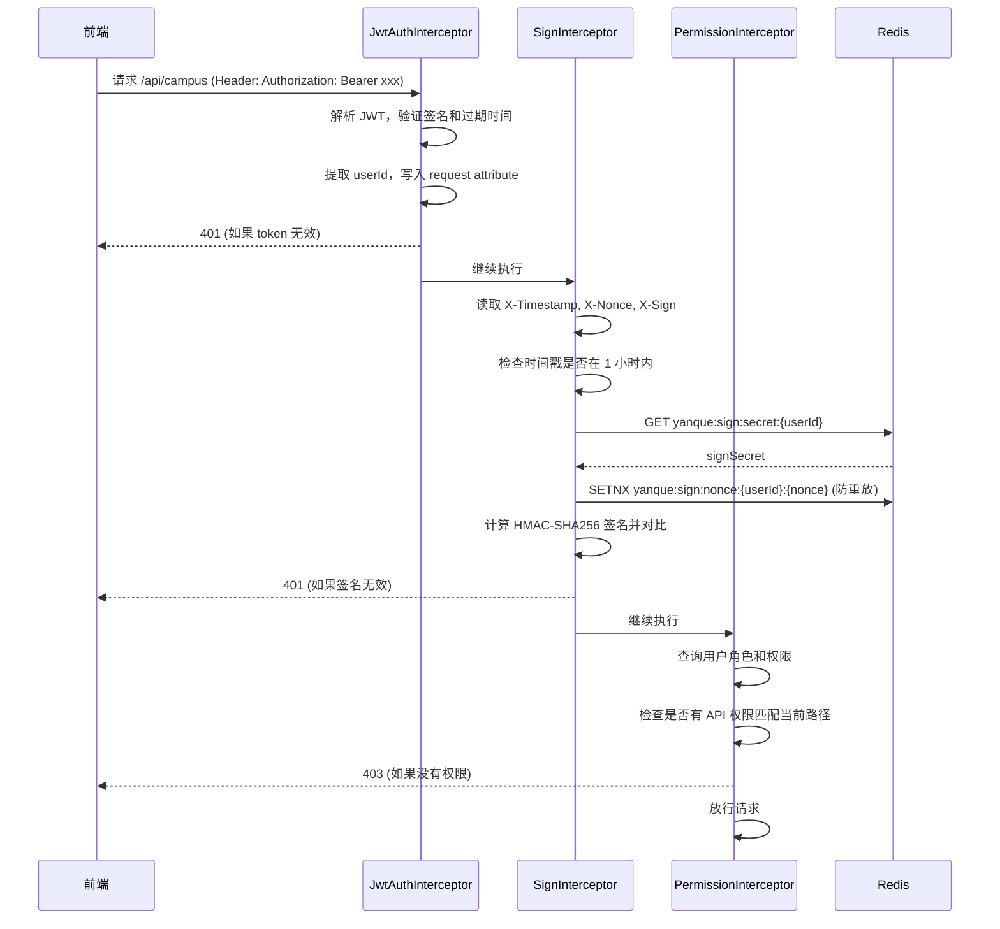

**文字流程图：**

```
┌─────────────────────────────────────────────────────────────────┐
│                    请求签名验证流程                                │
└─────────────────────────────────────────────────────────────────┘
                              │
                              ▼
                   ┌─────────────────────┐
                   │  前端构建签名原文    │
                   │  METHOD\nURI\n       │
                   │  QUERY\nTIMESTAMP\n  │
                   │  NONCE               │
                   └─────────────────────┘
                              │
                              ▼
                   ┌─────────────────────┐
                   │  HMAC-SHA256 签名    │
                   │  signSecret 为密钥   │
                   └─────────────────────┘
                              │
                              ▼
                   ┌─────────────────────┐
                   │  发送请求            │
                   │  Header:            │
                   │  X-Timestamp        │
                   │  X-Nonce            │
                   │  X-Sign             │
                   └─────────────────────┘
                              │
        ┌─────────────────────┼─────────────────────┐
        │                     │                     │
        ▼                     ▼                     ▼
┌───────────────┐   ┌───────────────┐   ┌───────────────┐
│ 1.时间戳校验   │   │ 2.Nonce 校验  │   │ 3.签名校验    │
│ 检查是否过期   │   │ 检查是否重复  │   │ 对比签名值    │
│ (1小时窗口)   │   │ (Redis去重)   │   │ (HMAC-SHA256) │
└───────────────┘   └───────────────┘   └───────────────┘
        │                     │                     │
        └─────────────────────┼─────────────────────┘
                              │
                              ▼
                   ┌─────────────────────┐
                   │  全部通过 → 放行    │
                   │  任一失败 → 401     │
                   └─────────────────────┘
```

**为什么需要签名？JWT 不够吗？**

JWT 只证明"这个用户已登录"，但不保证：
- 请求内容没被篡改（中间人攻击）
- 请求不是重放的（抓包后重新发送）

签名解决了这两个问题：
- **防篡改**：任何参数变化都会导致签名不匹配
- **防重放**：nonce 一次性，用过就失效
- **防过期**：时间戳窗口限制，旧请求自动失效

**为什么签名密钥存 Redis 而非 JWT？**
- 签名密钥需要随时失效（退出登录时删除 Redis key）
- 如果放在 JWT payload 里，JWT 过期前无法使密钥失效
- Redis 支持 TTL，密钥 1 小时后自动过期

### 4.4 拦截器链注册顺序

项目有**两套拦截器体系**，分别处理后台管理和学生端：

**后台管理（`/api/**`）：**
```
JwtAuthInterceptor → SignInterceptor → PermissionInterceptor
（解析JWT）           （验签）            （权限校验）
```

**学生端（`/student/**`）：**
```
PendingPaySignInterceptor → StudentJwtAuthInterceptor → StudentSignInterceptor
（待支付接口验签）           （解析学生JWT）               （学生端验签）
```

```java
// ===== 后台管理拦截器 =====
registry.addInterceptor(jwtAuthInterceptor)          // 1. 先解析 JWT，拿到 userId
    .addPathPatterns("/api/**")
    .excludePathPatterns("/api/sysUser/login", ...);

registry.addInterceptor(signInterceptor)              // 2. 再验签（需要 userId）
    .addPathPatterns("/api/**")
    .excludePathPatterns("/api/sysUser/login", ...);

registry.addInterceptor(permissionInterceptor)        // 3. 最后检查权限（需要 userId）
    .addPathPatterns("/api/**")
    .excludePathPatterns("/api/sysUser/login", ...);

// ===== 学生端拦截器 =====
registry.addInterceptor(pendingPaySignInterceptor)    // 4. 待支付接口单独验签（无JWT）
    .addPathPatterns("/student/pending/**");

registry.addInterceptor(studentJwtAuthInterceptor)    // 5. 学生 JWT 认证
    .addPathPatterns("/student/**")
    .excludePathPatterns("/student/login", "/student/pending/**");

registry.addInterceptor(studentSignInterceptor)        // 6. 学生端验签
    .addPathPatterns("/student/**")
    .excludePathPatterns("/student/login", "/student/pending/**");
```

**排除路径说明：**
| 排除路径 | 原因 |
|----------|------|
| `/api/sysUser/login` | 登录时还没有 token 和签名密钥 |
| `/student/login` | 学生登录没有 token |
| `/student/pending/**` | 待支付接口单独处理（只有验签，没有 JWT） |
| `/swagger-ui/**` | 本地开发调试接口文档 |

**为什么 `/student/pending/**` 要单独处理？**
- 学生下单前还没有 token（未注册），但需要验签防篡改
- 所以 `pendingPaySignInterceptor` 只验签不验 JWT

---

## 第 5 章：RBAC 权限模型

### 5.1 五表设计

```
sys_user ──┐
           ├── sys_user_role ──┐
sys_role ──┘                   ├── sys_role_permission ──┐
                               │                         │
                               └── sys_permission ───────┘
```

| 表 | 作用 |
|----|------|
| sys_user | 用户表 |
| sys_role | 角色表（如 SUPER_ADMIN、TEACHER） |
| sys_permission | 权限表（树形结构，支持菜单/接口/按钮） |
| sys_user_role | 用户-角色关联（多对多） |
| sys_role_permission | 角色-权限关联（多对多） |

### 5.2 权限类型

```java
public enum PermissionTypeEnum {
    API("api"),       // 接口权限，后端校验
    BUTTON("按钮"),    // 按钮权限，前端控制
    MENU("菜单");      // 菜单权限，前端渲染菜单树
}
```

**为什么分三种类型？**
- **MENU**：前端根据 MENU 权限渲染侧边栏菜单，没有菜单权限的页面不显示
- **API**：后端根据 API 权限校验接口访问，没有接口权限返回 403
- **BUTTON**：前端根据 BUTTON 权限控制页面内按钮的显示/隐藏

### 5.3 权限树结构

```sql
-- 权限表使用 parent_id 自引用，形成树形结构
(0, 'system', '系统管理', 'MENU', null, 10, ...)
  (1, 'system:user', '用户管理', 'MENU', null, 1010, ...)
    (2, 'api:user:page', '分页查询用户', 'API', '/yq-admin/api/sysUser', 1111, ...)
    (2, 'api:user:create', '新增用户', 'API', '/yq-admin/api/sysUser', 1113, ...)
  (1, 'system:role', '角色管理', 'MENU', null, 1020, ...)
```

**为什么用树形结构？**
- 前端菜单是树形的（一级菜单 → 二级菜单 → 页面）
- 用 `parent_id` 自引用可以无限扩展层级
- `sort_num` 控制同级节点的显示顺序

### 5.4 PermissionInterceptor — 接口权限校验

**权限校验流程图：**

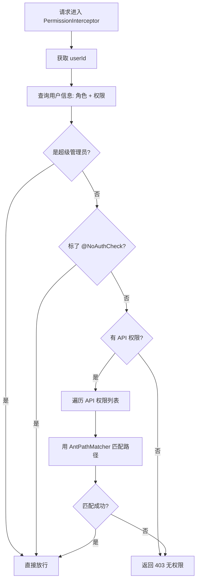

**文字流程图：**

```
┌─────────────────────────────────────────────────────────────────┐
│                      权限校验流程                                 │
└─────────────────────────────────────────────────────────────────┘
                              │
                              ▼
                   ┌─────────────────────┐
                   │  获取 userId        │
                   │  (从 request attr)  │
                   └─────────────────────┘
                              │
                              ▼
                   ┌─────────────────────┐
                   │  查询用户信息        │
                   │  - 角色列表         │
                   │  - 权限列表         │
                   └─────────────────────┘
                              │
                              ▼
                   ┌─────────────────────┐
                   │  是超级管理员?       │
                   │  (SUPER_ADMIN)      │
                   └─────────────────────┘
                          │         │
                       是 │         │否
                          ▼         ▼
              ┌──────────────┐  ┌─────────────────────┐
              │  直接放行    │  │  标了 @NoAuthCheck?  │
              └──────────────┘  └─────────────────────┘
                                      │         │
                                   是 │         │否
                                      ▼         ▼
                          ┌──────────────┐  ┌─────────────────────┐
                          │  直接放行    │  │  有 API 类型权限?   │
                          └──────────────┘  └─────────────────────┘
                                                  │         │
                                              无  │         │有
                                                  ▼         ▼
                                      ┌──────────────┐  ┌─────────────────────┐
                                      │  返回 403    │  │  遍历权限列表       │
                                      │  "暂无权限"  │  │  AntPathMatcher    │
                                      └──────────────┘  │  匹配请求路径       │
                                                        └─────────────────────┘
                                                                  │
                                                          ┌───────┴───────┐
                                                          │               │
                                                       匹配             不匹配
                                                          │               │
                                                          ▼               ▼
                                              ┌──────────────┐  ┌──────────────┐
                                              │  放行        │  │  返回 403    │
                                              └──────────────┘  └──────────────┘
```

**为什么用 AntPathMatcher？**
- 权限配置的是 `/api/sysUser/{id}`，实际请求是 `/api/sysUser/123`
- `AntPathMatcher` 支持 `{id}` 占位符匹配，不需要为每个 ID 单独配置权限
- 这是 Spring MVC 自带的路径匹配器，可靠且高效

**为什么超级管理员要硬编码？**
- 系统初始化时需要一个不受限的账号来创建其他用户和角色
- 如果超级管理员也受权限控制，可能出现"没有任何权限的管理员"的死锁
- `SUPER_ADMIN` 角色代码是约定，不会被删除

---

## 第 6 章：业务模块 CRUD 实现模式

### 6.1 完整流程：以校区管理为例

**CRUD 请求处理流程图：**

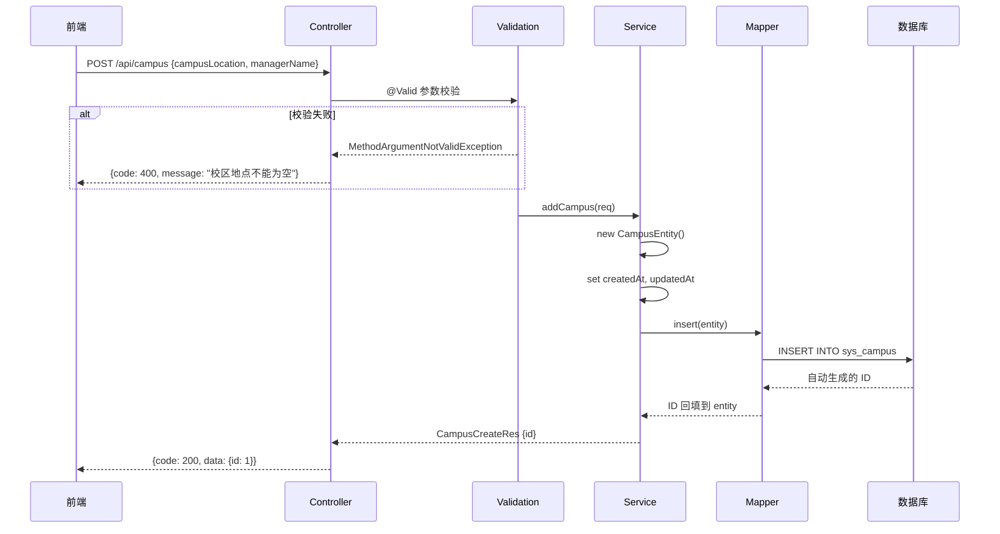

**文字流程图：**

```
┌─────────────────────────────────────────────────────────────────┐
│                      CRUD 请求处理流程                            │
└─────────────────────────────────────────────────────────────────┘
                              │
                              ▼
                   ┌─────────────────────┐
                   │  HTTP 请求进入       │
                   │  POST /api/campus   │
                   └─────────────────────┘
                              │
                              ▼
                   ┌─────────────────────┐
                   │  Filter 链          │
                   │  RequestGuidFilter  │
                   │  (分配请求ID)       │
                   └─────────────────────┘
                              │
                              ▼
                   ┌─────────────────────┐
                   │  Interceptor 链     │
                   │  1. JwtAuth         │
                   │  2. Sign            │
                   │  3. Permission      │
                   └─────────────────────┘
                              │
                              ▼
                   ┌─────────────────────┐
                   │  DispatcherServlet  │
                   │  路由到 Controller  │
                   └─────────────────────┘
                              │
                              ▼
                   ┌─────────────────────┐
                   │  @Valid 参数校验    │
                   └─────────────────────┘
                          │         │
                      失败│         │成功
                          ▼         ▼
              ┌──────────────┐  ┌─────────────────────┐
              │  返回 400    │  │  调用 Service 方法   │
              └──────────────┘  └─────────────────────┘
                                          │
                                          ▼
                                ┌─────────────────────┐
                                │  Service 业务逻辑   │
                                │  1. 构建 Entity     │
                                │  2. 设置时间戳      │
                                │  3. 调用 Mapper     │
                                └─────────────────────┘
                                          │
                                          ▼
                                ┌─────────────────────┐
                                │  Mapper 执行 SQL    │
                                │  INSERT/UPDATE/DELETE│
                                └─────────────────────┘
                                          │
                                          ▼
                                ┌─────────────────────┐
                                │  返回结果            │
                                │  ApiResponse.success │
                                └─────────────────────┘
```

```
1. 定义 Entity（数据库映射）
2. 定义 Mapper 接口（数据访问方法）
3. 编写 Mapper XML（SQL 语句）
4. 定义 Service 接口（业务方法）
5. 实现 ServiceImpl（业务逻辑）
6. 编写 Controller（HTTP 接口）
7. 定义 Request VO（入参校验）
8. 定义 Response VO（出参控制）
```

### 6.2 Entity — 数据库映射

```java
@Data
public class CampusEntity {
    private Long id;
    private String campusLocation;    // 数据库列: campus_location
    private String managerName;       // 数据库列: manager_name
    private String managerPhone;      // 数据库列: manager_phone
    private Date createdAt;           // 数据库列: created_at
    private Date updatedAt;           // 数据库列: updated_at
}
```

**为什么字段用驼峰，数据库用下划线？**
- MyBatis 默认开启 `mapUnderscoreToCamelCase`，自动转换
- 或者在 Mapper XML 的 `<resultMap>` 里手动映射

### 6.3 Mapper 接口 + XML

**接口：**
```java
public interface CampusMapper {
    void insert(CampusEntity campus);
    int updateById(CampusEntity campus);
    CampusEntity selectById(@Param("id") Long id);
    List<CampusEntity> selectPage(@Param("keyword") String keyword);
    int deleteById(@Param("id") Long id);
}
```

**XML：**
```xml
<insert id="insert" useGeneratedKeys="true" keyProperty="id">
    insert into sys_campus (campus_location, manager_name, manager_phone, created_at, updated_at)
    values (#{campusLocation}, #{managerName}, #{managerPhone}, #{createdAt}, #{updatedAt})
</insert>

<select id="selectPage" resultMap="CampusMap">
    select <include refid="BaseColumns"/> from sys_campus
    <where>
        <if test="keyword != null and keyword != ''">
            and (campus_location like concat('%', #{keyword}, '%')
            or manager_name like concat('%', #{keyword}, '%'))
        </if>
    </where>
    order by id desc
</select>
```

**为什么用 XML 而非注解？**
- XML 支持动态 SQL（`<if>`、`<where>`、`<foreach>`），注解做动态 SQL 很丑
- SQL 集中在 XML 文件里，便于审查和优化
- 复杂 SQL（多表 JOIN、子查询）在 XML 里更易读

**为什么 `useGeneratedKeys="true"`？**
- 插入后自动把数据库生成的主键 ID 回填到 Entity 的 `id` 字段
- 这样插入后可以直接 `campus.getId()` 获取 ID，无需再查一次

### 6.4 Service 实现 — 分页查询

```java
@Override
public PageResult<CampusPageRes> pageCampus(CampusPageReq req) {
    int pageNum = req.getPageNum() == null ? 1 : req.getPageNum();
    int pageSize = req.getPageSize() == null ? 10 : req.getPageSize();

    // 1. 开启分页（ThreadLocal，影响下一条 SQL）
    PageHelper.startPage(pageNum, pageSize);

    // 2. 执行查询（PageHelper 自动追加 LIMIT）
    List<CampusEntity> list = campusMapper.selectPage(req.getKeyword());

    // 3. 获取分页信息（total、pageNum、pageSize）
    PageInfo<CampusEntity> pageInfo = new PageInfo<>(list);

    // 4. Entity → VO 转换
    List<CampusPageRes> records = list.stream().map(this::buildCampusPageRes).toList();

    // 5. 封装返回
    return new PageResult<>(pageInfo.getTotal(), pageNum, pageSize, records);
}
```

**为什么 `PageHelper.startPage()` 必须紧跟查询？**
- PageHelper 通过 ThreadLocal 实现，`startPage()` 设置分页参数
- 只影响**紧跟其后的第一条 SQL**
- 如果中间有其他 SQL（如先查总数再查列表），分页会应用到错误的 SQL 上

### 6.5 Service 实现 — 新增

```java
@Override
@Transactional(rollbackFor = Exception.class)
public CampusCreateRes addCampus(CampusCreateReq req) {
    CampusEntity campus = new CampusEntity();
    campus.setCampusLocation(req.getCampusLocation());
    campus.setManagerName(req.getManagerName());
    campus.setManagerPhone(req.getManagerPhone());
    campus.setCreatedAt(new Date());      // 手动设时间戳
    campus.setUpdatedAt(new Date());
    campusMapper.insert(campus);

    CampusCreateRes res = new CampusCreateRes();
    res.setId(campus.getId());            // insert 后自动回填 ID
    return res;
}
```

**为什么手动设 `createdAt`/`updatedAt` 而非数据库 DEFAULT？**
- 代码里看到时间赋值，逻辑更明确
- 避免数据库 DEFAULT 和代码逻辑不一致（如数据库用 `CURRENT_TIMESTAMP`，代码用 `new Date()`）
- 便于测试（可以 mock 时间）

**为什么 `@Transactional(rollbackFor = Exception.class)`？**
- 默认只对 `RuntimeException` 回滚
- `rollbackFor = Exception.class` 让所有异常都回滚，更安全
- 写操作（insert/update/delete）都应该加事务

### 6.6 Service 实现 — 修改和删除

```java
// 修改：检查影响行数
int rows = campusMapper.updateById(campus);
if (rows == 0) {
    throw BusinessException.CampusNotExist;
}

// 删除：检查影响行数
int rows = campusMapper.deleteById(id);
if (rows == 0) {
    throw BusinessException.CampusNotExist;
}
```

**为什么要检查 `rows == 0`？**
- 如果不检查，操作不存在的数据会"静默成功"
- 前端以为删除成功了，但数据本来就不在，可能导致业务逻辑错误
- 检查后抛异常，前端可以明确知道"数据不存在"

### 6.7 唯一约束与 DuplicateKeyException

```java
try {
    sysRoleMapper.insert(role);
} catch (DuplicateKeyException e) {
    throw BusinessException.RoleExist;
}
```

数据库对 `role_code` 字段加了唯一索引（UNIQUE），插入重复值时 MySQL 抛异常，Spring 包装为 `DuplicateKeyException`。

**为什么不先查再插？**
- 先查再插有并发问题：两个请求同时查到"不存在"，都去插入，第二个会失败
- 直接插入 + 捕获异常更简洁，数据库唯一索引是最终保障
- 这叫**乐观策略**：先做，失败了再处理

### 6.8 先删后插：角色权限分配

```java
public void resetRolePermissions(Long roleId, List<Long> permissionIds) {
    sysRoleMapper.deleteRolePermissions(roleId);              // 删掉该角色的所有权限
    if (permissionIds != null && !permissionIds.isEmpty()) {
        sysRoleMapper.insertRolePermissions(roleId, permissionIds); // 插入新权限
    }
}
```

**为什么用"先删后插"而不是"对比差异更新"？**
- 前端传的是完整的权限ID列表，代表"这个角色应该有哪些权限"
- 对比差异需要计算"新增了哪些、删除了哪些"，逻辑复杂
- 先删后插两条 SQL 搞定，在事务里保证一致性

**这个模式在项目中多次出现：**
- 角色分配权限（`resetRolePermissions`）
- 用户分配角色（`assignUserRoles`）
- 重新生成课表（`deleteByClassId` + `batchInsert`）
- 值班按日期保存（`deleteByDutyDate` + 逐条 insert）

### 6.9 主从表级联：课程与课程详情

```java
// 删除课程时，先删课程详情
@Override
public CourseDeleteRes deleteCourse(Long id) {
    courseDetailMapper.deleteByCourseId(id);  // 先删从表
    int rows = courseMapper.deleteById(id);    // 再删主表
    if (rows == 0) throw BusinessException.CourseNotExist;
    ...
}
```

**为什么先删从表再删主表？**
- 如果先删主表，从表的 `course_id` 就成了孤立数据
- 虽然数据库有外键约束可以自动级联删除，但本项目没有用外键（性能考虑）
- 手动控制删除顺序，逻辑更清晰

---

## 第 7 章：横切关注点 — AOP 日志与请求追踪

### 7.1 ControllerLogAspect — AOP 自动日志

```java
@Aspect
@Component
public class ControllerLogAspect {

    @Around("execution(* cn.yanque..controller..*.*(..))")
    public Object logController(ProceedingJoinPoint joinPoint) throws Throwable {
        long start = System.currentTimeMillis();
        MethodSignature signature = (MethodSignature) joinPoint.getSignature();
        String methodName = signature.getDeclaringType().getSimpleName() + "#" + signature.getName();
        HttpServletRequest request = getCurrentRequest();

        log.info("接口开始: uri={}, httpMethod={}, controller={}, args={}",
                request == null ? "-" : request.getRequestURI(),
                request == null ? "-" : request.getMethod(),
                methodName,
                buildArgsLog(joinPoint.getArgs(), signature.getParameterNames()));

        Object result = joinPoint.proceed();
        long cost = System.currentTimeMillis() - start;

        log.info("接口结束: uri={}, controller={}, cost={}ms, result={}",
                request == null ? "-" : request.getRequestURI(),
                methodName,
                cost,
                toJson(sanitizeObject(result)));
        return result;
    }
}
```

**切入点表达式解析：**
```java
@Around("execution(* cn.yanque..controller..*.*(..))")
//                              │        │     │ │
//                              │        │     │ └── 任意方法参数
//                              │        │     └── 任意方法名
//                              │        └── 任意类名
//                              └── cn.yanque 下任意子包中的 controller 包
```
- 匹配 `cn.yanque` 包下所有 `controller` 包中的所有方法
- 新增接口自动有日志，无需额外配置

**执行流程：**
```
请求进入
  ↓
记录开始时间 start
  ↓
获取方法名（如 StudentController#login）
  ↓
获取 HttpServletRequest（URI、HTTP 方法）
  ↓
打印请求日志：uri、httpMethod、controller、参数
  ↓
执行实际方法 joinPoint.proceed()
  ↓
计算耗时 cost = 当前时间 - 开始时间
  ↓
打印响应日志：uri、controller、耗时、返回值（脱敏后）
  ↓
返回结果
```

**关键方法说明：**
| 方法 | 作用 |
|------|------|
| `buildArgsLog()` | 格式化请求参数，方便排查 |
| `sanitizeObject()` | 敏感字段脱敏（密码、手机号等） |
| `toJson()` | 将返回对象转为 JSON 字符串打印 |
| `getCurrentRequest()` | 从 Spring 上下文获取当前请求对象 |

**实际日志效果：**
```
接口开始: uri=/api/student/login, httpMethod=POST, controller=StudentController#login, args={phone: "138****1234", password: "***"}
接口结束: uri=/api/student/login, controller=StudentController#login, cost=58ms, result={"code":200,"data":{...}}
```

**为什么用 AOP 而非在每个 Controller 方法里写 log？**
- 日志是横切关注点，与业务逻辑无关
- AOP 统一处理，避免每个方法重复写 log.info
- 新增接口自动有日志，无需额外代码

**为什么用 `@Around` 而非 `@Before` + `@After`？**
- `@Around` 可以计算耗时（`proceed()` 前后的时间差）
- `@Around` 可以修改返回值（虽然这里没有）
- `@Around` 是最灵活的通知类型

### 7.2 敏感字段脱敏

```java
private boolean isSensitiveField(String fieldName) {
    String lower = fieldName.toLowerCase();
    return lower.contains("password")
        || lower.contains("secret")
        || lower.contains("token");
}

private String mask(String value) {
    if (value.length() <= 6) return "****";
    return value.substring(0, 2) + "****" + value.substring(value.length() - 2);
}
```

**为什么用反射遍历字段而非手动标记？**
- 通用性：任何对象都能脱敏，无需每个类都加注解
- 维护成本低：新增字段自动被检查
- 缺点是性能略差，但日志场景可以接受

### 7.3 RequestGuidFilter — 请求追踪

```java
@Component
@Order(Ordered.HIGHEST_PRECEDENCE)  // 最高优先级，保证第一个执行
public class RequestGuidFilter extends OncePerRequestFilter {

    public static final String REQUEST_GUID_KEY = "guid";
    public static final String REQUEST_GUID_ATTR = "requestGuid";
    public static final String REQUEST_GUID_HEADER = "X-Request-Guid";

    @Override
    protected void doFilterInternal(HttpServletRequest request, HttpServletResponse response, FilterChain filterChain)
            throws ServletException, IOException {
        String guid = resolveGuid(request);
        MDC.put(REQUEST_GUID_KEY, guid);                      // 1. 放入 MDC，日志自动带上
        request.setAttribute(REQUEST_GUID_ATTR, guid);        // 2. 存入 request，后续代码可获取
        response.setHeader(REQUEST_GUID_HEADER, guid);         // 3. 响应头返回，前端可记录

        try {
            filterChain.doFilter(request, response);           // 4. 继续执行后续过滤器
        } finally {
            MDC.remove(REQUEST_GUID_KEY);                      // 5. 清理 MDC，防止线程复用污染
        }
    }

    private String resolveGuid(HttpServletRequest request) {
        String guid = request.getHeader(REQUEST_GUID_HEADER);
        if (StringUtils.hasText(guid)) {
            return guid.trim();                                // 客户端传了就复用
        }
        return UUID.randomUUID().toString().replace("-", "");  // 否则自动生成
    }
}
```

**MDC 是什么？**

MDC（Mapped Diagnostic Context）是日志框架（Logback/Log4j）提供的**线程级上下文容器**，本质就是一个线程安全的 Map：

```java
// 底层就是 ThreadLocal<Map<String, String>>
MDC.put("guid", "abc123");   // 存
MDC.get("guid");             // 取
MDC.remove("guid");          // 删
```

**为什么不用手动传参？**
```java
// 手动传参：每条日志都要加 guid，太麻烦
log.info("guid={}, msg={}", guid, "处理请求");

// MDC：放一次，当前线程所有日志自动带上
MDC.put("guid", "abc123");
log.info("处理请求");           // 自动输出 [guid=abc123] 处理请求
log.info("查询数据库");          // 自动输出 [guid=abc123] 查询数据库
```

**MDC 在 logback 中的配置：**
```xml
<pattern>%d{HH:mm:ss} [%X{guid}] %msg%n</pattern>
<!--                         ↑
                      %X{key} 就是读 MDC 中的值 -->
```

**执行流程：**
```
请求进入 Filter
  ↓
resolveGuid(): 有 X-Request-Guid 头就复用，否则生成 UUID
  ↓
MDC.put("guid", guid)         → 当前线程所有日志自动带上 [guid=xxx]
  ↓
request.setAttribute(...)      → 后续代码可通过 request 获取
  ↓
response.setHeader(...)        → 前端可通过响应头获取
  ↓
filterChain.doFilter(...)      → 执行后续过滤器 + Controller
  ↓
finally: MDC.remove("guid")   → 清理，防止线程池复用导致下一个请求带上旧 guid
```

**实际效果：**
```
[10:30:01] [a1b2c3d4] 接口开始: uri=/api/student/login ...
[10:30:01] [a1b2c3d4] 查询学生表: SELECT * FROM student WHERE phone=?
[10:30:01] [a1b2c3d4] 接口结束: cost=58ms ...
```
一条请求的所有日志共享同一个 GUID，排查问题时搜 GUID 即可找到完整链路。

**为什么优先用前端传的 GUID？**
- 前后端联调时，前端可以在控制台看到自己的请求 GUID
- 后端日志搜索同一个 GUID，就能看到这个请求的完整链路
- 如果前端没传，服务端生成一个，保证每个请求都有唯一标识

### 7.4 logback 配置

```xml
<pattern>%d{yyyy-MM-dd HH:mm:ss.SSS} [%thread] [%X{guid}] %-5level %logger{36} - %msg%n</pattern>
```

日志输出示例：
```
2024-06-10 14:30:00.123 [http-nio-8080-exec-1] [a1b2c3d4e5f6] INFO  c.y.c.aop.ControllerLogAspect - 接口开始: uri=/api/campus, ...
```

---

## 第 8 章：系统配置与本地缓存

### 8.1 类型安全的配置项定义

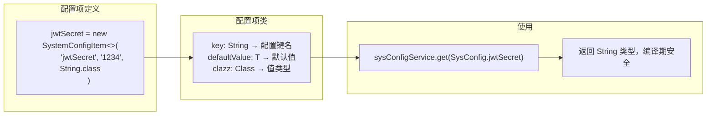

```java
// 配置项定义（静态常量）
public class SysConfig {
    public static final SystemConfigItem<String> jwtSecret =
        new SystemConfigItem<>("jwtSecret", "1234", String.class);
}

// 配置项类（泛型）
@Data
@AllArgsConstructor
public class SystemConfigItem<T> {
    private String key;
    private T defaultValue;
    private Class<T> clazz;
}
```

**为什么用泛型而非直接返回 String？**
- 编译期类型安全：`sysConfigService.get(SysConfig.jwtSecret)` 返回 String，不会拿到 Integer
- 默认值类型与返回类型一致，避免类型转换错误
- 新增配置项只需在 `SysConfig` 类里加一行

### 8.2 SysConfigService — 配置 CRUD + 缓存

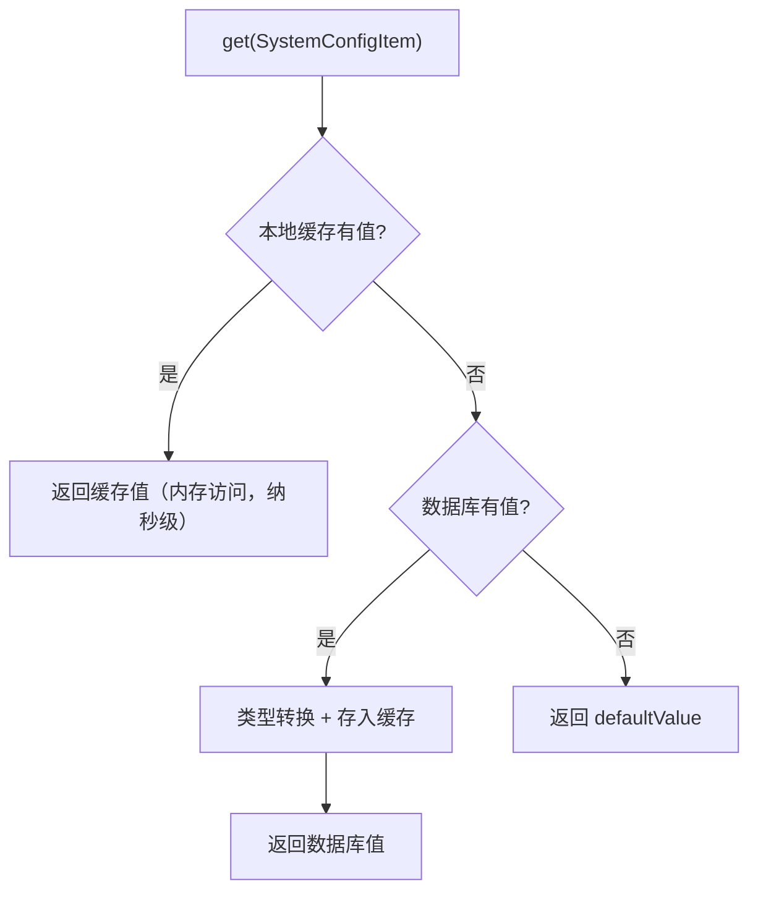

**Guava 本地缓存配置：**
```java
Cache<String, Object> cache = CacheBuilder.newBuilder()
    .expireAfterAccess(10, TimeUnit.SECONDS)  // 10秒无访问自动过期
    .maximumSize(10000)                        // 最多缓存10000条
    .build();
```

```java
@Component
public class SysConfigService {

    // Guava 本地缓存：10 秒过期，最大 10000 条
    private final Cache<String, Object> cache = CacheBuilder.newBuilder()
        .expireAfterAccess(10, TimeUnit.SECONDS)
        .maximumSize(10000).build();

    public <T> T get(SystemConfigItem<T> item) {
        // 1. 先查本地缓存
        Object value = cache.getIfPresent(item.getKey());
        if (value != null) return Convert.convert(item.getClazz(), value);

        // 2. 缓存没有，查数据库
        SysConfigEntity entity = sysConfigMapper.selectByKey(item.getKey());
        if (entity != null) {
            T configValue = Convert.convert(item.getClazz(), entity.getV());
            cache.put(item.getKey(), configValue);
            return configValue;
        }

        // 3. 数据库也没有，返回默认值
        return Convert.convert(item.getClazz(), item.getDefaultValue());
    }
}
```

**为什么用本地缓存而非每次都查 Redis/数据库？**
- JWT 密钥每次请求都要读（验签用），频率极高
- 本地缓存 10 秒过期，数据库查询减少 99%+
- 配置项变更频率低，10 秒延迟可接受

**为什么不用 Redis 做缓存？**
- Redis 有网络开销，每次请求都要网络调用
- 本地缓存是内存访问，纳秒级
- 两级缓存（本地 + Redis）更复杂，本项目规模不需要

### 8.3 配置变更时清缓存

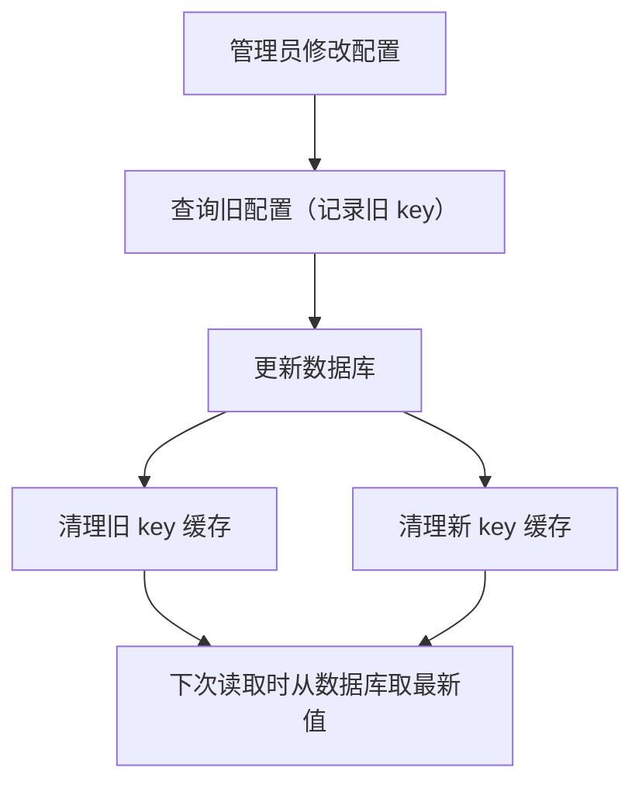

**为什么要清理旧 key？**
- 如果 key 从 "jwt.secret" 改成了 "jwt.key"，旧 key 的缓存还在
- 不清理的话，旧 key 的缓存会一直占内存直到过期
- 新 key 也要清理，确保下次读取时从数据库取最新值

```java
public SysConfigUpdateRes updateConfig(SysConfigUpdateReq req) {
    SysConfigEntity oldConfig = sysConfigMapper.selectById(req.getId());
    // ... 更新数据库 ...

    // 清理旧 key 和新 key 的缓存
    cache.invalidate(oldConfig.getK());
    cache.invalidate(req.getK());
}
```

**为什么要清理旧 key？**
- 如果 key 从 "jwt.secret" 改成了 "jwt.key"，旧 key 的缓存还在
- 不清理的话，旧 key 的缓存会一直占内存直到过期
- 新 key 也要清理，确保下次读取时从数据库取最新值

### 8.4 JWT 密钥的完整链路

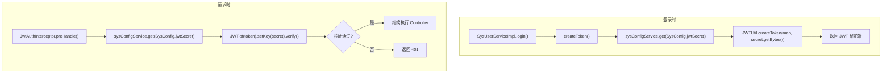

```
登录时：
  SysUserServiceImpl.login()
    → createToken()
    → sysConfigService.get(SysConfig.jwtSecret)  // 从配置读密钥
    → JWTUtil.createToken(map, secret.getBytes())  // 生成 JWT

请求时：
  JwtAuthInterceptor.preHandle()
    → sysConfigService.get(SysConfig.jwtSecret)  // 从配置读密钥（有缓存）
    → JWT.of(token).setKey(secret).verify()       // 验证 JWT
```

**为什么 JWT 密钥不硬编码？**
- 硬编码在代码里，泄露后无法快速更换
- 存数据库可以通过管理后台修改，修改后所有 token 立即失效
- 配合本地缓存，每次请求读密钥的性能开销几乎为零

---

## 第 9 章：排课系统 — 算法驱动的业务模块

> 这是项目中最复杂的模块，展示了如何将业务规则抽象为配置、如何实现日期算法、如何集成外部服务。

### 9.1 排课需求分析

**核心需求：** 根据课程计划自动生成班级课表

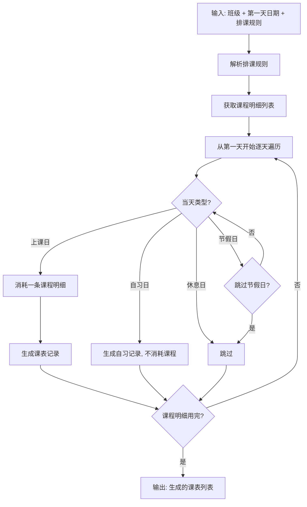

```
输入：
  - 班级（关联课程）
  - 第一天上课日期
  - 排课规则（上课日、自习日、休息日、是否跳过节假日）

输出：
  - 从第一天开始，按规则逐天排课
  - 上课日消耗课程明细，自习日/休息日/节假日不消耗
  - 直到课程明细用完为止
```

**业务规则示例：**
```json
{
  "classDays": [1, 2, 3, 5, 6],    // 周一、二、三、五、六上课
  "selfStudyDays": [4],             // 周四自习
  "restDays": [7],                  // 周日休息
  "holidayRest": true               // 法定节假日休息
}
```

### 9.2 模块结构

```
schedule/
├── controller/ClassScheduleController.java    ← HTTP 接口
├── enums/ClassScheduleTypeEnum.java           ← 课表类型枚举
├── mapper/ClassScheduleMapper.java            ← 数据访问
├── pojo/
│   ├── config/ScheduleRuleConfig.java         ← 排课规则配置
│   ├── entity/ClassScheduleEntity.java        ← 数据库实体
│   ├── info/AddCourseInfo.java                ← 补课信息
│   ├── info/HolidayInfo.java                  ← 节假日信息
│   ├── vo/req/
│   │   ├── AddClassSchuleReq.java             ← 加课请求
│   │   ├── ClassScheduleGenerateReq.java      ← 生成课表请求
│   │   ├── ClassScheduleTeacherAssignReq.java ← 分配老师请求
│   │   └── TeacherDetailReq.java              ← 老师详情查询请求
│   └── vo/res/
│       ├── ClassScheduleDateDetailRes.java    ← 当天课程详情
│       ├── ClassScheduleGenerateRes.java      ← 生成课表响应
│       ├── ClassScheduleItemRes.java          ← 课表列表项
│       ├── ClassScheduleTeacherAssignRes.java ← 分配老师响应
│       ├── ClassStageInfoRes.java             ← 阶段信息
│       └── TeacherDetailRes.java              ← 老师上课详情
└── service/
    ├── ClassScheduleService.java              ← 业务接口
    ├── HolidayService.java                    ← 节假日服务（外部 API）
    ├── ScheduleRuleService.java               ← 规则配置服务
    └── impl/ClassScheduleServiceImpl.java     ← 业务实现
```

**为什么排课模块比其他模块多这么多类？**
- 排课涉及**日期计算**、**外部 API 调用**、**配置驱动**、**批量操作**
- 每个职责独立成类，符合单一职责原则
- HolidayService 和 ScheduleRuleService 可被其他模块复用

### 9.3 配置驱动的排课规则

```java
// SysConfig 中定义配置项
public static SystemConfigItem<String> teachingScheduleRule = new SystemConfigItem<>(
    "teaching.schedule.rule",
    "{\"classDays\":[1,2,3,5,6],\"selfStudyDays\":[4],\"restDays\":[7],\"holidayRest\":true}",
    String.class);

// ScheduleRuleService 读取并解析配置
@Service
public class ScheduleRuleService {
    public ScheduleRuleConfig getScheduleRule() {
        String ruleJson = sysConfigService.get(SysConfig.teachingScheduleRule);
        ScheduleRuleConfig config = JSON.parseObject(ruleJson, ScheduleRuleConfig.class);
        config.validate();  // 校验配置合法性
        return config;
    }
}

// ScheduleRuleConfig 配置实体
@Data
public class ScheduleRuleConfig {
    private List<Integer> classDays;       // 上课日（1-7）
    private List<Integer> selfStudyDays;   // 自习日
    private List<Integer> restDays;        // 休息日
    private Boolean holidayRest;           // 是否跳过节假日
}
```

**为什么排课规则存数据库而非硬编码？**
- 不同校区/班级可能有不同的排课规则
- 通过管理后台修改配置，无需改代码重启
- 配置变更后下次生成课表立即生效

**为什么用 JSON 字符串存储而非单独建表？**
- 规则结构简单，JSON 足够表达
- 避免为配置建多张表（classDays 表、restDays 表...）
- 读取一次后缓存在本地，性能无影响

**为什么配置要 `validate()`？**
- 用户可能通过管理后台手动修改 JSON，格式可能错误
- 校验上课日/休息日不能重复（同一天不能既是上课日又是休息日）
- 校验日期范围（1-7 代表周一到周日）

### 9.4 核心算法：课表生成

**课表生成流程图：**

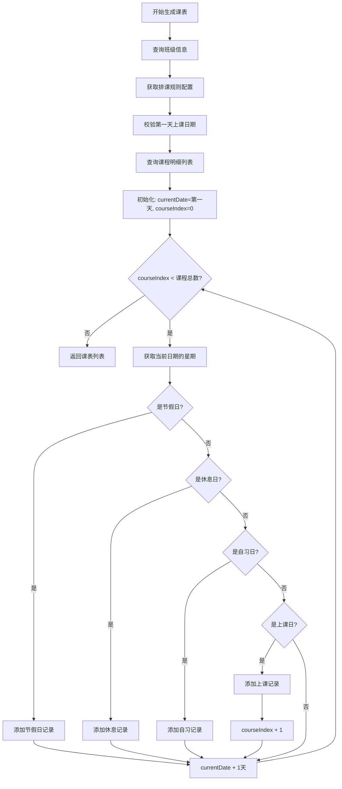

**核心代码：**
```java
List<ClassScheduleEntity> schedules = new ArrayList<>();
Date currentDate = truncateDate(firstClassDate);
int courseIndex = 0;

while (courseIndex < courseDetails.size()) {
    int weekValue = getWeekValue(currentDate);  // 1-7 代表周一到周日
    
    // 1. 节假日判断（调用外部 API）
    if (Boolean.TRUE.equals(rule.getHolidayRest())) {
        HolidayInfo holidayInfo = holidayService.getHolidayInfo(currentDate);
        if (holidayInfo != null && Boolean.TRUE.equals(holidayInfo.getHoliday())) {
            schedules.add(buildSchedule(classId, currentDate, null, 
                holidayInfo.getName(), ClassScheduleTypeEnum.HOLIDAY));
            currentDate = addDays(currentDate, 1);
            continue;  // 不消耗课程明细
        }
    }
    
    // 2. 休息日判断
    if (rule.getRestDays() != null && rule.getRestDays().contains(weekValue)) {
        schedules.add(buildSchedule(classId, currentDate, null, 
            "休息", ClassScheduleTypeEnum.REST));
        currentDate = addDays(currentDate, 1);
        continue;
    }
    
    // 3. 自习日判断
    if (rule.getSelfStudyDays() != null && rule.getSelfStudyDays().contains(weekValue)) {
        schedules.add(buildSchedule(classId, currentDate, null, 
            "自习", ClassScheduleTypeEnum.SELF_STUDY));
        currentDate = addDays(currentDate, 1);
        continue;
    }
    
    // 4. 上课日 → 消耗一条课程明细
    if (rule.getClassDays().contains(weekValue)) {
        CourseDetailEntity detail = courseDetails.get(courseIndex);
        schedules.add(buildSchedule(classId, currentDate, detail, 
            detail.getClassContent(), ClassScheduleTypeEnum.CLASS));
        courseIndex++;  // 消耗课程
    }
    
    currentDate = addDays(currentDate, 1);
}
return schedules;
```

**关键设计：**
- **while 循环逐天遍历**，自动跳过休息日/节假日/自习日
- **只有上课日消耗课程明细**，其他类型不消耗
- **节假日判断优先级最高**，避免在节假日生成上课记录
                   │  必须是上课日        │
                   │  不能是节假日        │
                   └─────────────────────┘
                              │
                              ▼
                   ┌─────────────────────┐
                   │  查询课程明细列表    │
                   │  courseIndex = 0     │
                   └─────────────────────┘
                              │
                              ▼
              ┌───────────────┴───────────────┐
              │                               │
              ▼                               │
   ┌─────────────────────┐                    │
   │  courseIndex < 总数? │──── 否 ───────────┼──▶ 返回课表
   └─────────────────────┘                    │
              │是                             │
              ▼                               │
   ┌─────────────────────┐                    │
   │  获取当前日期星期    │                    │
   │  weekValue = 1-7    │                    │
   └─────────────────────┘                    │
              │                               │
              ▼                               │
   ┌─────────────────────┐                    │
   │  是节假日?           │── 是 ──▶ 添加HOLIDAY记录 ──▶ currentDate+1 ─┐
   └─────────────────────┘                    │                       │
              │否                             │                       │
              ▼                               │                       │
   ┌─────────────────────┐                    │                       │
   │  是休息日?           │── 是 ──▶ 添加REST记录 ──▶ currentDate+1 ──┐│
   └─────────────────────┘                    │                      ││
              │否                             │                      ││
              ▼                               │                      ││
   ┌─────────────────────┐                    │                      ││
   │  是自习日?           │── 是 ──▶ 添加SELF_STUDY记录 ──▶ currentDate+1 ┐││
   └─────────────────────┘                    │                     │││
              │否                             │                     │││
              ▼                               │                     │││
   ┌─────────────────────┐                    │                     │││
   │  是上课日?           │── 是 ──▶ 添加CLASS记录 ──▶ courseIndex++ ─┼┼┼┘
   └─────────────────────┘                    │                     │││
              │否                             │                     │││
              ▼                               │                     │││
   ┌─────────────────────┐                    │                     │││
   │  跳过（非配置日）    │────────────────────┼─────────────────────┘││
   └─────────────────────┘                    │                      ││
                                              │◀─────────────────────┘│
                                              │◀──────────────────────┘
                                              │
                                              ▼
                                    继续循环处理下一天
```

**算法核心思想：**
1. 从第一天上课日期开始，逐天遍历
2. 每天先判断是节假日/休息日/自习日/上课日
3. 只有上课日才消耗课程明细（`courseIndex++`）
4. 当 `courseIndex >= courseDetails.size()` 时，所有课程排完，循环结束

**为什么用 `while` 而非 `for`？**
- 循环次数不确定（取决于有多少非上课日）
- 游标 `courseIndex` 只在上课日才前进
- `while` 更直观地表达"直到课程排完"

**为什么 `continue` 而非嵌套 `if-else`？**
- 每种情况处理完后都要 `currentDate = addDays(currentDate, 1)`
- 用 `continue` 跳过后续逻辑，减少嵌套层级
- 代码更扁平，可读性更好

### 9.5 外部服务集成：HolidayService

```java
@Service
public class HolidayService {

    private static final String HOLIDAY_YEAR_URL = "https://timor.tech/api/holiday/year/";

    // 年度节假日缓存（1天过期，最多缓存20年）
    private final Cache<Integer, Map<String, HolidayInfo>> cache = CacheBuilder.newBuilder()
        .expireAfterWrite(1, TimeUnit.DAYS)
        .maximumSize(20)
        .build();

    public HolidayInfo getHolidayInfo(Date date) {
        Integer year = getYear(date);
        Map<String, HolidayInfo> yearHolidayMap = cache.getIfPresent(year);
        if (yearHolidayMap == null) {
            yearHolidayMap = loadYearHoliday(year);  // 调用外部 API
            cache.put(year, yearHolidayMap);
        }
        return yearHolidayMap.get(formatDate(date));
    }
}
```

**为什么按年缓存而非按天？**
- 节假日数据按年返回（一次 API 调用获取全年数据）
- 一年内节假日数据不会变化，缓存 1 天足够
- 最多缓存 20 年，内存占用很小

**为什么用 `HttpClient` 而非 `RestTemplate`？**
- Java 11+ 内置 `HttpClient`，无需额外依赖
- 支持异步调用（虽然这里用了同步）
- `connectTimeout` 控制连接超时，避免外部服务慢导致线程阻塞

**外部 API 调用的异常处理：**
```java
try {
    // 调用外部 API
} catch (BusinessException e) {
    throw e;  // 业务异常直接抛出
} catch (Exception e) {
    throw BusinessException.DateError.newInstance("节假日信息获取失败");
}
```
- 区分业务异常和系统异常
- 外部服务不可用时，返回明确的错误信息
- 不暴露外部服务的内部错误给前端

### 9.6 跨模块数据聚合：阶段信息查询

```java
public List<ClassStageInfoRes> classStageInfo(Long classId) {
    // 1. 查班级 → 获取课程ID
    ClazzEntity clazz = clazzMapper.selectById(classId);

    // 2. 查课程明细 → 按阶段分组
    List<CourseDetailEntity> courseDetails = courseDetailMapper.selectByCourseId(clazz.getCourseId());
    Map<String, List<CourseDetailEntity>> courseDetailGroup = groupCourseDetailsByStage(courseDetails);

    // 3. 遍历每个阶段
    for (Map.Entry<String, List<CourseDetailEntity>> entry : courseDetailGroup.entrySet()) {
        // 4. 查该阶段的课表 → 获取日期范围
        List<ClassScheduleEntity> schedules = classScheduleMapper.selectByCourseIds(courseIds, classId);
        Date stageStartDate = schedules.get(0).getScheduleDate();
        Date stageEndDate = schedules.get(schedules.size() - 1).getScheduleDate();

        // 5. 查该时间段内已排课的老师
        List<Long> teacherIds = classScheduleMapper.selectTeacheringUserId(stageStartDate, stageEndDate, classId);

        // 6. 查所有老师 → 排除已排课的 → 得到空闲老师
        List<SysUserEntity> teacher = sysUserService.getUserByRoleCode("TEACHER");
        teacher.removeIf(next -> teacherIds.contains(next.getId()));
    }
}
```

**为什么需要跨模块查询？**
- 排课涉及：班级 → 课程 → 课表 → 用户（老师）
- 每个数据在不同模块，需要跨 Mapper 查询
- Service 层负责组装数据，Controller 层只做参数校验

**为什么在 Service 层做聚合而非 SQL JOIN？**
- 各模块独立演进，JOIN 会增加耦合
- 单表查询更简单，便于优化和缓存
- Service 层用 Java 代码组装，逻辑更清晰

### 9.7 批量操作

```java
// Mapper XML — 批量插入
<insert id="batchInsert">
    insert into sys_class_schedule
    (class_id, teacher_id, schedule_date, course_detail_id, course_content, class_type)
    values
    <foreach collection="list" item="item" separator=",">
        (#{item.classId}, #{item.teacherId}, #{item.scheduleDate},
         #{item.courseDetailId}, #{item.courseContent}, #{item.classType})
    </foreach>
</insert>
```

**为什么用批量插入而非逐条插入？**
- 一个班级的课表可能有 60-100 条记录
- 逐条插入 = 100 次数据库往返
- 批量插入 = 1 次数据库往返，性能提升 100 倍

**为什么用 `<foreach>` 而非 `VALUES (), (), ()` 拼接？**
- MyBatis 的 `<foreach>` 自动处理参数绑定，防止 SQL 注入
- 拼接字符串容易出错（逗号、引号）
- `<foreach>` 代码更清晰，MyBatis 自动优化

### 9.8 课表重新生成

```java
@Override
@Transactional(rollbackFor = Exception.class)
public ClassScheduleGenerateRes generateSchedule(ClassScheduleGenerateReq req) {
    // ... 校验、构建课表 ...

    // 先删旧课表，再插新课表
    classScheduleMapper.deleteByClassId(req.getClassId());
    classScheduleMapper.batchInsert(schedules);
}
```

**为什么用"先删后插"而非"逐条对比更新"？**
- 课表是整体生成的，部分更新没有意义
- 先删后插逻辑简单，只需两条 SQL
- 在事务中执行，删除失败不会插入，保证一致性

**为什么删除和插入要在同一个事务？**
- 如果删除成功但插入失败，班级就没有课表了
- 事务回滚保证要么全部成功，要么全部失败
- `@Transactional(rollbackFor = Exception.class)` 确保任何异常都回滚

### 9.9 老师分配与冲突检测

**老师分配流程图：**

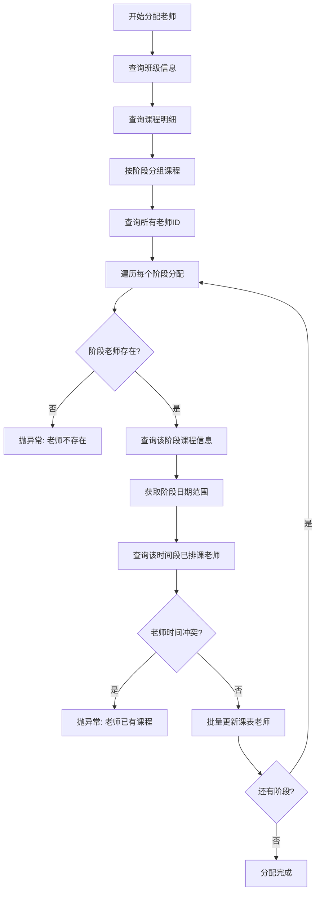

**老师冲突检测核心代码：**
```java
// 查询该阶段的日期范围
Date stageStartDate = schedules.get(0).getScheduleDate();
Date stageEndDate = schedules.get(schedules.size() - 1).getScheduleDate();

// 查询该时间段内已排课的老师（排除当前班级）
List<Long> occupiedTeacherIds = classScheduleMapper
    .selectTeacheringUserId(stageStartDate, stageEndDate, classId);

// 检查冲突
if (occupiedTeacherIds.contains(item.getTeacherId())) {
    throw BusinessException.DateError.newInstance("老师在该阶段时间内已有课程");
}

// 批量更新该阶段所有课表的 teacher_id
updateCount += classScheduleMapper.updateTeacherByCourseDetailIds(
    classId, courseDetailIds, item.getTeacherId());
```

**为什么要排除当前班级？**
```sql
SELECT DISTINCT teacher_id 
FROM sys_class_schedule
WHERE schedule_date BETWEEN ? AND ?
  AND teacher_id IS NOT NULL
  AND class_id != ?  -- 排除当前班级
```
- 同一个老师可以在不同班级的不同时间段授课
- 只检查**其他班级**在该时间段内是否占用了这个老师
- 当前班级重新分配老师时，不会被自己之前的分配记录阻塞
                   │  Stage2: [day6-10]  │
                   └─────────────────────┘
                              │
                              ▼
                   ┌─────────────────────┐
                   │  遍历每个阶段        │
                   └─────────────────────┘
                              │
                              ▼
         ┌────────────────────┴────────────────────┐
         │                                         │
         ▼                                         │
┌─────────────────────┐                            │
│  检查老师是否存在    │── 不存在 ──▶ 抛异常        │
└─────────────────────┘                            │
         │存在                                     │
         ▼                                         │
┌─────────────────────┐                            │
│  获取阶段日期范围    │                            │
│  startDate ~ endDate │                            │
└─────────────────────┘                            │
         │                                         │
         ▼                                         │
┌─────────────────────┐                            │
│  查询该时间段内      │                            │
│  已排课的老师ID      │                            │
│  (排除当前班级)      │                            │
└─────────────────────┘                            │
         │                                         │
         ▼                                         │
┌─────────────────────┐                            │
│  老师时间冲突?       │                            │
└─────────────────────┘                            │
         │         │                               │
     有冲突        │无冲突                          │
         ▼         ▼                               │
┌────────────┐ ┌─────────────┐                     │
│  抛异常    │ │  更新课表    │                     │
│ "已有课程" │ │  的老师ID   │                     │
└────────────┘ └─────────────┘                     │
                           │                       │
                           ▼                       │
                  ┌─────────────────┐              │
                  │  还有阶段?      │── 是 ────────┘
                  └─────────────────┘
                           │否
                           ▼
                  ┌─────────────────┐
                  │  分配完成        │
                  │  返回更新数量    │
                  └─────────────────┘
```

**为什么老师冲突检测按时间段而非按天？**
- 一个阶段可能跨多天（如 5 天课程）
- 一次查询判断整个阶段，性能更好
- 如果按天查询，需要循环查 5 次数据库

**加课功能关键设计：**
```java
// 1. 在指定日期插入新课程
if (当天是自习/休息/节假日) {
    // 直接改为上课
    classScheduleEntity.setClassType(ClassScheduleTypeEnum.CLASS);
} else if (当天已是上课) {
    // 插入一条新上课记录（该班当天有两节课）
    newList.add(newClassSchedule);
}

// 2. 后续所有上课日往后顺延
for (剩余课程) {
    按排课规则重新计算日期（跳过休息日/节假日/自习日）
}

// 3. 冲突检测（SQL 层面）
SELECT teacher_id, schedule_date, COUNT(*) cnt
FROM sys_class_schedule
WHERE teacher_id IS NOT NULL
GROUP BY teacher_id, schedule_date
HAVING cnt > 1;

// 有重复则回滚事务
if (duplicateCount > 0) {
    throw new BusinessException("老师同一天存在重复课表");
}
```

**N+1 查询优化：**
```java
// ❌ 不好的写法：逐个查询老师
for (ClassScheduleEntity schedule : schedules) {
    SysUserEntity teacher = sysUserMapper.selectById(schedule.getTeacherId());
    // 100 条课表 = 100 次数据库查询
}

// ✅ 优化写法：批量查询 + Map 缓存
Set<Long> teacherIds = schedules.stream()
    .map(ClassScheduleEntity::getTeacherId)
    .collect(Collectors.toSet());

List<SysUserEntity> teachers = sysUserMapper.selectByIds(new ArrayList<>(teacherIds));
Map<Long, SysUserEntity> teacherMap = teachers.stream()
    .collect(Collectors.toMap(SysUserEntity::getId, Function.identity()));

// 100 条课表 = 1 次数据库查询
for (ClassScheduleEntity schedule : schedules) {
    SysUserEntity teacher = teacherMap.get(schedule.getTeacherId());
}
```
- 只要老师在这 5 天内有任何一天有课，就不能分配
- `selectTeacheringUserId` 查询的是时间段内的所有已排课老师

**SQL 实现：**
```xml
<select id="selectTeacheringUserId" resultType="java.lang.Long">
    select distinct teacher_id
    from sys_class_schedule
    where schedule_date >= #{stageStartDate}
    and schedule_date <= #{stageEndDate}
    and class_id != #{classId}        -- 排除当前班级
    and teacher_id is not null
</select>
```

**为什么排除当前班级（`class_id != #{classId}`）？**
- 重新分配老师时，当前班级的旧数据还没删除
- 如果不排除，会检测到自己班的旧老师，导致误判冲突

### 9.10 加课功能：插入临时课程并重排后续课表

**加课流程图：**

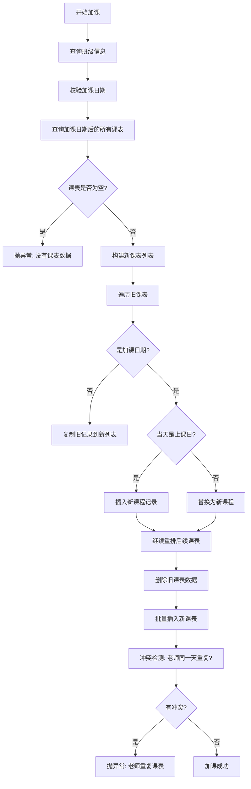

**文字流程图：**

```
┌─────────────────────────────────────────────────────────────────┐
│                         加课流程                                  │
└─────────────────────────────────────────────────────────────────┘
                              │
                              ▼
                   ┌─────────────────────┐
                   │  查询班级信息        │
                   └─────────────────────┘
                              │
                              ▼
                   ┌─────────────────────┐
                   │  校验加课日期        │
                   │  不能为空            │
                   └─────────────────────┘
                              │
                              ▼
                   ┌─────────────────────┐
                   │  查询该日期后的      │
                   │  所有课表            │
                   └─────────────────────┘
                              │
                              ▼
                   ┌─────────────────────┐
                   │  遍历旧课表          │
                   │  构建新课表列表      │
                   └─────────────────────┘
                              │
              ┌───────────────┼───────────────┐
              │               │               │
              ▼               ▼               ▼
      ┌──────────────┐ ┌──────────────┐ ┌──────────────┐
      │ 加课日期之前  │ │  加课日期    │ │ 加课日期之后  │
      │ 直接复制     │ │  插入新课程  │ │ 重新排课     │
      └──────────────┘ └──────────────┘ └──────────────┘
                              │
                              ▼
                   ┌─────────────────────┐
                   │  删除旧课表          │
                   │  (该日期及之后)      │
                   └─────────────────────┘
                              │
                              ▼
                   ┌─────────────────────┐
                   │  批量插入新课表      │
                   └─────────────────────┘
                              │
                              ▼
                   ┌─────────────────────┐
                   │  冲突检测            │
                   │  老师同一天重复?     │
                   └─────────────────────┘
                          │         │
                      有冲突        │无冲突
                          ▼         ▼
              ┌──────────────┐  ┌──────────────┐
              │  抛异常      │  │  加课成功    │
              │  回滚事务    │  │              │
              └──────────────┘  └──────────────┘
```

**业务场景：** 某天需要临时加一节课（如补课、调课），加课后后续课表需要顺延。

**接口定义：**
```java
@PutMapping("{classId}/addClassSchule")
public ApiResponse<Void> addClassSchule(@PathVariable Long classId,
                                        @Valid @RequestBody AddClassSchuleReq req)
```

**请求参数：**
```java
@Data
public class AddClassSchuleReq {
    private String courseContent;    // 加课内容
    private Date scheduleDate;       // 加课日期
    private Long teacherId;          // 上课老师
}
```

**核心实现逻辑：**
```java
public void addClassSchule(Long classId, AddClassSchuleReq req) {
    // 1. 校验参数
    Date scheduleDate = truncateDate(req.getScheduleDate());

    // 2. 查询加课日期后面的所有课表
    List<ClassScheduleEntity> oldList = classScheduleMapper
        .selectByClassIdAndAfterScheduleDate(classId, scheduleDate);

    // 3. 构建新课表（插入加课 + 重排后续）
    List<ClassScheduleEntity> newList = buildAddClassSchuleList(oldList, addCourseInfo);

    // 4. 删除旧数据，插入新数据
    classScheduleMapper.deleteByClassIdAndAfterScheduleDate(classId, scheduleDate);
    classScheduleMapper.batchInsert(newList);

    // 5. 冲突检测：检查老师同一天是否有重复课
    int duplicateCount = classScheduleMapper.countDuplicateTeacherSchedule();
    if (duplicateCount > 0) {
        throw BusinessException.DateError.newInstance("老师同一天存在重复课表");
    }
}
```

**为什么用"先删后插"而非"逐条更新"？**
- 加课会导致后续所有课表日期顺延，相当于重新排课
- 逐条更新需要计算每条记录的新日期，逻辑复杂且容易出错
- 先删后插逻辑清晰，事务保证一致性

**为什么冲突检测在插入之后？**
- 插入后才能检测到完整的课表数据
- 如果在插入前检测，无法发现与新插入数据的冲突
- 事务保证：检测到冲突后抛异常，整个操作回滚

### 9.11 冲突检测：老师同一天重复上课

**检测场景：** 老师在同一天被分配到多个班级上课。

**SQL 实现：**
```xml
<select id="countDuplicateTeacherSchedule" resultType="java.lang.Integer">
    select count(1)
    from (
        select teacher_id, schedule_date, count(*) cnt
        from sys_class_schedule
        where teacher_id is not null
        group by teacher_id, schedule_date
        having cnt > 1
    ) t
</select>
```

**SQL 解析：**
1. 按 `teacher_id` + `schedule_date` 分组
2. 统计每个分组的记录数 `cnt`
3. 过滤 `cnt > 1`（同一天有多条记录）
4. 统计有多少个这样的分组

**为什么用子查询而非直接 COUNT？**
- 需要先分组再过滤，不能直接 COUNT
- 子查询先找出"有问题的分组"，外层 COUNT 统计数量
- 返回 0 表示无冲突，>0 表示有冲突

**为什么在插入后检测而非插入前？**
- 插入前无法知道新数据是否会导致冲突
- 可能新数据本身就有重复（如同一天加了两节课）
- 事务保证：检测到冲突后回滚，数据不会不一致

### 9.12 老师上课详情查询

**老师详情查询流程图：**

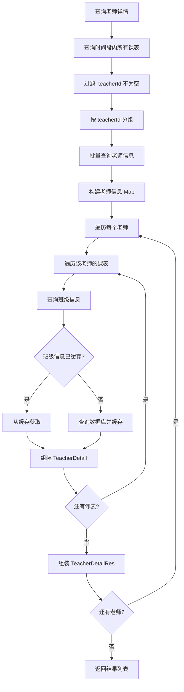

**文字流程图：**

```
┌─────────────────────────────────────────────────────────────────┐
│                    老师上课详情查询流程                            │
└─────────────────────────────────────────────────────────────────┘
                              │
                              ▼
                   ┌─────────────────────┐
                   │  查询时间段内        │
                   │  所有班级的课表      │
                   │  (classId = null)   │
                   └─────────────────────┘
                              │
                              ▼
                   ┌─────────────────────┐
                   │  过滤有老师的记录    │
                   │  按 teacherId 分组   │
                   └─────────────────────┘
                              │
                              ▼
                   ┌─────────────────────┐
                   │  批量查询老师信息    │
                   │  selectByIds()      │
                   │  (避免 N+1 查询)    │
                   └─────────────────────┘
                              │
                              ▼
                   ┌─────────────────────┐
                   │  遍历每个老师        │
                   └─────────────────────┘
                              │
                              ▼
         ┌────────────────────┴────────────────────┐
         │                                         │
         ▼                                         │
┌─────────────────────┐                            │
│  遍历该老师的课表    │                            │
└─────────────────────┘                            │
         │                                         │
         ▼                                         │
┌─────────────────────┐                            │
│  查询班级信息        │                            │
│  (带缓存优化)        │                            │
└─────────────────────┘                            │
         │                                         │
         ▼                                         │
┌─────────────────────┐                            │
│  组装 TeacherDetail │                            │
│  classId + date     │                            │
│  + classPeriod      │                            │
└─────────────────────┘                            │
         │                                         │
         ▼                                         │
┌─────────────────────┐                            │
│  还有课表?           │── 是 ──▶ 继续遍历 ─────────┘
└─────────────────────┘
         │否
         ▼
┌─────────────────────┐
│  组装 TeacherDetailRes │
│  teacherId + name   │
│  + detailList       │
└─────────────────────┘
         │
         ▼
┌─────────────────────┐
│  还有老师?           │── 是 ──▶ 继续遍历老师
└─────────────────────┘
         │否
         ▼
┌─────────────────────┐
│  返回结果列表        │
└─────────────────────┘
```

**业务场景：** 查询指定时间段内所有老师的上课安排，用于排课时避免冲突。

**接口定义：**
```java
@PostMapping("/teacher-detail")
public ApiResponse<List<TeacherDetailRes>> teacherDetail(@RequestBody TeacherDetailReq req)
```

**请求参数：**
```java
@Data
public class TeacherDetailReq {
    @JsonFormat(pattern = "yyyy-MM-dd", timezone = "Asia/Shanghai")
    private Date startTime;

    @JsonFormat(pattern = "yyyy-MM-dd", timezone = "Asia/Shanghai")
    private Date endTime;
}
```

**响应参数：**
```java
@Data
public class TeacherDetailRes {
    private Long teacherId;
    private String teacherName;
    private List<TeacherDetail> teacherDetailList;

    @Data
    public static class TeacherDetail {
        private Date teacheringDate;   // 上课日期
        private Long classId;          // 班级ID
        private String classPeriod;    // 班期
    }
}
```

**核心实现逻辑：**
```java
public List<TeacherDetailRes> teacherDetail(TeacherDetailReq req) {
    // 1. 查询时间段内所有课表（不限班级）
    List<ClassScheduleEntity> classScheduleEntityList = classScheduleMapper
        .selectByClassIdAndDate(null, req.getStartTime(), req.getEndTime());

    // 2. 按老师ID分组
    Map<Long, List<ClassScheduleEntity>> teacherGroup = classScheduleEntityList.stream()
        .filter(e -> e.getTeacherId() != null)
        .collect(Collectors.groupingBy(ClassScheduleEntity::getTeacherId));

    // 3. 批量查询老师信息（避免 N+1 查询）
    List<SysUserEntity> teacherList = sysUserMapper.selectByIds(new ArrayList<>(teacherIds));
    Map<Long, SysUserEntity> teacherEntityGroup = teacherList.stream()
        .collect(Collectors.toMap(SysUserEntity::getId, Function.identity()));

    // 4. 遍历组装结果（带班级信息缓存）
    Map<Long, ClazzEntity> clazzEntityMap = new HashMap<>();  // 缓存班级信息
    for (Map.Entry<Long, List<ClassScheduleEntity>> entry : teacherGroup.entrySet()) {
        // ... 组装 TeacherDetailRes
    }
}
```

**为什么 Mapper 的 `selectByClassIdAndDate` 支持 `classId` 为 null？**
```xml
<select id="selectByClassIdAndDate" resultMap="ClassScheduleMap">
    select <include refid="BaseColumns"/>
    from sys_class_schedule
    where schedule_date >= #{startDate}
    and schedule_date <= #{endDate}
    <if test="classId != null">and class_id = #{classId}</if>
    order by id asc
</select>
```
- `classId` 为 null 时不加班级过滤，查询所有班级的课表
- 这样一个方法可以同时支持"查班级课表"和"查老师课表"两个场景

**为什么用 `Map<Long, ClazzEntity>` 缓存班级信息？**
- 同一个班级的多条课表记录会重复查询班级表
- 用 Map 缓存后，每个班级只查一次数据库
- 这是经典的 **N+1 查询优化** 模式

**为什么批量查询老师而非逐个查询？**
```java
List<SysUserEntity> teacherList = sysUserMapper.selectByIds(new ArrayList<>(teacherIds));
Map<Long, SysUserEntity> teacherEntityGroup = teacherList.stream()
    .collect(Collectors.toMap(SysUserEntity::getId, Function.identity()));
```
- 10 个老师逐个查询 = 10 次数据库往返
- 批量查询 = 1 次数据库往返
- 用 Map 组装后，查找复杂度 O(1)

### 9.13 Mapper 方法汇总

| 方法 | 作用 | 使用场景 |
|------|------|----------|
| `batchInsert` | 批量插入课表 | 生成课表、加课 |
| `selectByClassId` | 查询班级全部课表 | 查看课表 |
| `selectByClassIdAndDate` | 按日期范围查询 | 查看当天详情、老师详情 |
| `deleteByClassId` | 删除班级全部课表 | 重新生成课表 |
| `selectByCourseIds` | 按课程详情ID查询 | 阶段信息、老师分配 |
| `selectTeacheringUserId` | 查询时间段内已排课老师 | 老师冲突检测 |
| `updateTeacherByCourseDetailIds` | 批量更新课表老师 | 分配老师 |
| `selectByClassIdAndAfterScheduleDate` | 查询指定日期后的课表 | 加课 |
| `deleteByClassIdAndAfterScheduleDate` | 删除指定日期后的课表 | 加课 |
| `countDuplicateTeacherSchedule` | 统计老师同一天重复上课数 | 冲突检测 |

---

## 附录：动手练习

### 练习 1：新增教师管理模块（基础）

按照第 6 章的 CRUD 模式，独立新增一个**教师管理**模块：

1. 创建 `TeacherEntity`（id, name, phone, campus_id, created_at, updated_at）
2. 创建 `TeacherMapper` 接口 + XML
3. 创建 `TeacherService` 接口 + `TeacherServiceImpl`
4. 创建 `TeacherController`（标准 CRUD）
5. 创建 Request/Response VO
6. 在 `all_api_permissions.sql` 中添加教师管理的权限数据
7. 在 `YanqueApplication` 中添加 `@MapperScan`
8. 通过 Swagger 测试所有接口

**检查点：**
- [ ] 新增教师返回 ID
- [ ] 修改不存在的教师返回错误
- [ ] 分页查询支持关键字搜索
- [ ] 删除教师检查影响行数
- [ ] 未登录访问返回 401
- [ ] 无权限访问返回 403
- [ ] Swagger 文档自动生成

### 练习 2：扩展排课功能（进阶）

基于第 9 章的排课模块，尝试添加以下功能：

1. **课表导出 Excel**：使用 EasyExcel 将班级课表导出为 Excel 文件
2. **班级日期冲突检测**：同一个班级同一天不能有两条上课记录（参考 9.11 的老师冲突检测实现）
3. **课表统计报表**：统计每个班级的上课天数、休息天数、自习天数

**检查点：**
- [ ] 导出的 Excel 包含日期、课程内容、老师、课表类型
- [ ] 重复生成课表时旧数据被正确替换
- [ ] 统计报表数据准确

---

## 第 10 章：订单与支付 — 第三方支付集成

> 本章讲解订单系统的设计和易宝支付的集成方式，展示如何安全地处理第三方支付回调。

### 10.1 订单系统架构

**订单流程图：**

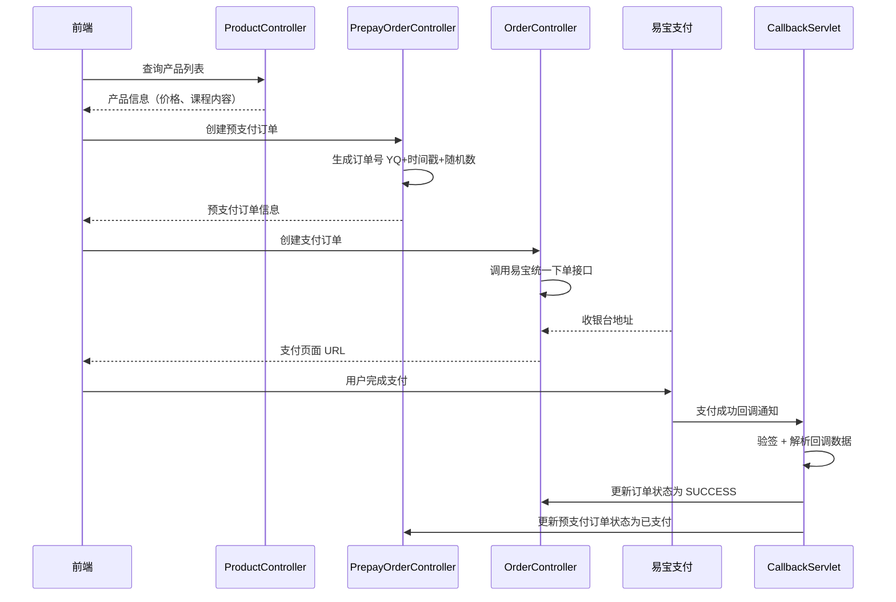

**文字流程图：**

```
┌─────────────────────────────────────────────────────────────────┐
│                        订单支付流程                                │
└─────────────────────────────────────────────────────────────────┘
                              │
                              ▼
                   ┌─────────────────────┐
                   │  1. 查询产品信息     │
                   │  ProductController  │
                   └─────────────────────┘
                              │
                              ▼
                   ┌─────────────────────┐
                   │  2. 创建预支付订单   │
                   │  PrepayOrderService │
                   │  - 生成唯一订单号   │
                   │  - 记录学生信息     │
                   │  - 状态: PENDING    │
                   └─────────────────────┘
                              │
                              ▼
                   ┌─────────────────────┐
                   │  3. 创建支付订单     │
                   │  调用易宝统一下单    │
                   │  YeepayCashierService│
                   └─────────────────────┘
                              │
                              ▼
                   ┌─────────────────────┐
                   │  4. 用户跳转支付页   │
                   │  易宝收银台         │
                   └─────────────────────┘
                              │
                              ▼
                   ┌─────────────────────┐
                   │  5. 支付成功回调     │
                   │  YeepayCallback     │
                   │  Servlet → Handle   │
                   └─────────────────────┘
                              │
                              ▼
                   ┌─────────────────────┐
                   │  6. 更新订单状态     │
                   │  Order: SUCCESS     │
                   │  Prepay: PAID       │
                   └─────────────────────┘
```

### 10.2 三层订单设计

**为什么分 Product、PrepayOrder、Order 三层？**

| 层级 | 实体 | 作用 | 生命周期 |
|------|------|------|----------|
| 产品 | ProductEntity | 定义可售卖的课程产品 | 长期存在 |
| 预支付订单 | PrepayOrderEntity | 学生下单前的意向记录 | 创建 → 支付/取消 |
| 支付订单 | OrderEntity | 实际支付记录 | 创建 → 支付中 → 成功/失败 |

**ProductEntity（产品表）：**
```java
@Data
public class ProductEntity {
    private Long id;
    private String courseContent;    // 课程内容
    private String teachingMode;     // 上课方式：ONLINE/OFFLINE
    private BigDecimal price;        // 产品价格
    private Date createdAt;
    private Date updatedAt;
}
```

**PrepayOrderEntity（预支付订单表）：**
```java
@Data
public class PrepayOrderEntity {
    private Long id;
    private String orderNo;           // 订单号：YQ + 时间戳 + 随机数
    private String studentName;       // 学生姓名
    private String studentPhone;      // 学生手机号
    private Long productId;           // 关联产品
    private BigDecimal productAmount; // 产品金额
    private BigDecimal discountAmount;// 优惠金额
    private String orderStatus;       // PENDING_PAYMENT / PAID / CANCELED
    private Date createdAt;
    private Date updatedAt;
}
```

**OrderEntity（支付订单表）：**
```java
@Data
public class OrderEntity {
    private Long id;
    private String orderNo;           // 支付订单号
    private String studentPhone;      // 学生手机号
    private String studentName;       // 学生姓名
    private String productId;         // 产品ID
    private BigDecimal orderAmount;   // 支付金额
    private String prepayOrderNo;     // 关联预支付订单号
    private String status;            // INIT / PROCESSING / SUCCESS / FAIL / TIMEOUT
    private String uniqueOrderNo;     // 支付渠道唯一订单号
    private Date paySuccessTime;      // 支付成功时间
    private Date createdAt;
    private Date updatedAt;
}
```

**为什么预支付订单和支付订单分开？**
- **预支付订单**：学生填完信息就创建，还没真正付款，可能取消
- **支付订单**：调用支付接口时创建，有真实的支付状态
- 一个预支付订单可以对应多次支付尝试（如第一次失败后重试）
- 解耦业务逻辑和支付逻辑，预支付订单不关心支付渠道

### 10.3 订单号生成策略

```java
private String createOrderNo() {
    String timestamp = new SimpleDateFormat("yyyyMMddHHmmssSSS").format(new Date());
    int random = SECURE_RANDOM.nextInt(900000) + 100000;  // 6位随机数
    return "YQ" + timestamp + random;
}
```

**订单号格式：** `YQ20260613143025123456789`

| 部分 | 说明 |
|------|------|
| YQ | 业务前缀（燕雀） |
| 20260613143025123 | 时间戳（精确到毫秒） |
| 456789 | 6位随机数 |

**为什么用时间戳+随机数而非数据库自增ID？**
- 自增ID可预测，存在安全风险（遍历ID获取所有订单）
- 时间戳保证全局递增，方便排序
- 随机数防止同一毫秒内多个订单号冲突
- `SecureRandom` 比 `Random` 更安全

### 10.4 易宝支付集成

**YeepayCashierService — 统一下单：**

```java
public YeepayUnifiedOrderRes unifiedOrder(YeepayUnifiedOrderReq req) {
    YopRequest request = new YopRequest("/rest/v1.0/cashier/unified/order", "POST");
    request.addParameter("parentMerchantNo", yeepayProperties.getParentMerchantNo());
    request.addParameter("merchantNo", yeepayProperties.getMerchantNo());
    request.addParameter("orderId", req.getOrderNo());
    request.addParameter("orderAmount", req.getOrderAmount());
    request.addParameter("goodsName", sysConfigService.get(SysConfig.createOrderGoodsName));
    request.addParameter("notifyUrl", yeepayProperties.getPaySuccessNotifyUrl());
    request.addParameter("expiredTime", ...);  // 订单过期时间
    request.addParameter("returnUrl", yeepayProperties.getPaySuccessReturnUrl());

    JSONObject result = yeepayGatewayService.request(request);
    return JSONObject.parseObject(result.toJSONString(), YeepayUnifiedOrderRes.class);
}
```

**为什么用配置类 `YeepayProperties` 而非直接读配置文件？**
```java
@ConfigurationProperties(prefix = "yeepay")
public class YeepayProperties {
    private String parentMerchantNo;
    private String merchantNo;
    private String paySuccessNotifyUrl;
    private String paySuccessReturnUrl;
}
```
- 类型安全：配置项有明确的类型和字段名
- IDE 支持：自动提示、校验
- 集中管理：所有易宝相关配置在一个类里

### 10.5 支付回调处理

**回调流程图：**

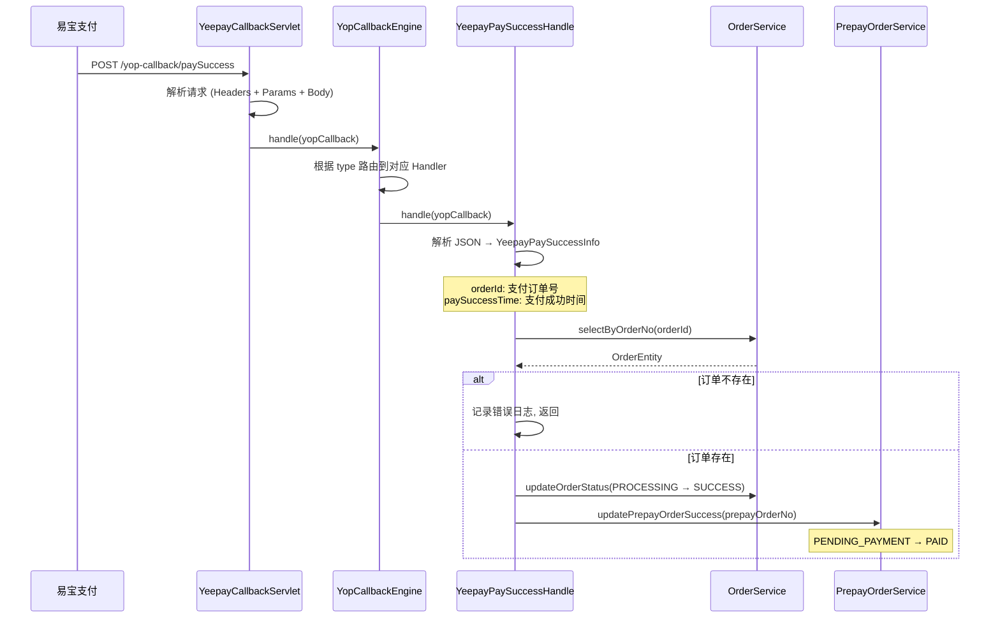

**核心代码：**
```java
@Override
public void handle(YopCallback yopCallback) {
    // 1. 解析回调数据
    YeepayPaySuccessInfo info = JSONObject.parseObject(
        yopCallback.getBizData(), YeepayPaySuccessInfo.class);

    // 2. 查询订单
    OrderEntity order = orderService.selectByOrderNo(info.getOrderId());
    if (order == null) {
        log.error("未查询到订单");
        return;
    }

    // 3. 更新支付订单状态: PROCESSING → SUCCESS
    Date paySuccessTime = DateUtil.parse(info.getPaySuccessDate(), ...);
    orderService.updateOrderStatus(new UpdateOrderStatusInfo(
        info.getOrderId(), 
        OrderStatusEnum.SUCCESS.name(),      // 新状态
        OrderStatusEnum.PROCESSING.name(),    // 旧状态（乐观锁）
        null, 
        paySuccessTime
    ));

    // 4. 更新预支付订单状态: PENDING_PAYMENT → PAID
    prepayOrderService.updatePrepayOrderSuccess(order.getPrepayOrderNo());
}
```

**为什么要更新两个表？**
| 表 | 字段 | 用途 |
|----|------|------|
| `order_payment` | status = SUCCESS | 支付订单状态，用于对账 |
| `prepay_order` | order_status = PAID | 预支付订单状态，前端展示 |

**为什么用乐观锁（带旧状态更新）？**
```sql
UPDATE order_payment 
SET status = 'SUCCESS', pay_success_time = ?
WHERE order_no = ? AND status = 'PROCESSING'  -- 只有当前是 PROCESSING 才更新
```
- 防止重复回调导致状态错误
- 如果已经是 SUCCESS，第二次回调不会更新任何行

**为什么用 Servlet 处理回调而非 Controller？**
- 易宝支付 SDK 要求使用 `YopCallbackEngine` 处理回调
- `YopCallbackEngine` 需要注册 `YopCallbackHandler`
- Servlet 更底层，可以直接处理请求头和请求体

**YeepayCallbackServlet 完整代码解析：**
```java
public class YeepayCallbackServlet extends HttpServlet {

    @Override
    protected void doPost(HttpServletRequest req, HttpServletResponse resp) throws IOException {
        try {
            // 1. 解析请求为 YopCallbackRequest
            YopCallbackRequest callbackRequest = resolve(req);
            // 2. 路由到对应 Handler 处理
            YopCallbackResponse callbackResponse = YopCallbackEngine.handle(callbackRequest);
            // 3. 写回响应给易宝
            writeResponse(resp, callbackResponse);
        } catch (Exception e) {
            log.error("error when handle yop callback", e);
            resp.sendError(HttpServletResponse.SC_INTERNAL_SERVER_ERROR, e.getMessage());
        }
    }

    private YopCallbackRequest resolve(HttpServletRequest req) throws IOException {
        Object content = null;
        YopContentType contentType;

        // 判断是 JSON 还是 Form 表单
        if (StringUtils.startsWith(req.getContentType(), "application/json")) {
            contentType = YopContentType.JSON;
            content = IOUtils.toString(req.getInputStream(), "UTF-8");  // 读取 Body
        } else {
            contentType = YopContentType.FORM_URL_ENCODE;
        }

        return new YopCallbackRequest(req.getRequestURI(), req.getMethod())
            .setContentType(contentType)
            .setHeaders(getHeaders(req))   // 请求头
            .setParams(getParams(req))     // 请求参数
            .setContent(content);          // 请求体
    }
}
```

**resolve() 方法解析了什么？**
| 组件 | 来源 | 用途 |
|------|------|------|
| `callbackType` | `req.getRequestURI()` | 路由到对应 Handler（如 `/yop-callback/paySuccess`） |
| `headers` | `req.getHeaderNames()` | 易宝签名验证 |
| `params` | `req.getParameterMap()` | 回调参数 |
| `content` | `req.getInputStream()` | 回调业务数据（JSON） |

**YopCallbackEngine 路由机制：**
```
URI: /yop-callback/paySuccess
  ↓
YopCallbackEngine 根据 URI 查找已注册的 Handler
  ↓
YeepayPaySuccessHandle.getType() 返回 "/yq-admin/yop-callback/paySuccess"
  ↓
匹配成功，调用 handle() 方法
```

**为什么这样写？设计决策解析：**

| 问题 | 设计决策 | 原因 |
|------|---------|------|
| 为什么用 Servlet 而非 Controller？ | 继承 `HttpServlet` | 易宝 SDK 的 `YopCallbackEngine.handle()` 需要原始 HTTP 请求信息，Controller 的 `@RequestBody` 会提前解析请求 |
| 为什么 `doGet()` 转发到 `doPost()`？ | 统一处理 | 防御性编程，易宝可能用 GET 或 POST 发送回调 |
| 为什么判断 Content-Type？ | 适配 JSON 和 Form | 易宝回调可能用两种格式，JSON 需手动读 `InputStream`，Form 由容器自动解析 |
| 为什么用 `req.getRequestURI()`？ | 一个 Servlet 处理所有回调 | 通过 URI 区分类型：`/paySuccess` → 支付成功，`/refund` → 退款 |
| 为什么转换 Headers 和 Params？ | 格式适配 | SDK 要求 `Map<String, String>` 和 `Map<String, List<String>>` |
| 为什么 `writeResponse()` 处理 null？ | 返回 200 OK | 某些回调不需要返回内容，避免易宝重复发送回调 |
| 为什么用 `getOutputStream()`？ | 支持二进制 | 比 `getWriter()` 更通用，编码可控 |

**整体设计模式：**
```
Servlet（适配器） → YopCallbackEngine（路由器） → Handler（业务处理）
```
- Servlet 只负责"翻译"，把 HTTP 请求转为 SDK 能理解的格式
- `YopCallbackEngine` 负责路由，根据 URI 找到对应 Handler
- Handler 负责业务逻辑（更新订单状态等）

**支付回调完整流程图：**

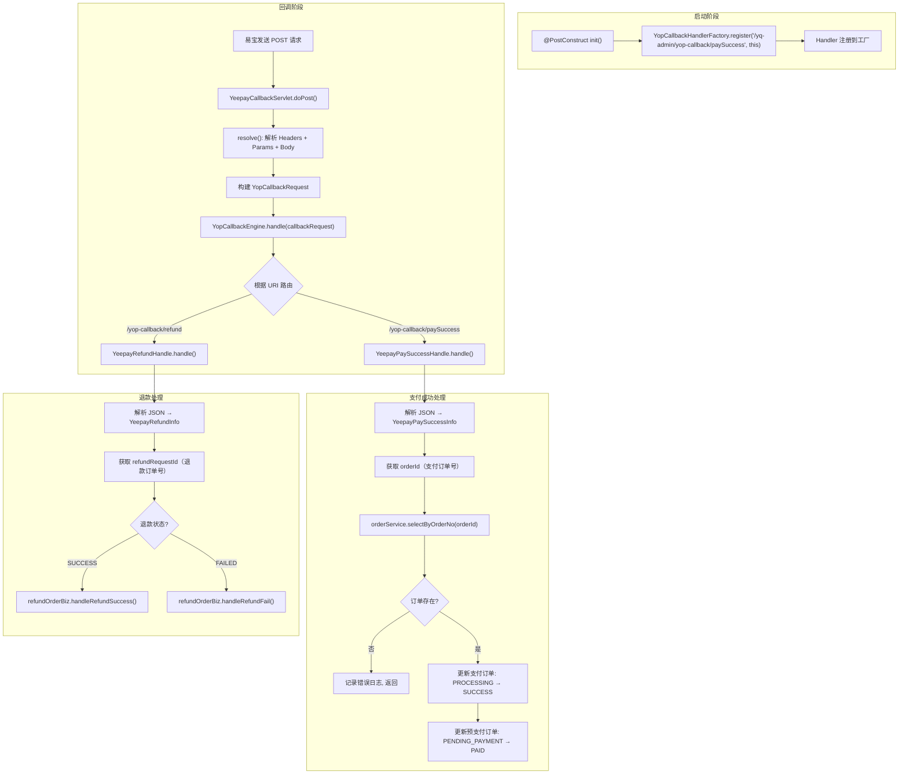

**用大白话解释整个流程：**

```
1. 应用启动时
   @PostConstruct → 把 Handler 注册到工厂
   工厂记录: "/yop-callback/paySuccess" → YeepayPaySuccessHandle
   工厂记录: "/yop-callback/refund" → YeepayRefundHandle

2. 学生支付成功后
   易宝服务器 → POST /yq-admin/yop-callback/paySuccess
   请求体: { "orderId": "YQ20260615...", "paySuccessDate": "2026-06-15 14:30:00" }

3. Servlet 接收请求
   resolve() → 解析为 YopCallbackRequest 对象
   包含: URI、Headers、Params、Body

4. Engine 路由
   YopCallbackEngine.handle() → 根据 URI 查找 Handler
   URI = "/yq-admin/yop-callback/paySuccess" → 找到 YeepayPaySuccessHandle

5. Handler 处理业务
   解析 JSON → 拿到 orderId
   查数据库 → 找到订单
   更新状态 → 支付订单 SUCCESS, 预支付订单 PAID

6. 返回响应
   Servlet 返回 200 OK → 易宝不再重发
```

**为什么回调处理要更新两个表？**
- 支付订单（Order）：记录支付状态，后续用于对账
- 预支付订单（PrepayOrder）：业务层关心的订单状态，前端展示用

### 10.6 订单状态机

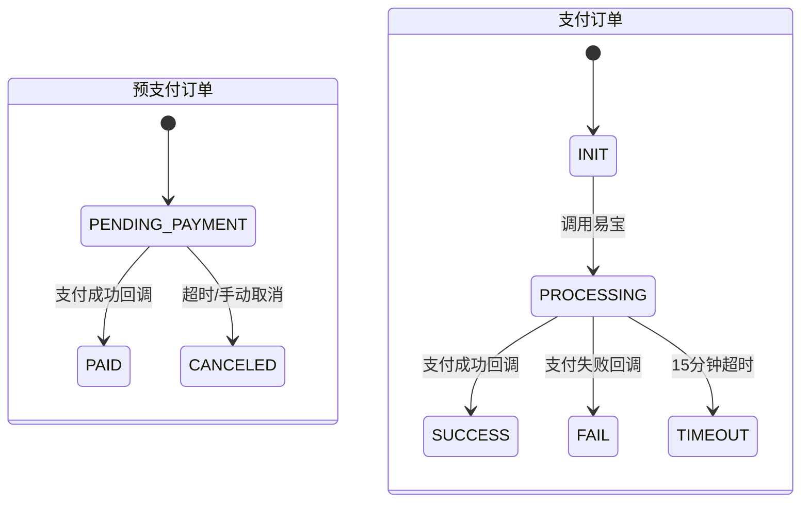

```
预支付订单状态：
  PENDING_PAYMENT（待支付）→ PAID（已支付）
  PENDING_PAYMENT（待支付）→ CANCELED（已取消）

支付订单状态：
  INIT（初始化）→ PROCESSING（支付中）→ SUCCESS（支付成功）
  INIT（初始化）→ PROCESSING（支付中）→ FAIL（支付失败）
  INIT（初始化）→ PROCESSING（支付中）→ TIMEOUT（超时）
```

**OrderStatusEnum 枚举：**
```java
public enum OrderStatusEnum {
    INIT("初始化"),
    FAIL("失败"),
    PROCESSING("支付中"),
    SUCCESS("支付成功"),
    TIMEOUT("超时");
}
```

**为什么更新状态时要带上旧状态？**
```java
orderService.updateOrderStatus(new UpdateOrderStatusInfo(
    orderId, OrderStatusEnum.SUCCESS.name(), OrderStatusEnum.PROCESSING.name(), ...));
```
- 乐观锁：只有当前状态是 PROCESSING 时才能更新为 SUCCESS
- 防止重复回调导致状态错误（如回调被触发两次）
- SQL 中用 `WHERE status = #{oldStatus}` 保证原子性

---

## 第 11 章：值班管理 — 教师排班系统

> 本章讲解值班管理模块的设计，展示如何处理复杂的业务规则校验和数据聚合。

### 11.1 值班类型设计

**DutyTypeEnum — 三种值班类型：**

```java
@Getter
@AllArgsConstructor
public enum DutyTypeEnum {
    EVENING_STUDY_CLASS("晚自习值班", "19:00", "21:00", true, false),
    EVENING_STUDY_CAMPUS("晚自习统一值班", "21:00", "22:30", false, true),
    SELF_STUDY_CLASS("自习日值班", "09:00", "18:00", true, false);

    private final String desc;
    private final String startTime;
    private final String endTime;
    private final boolean classRequired;   // 是否需要班级
    private final boolean campusRequired;  // 是否需要校区
}
```

| 类型 | 说明 | 粒度 | 时间段 |
|------|------|------|--------|
| EVENING_STUDY_CLASS | 晚自习值班 | 每班一个老师 | 19:00-21:00 |
| EVENING_STUDY_CAMPUS | 晚自习统一值班 | 每校区一个老师 | 21:00-22:30 |
| SELF_STUDY_CLASS | 自习日值班 | 每班一个老师 | 09:00-18:00 |

**为什么用枚举而非数据库配置？**
- 值班类型固定，不会频繁变更
- 枚举可以在编译期校验，避免运行时错误
- 每种类型有不同的业务规则（classRequired/campusRequired），枚举便于封装

### 11.2 值班实体设计

```java
@Data
public class ClassDutyEntity {
    private Long id;
    private Long classId;      // 班级ID（校区统一值班时可为空）
    private Long campusId;     // 校区ID
    private Long teacherId;    // 老师ID
    private Date dutyDate;     // 值班日期
    private String dutyType;   // 值班类型（枚举名）
    private String startTime;  // 开始时间
    private String endTime;    // 结束时间
    private String remark;     // 备注
    private Date createdAt;
    private Date updatedAt;
}
```

**为什么同时有 classId 和 campusId？**
- 班级值班（EVENING_STUDY_CLASS/SELF_STUDY_CLASS）：classId 必填，campusId 从班级自动获取
- 校区统一值班（EVENING_STUDY_CAMPUS）：campusId 必填，classId 为空
- 两个字段互斥，通过 `dutyType.isClassRequired()` 控制

### 11.3 业务规则校验

**校验流程图：**

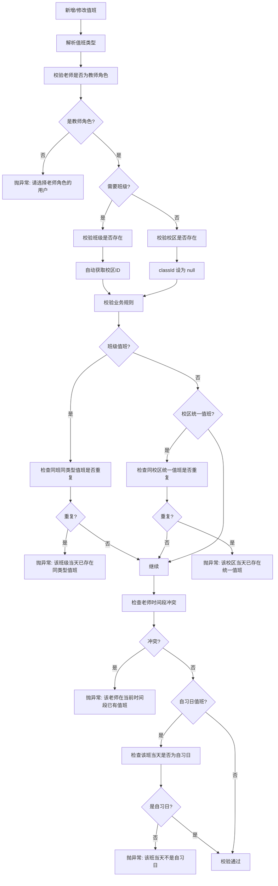

**文字流程图：**

```
┌─────────────────────────────────────────────────────────────────┐
│                      值班业务规则校验                               │
└─────────────────────────────────────────────────────────────────┘
                              │
                              ▼
                   ┌─────────────────────┐
                   │  1. 校验老师角色     │
                   │  必须是 TEACHER 角色 │
                   └─────────────────────┘
                              │
                              ▼
                   ┌─────────────────────┐
                   │  2. 校验班级/校区    │
                   │  根据 dutyType 判断  │
                   └─────────────────────┘
                              │
                              ▼
         ┌────────────────────┴────────────────────┐
         │                                         │
         ▼                                         ▼
┌─────────────────────┐                ┌─────────────────────┐
│  班级值班           │                │  校区统一值班       │
│  检查同班同类型重复  │                │  检查同校区重复     │
└─────────────────────┘                └─────────────────────┘
         │                                         │
         └────────────────────┬────────────────────┘
                              │
                              ▼
                   ┌─────────────────────┐
                   │  3. 老师时间段冲突   │
                   │  同一老师同一时间段  │
                   │  不能有多个值班     │
                   └─────────────────────┘
                              │
                              ▼
                   ┌─────────────────────┐
                   │  4. 自习日校验       │
                   │  自习日值班只能排在  │
                   │  课表标记为自习的天  │
                   └─────────────────────┘
```

**为什么自习日值班要检查课表？**
- 自习日值班的前提是"该班当天确实是自习日"
- 课表中标记了每天的类型（CLASS/SELF_STUDY/REST/HOLIDAY）
- 如果课表显示当天是上课日，就不能安排自习日值班

**SQL — 老师时间段冲突检测：**
```xml
<select id="countTeacherTimeConflict" resultType="java.lang.Integer">
    select count(1) from sys_class_duty
    where teacher_id = #{teacherId}
    and duty_date = #{dutyDate}
    and start_time &lt; #{endTime}
    and end_time &gt; #{startTime}
    <if test="id != null">and id != #{id}</if>
</select>
```

**为什么用时间范围重叠检测而非精确匹配？**
- 老师可能安排 19:00-21:00 的晚自习值班
- 同一天又安排 21:00-22:30 的统一值班
- 两个时间段刚好相邻（21:00），不算冲突
- 时间重叠条件：`start_time < endTime AND end_time > startTime`

### 11.4 按日期查询值班（getDateDuty）

**这是值班模块最复杂的查询，需要聚合多个数据源。**

**查询流程图：**

```mermaid
flowchart TD
    A[查询指定日期值班] --> B[查询当天所有课表]
    B --> C[过滤: 只保留上课日和自习日]
    C --> D[查询当天已有值班记录]

    D --> E[构建班级值班 Map]
    D --> F[构建校区值班 Map]

    E --> G[查询班级信息]
    F --> H[查询校区信息]
    G --> H

    H --> I[查询老师信息]
    I --> J[组装班级值班列表]

    J --> K[遍历课表]
    K --> L[判断课表类型: 上课日→晚自习值班, 自习日→自习日值班]
    L --> M[从 Map 中查找已有值班]
    M --> N[组装 ClassDutyClassItemRes]

    N --> O[组装校区值班列表]
    O --> P[遍历所有校区]
    P --> Q[从 Map 中查找已有值班]
    Q --> R[组装 ClassDutyCampusItemRes]

    R --> S[返回 ClassDutyDateRes]
```

**文字流程图：**

```
┌─────────────────────────────────────────────────────────────────┐
│                    按日期查询值班流程                                │
└─────────────────────────────────────────────────────────────────┘
                              │
                              ▼
                   ┌─────────────────────┐
                   │  查询当天所有课表    │
                   │  classSchedule      │
                   │  Mapper.selectBy... │
                   └─────────────────────┘
                              │
                              ▼
                   ┌─────────────────────┐
                   │  过滤课表类型        │
                   │  只保留:             │
                   │  CLASS + SELF_STUDY │
                   └─────────────────────┘
                              │
                              ▼
                   ┌─────────────────────┐
                   │  查询当天值班记录    │
                   │  classDutyMapper    │
                   │  .selectByDutyDate  │
                   └─────────────────────┘
                              │
              ┌───────────────┴───────────────┐
              ▼                               ▼
   ┌─────────────────────┐        ┌─────────────────────┐
   │  班级值班 Map        │        │  校区值班 Map        │
   │  key=classId:dutyType│        │  key=campusId       │
   └─────────────────────┘        └─────────────────────┘
              │                               │
              ▼                               ▼
   ┌─────────────────────┐        ┌─────────────────────┐
   │  批量查询班级信息    │        │  批量查询校区信息    │
   │  clazzMapper        │        │  campusMapper       │
   │  .selectByIds()     │        │  .selectByIds()     │
   └─────────────────────┘        └─────────────────────┘
              │                               │
              ▼                               ▼
   ┌─────────────────────┐        ┌─────────────────────┐
   │  组装班级值班列表    │        │  组装校区值班列表    │
   │  ClassDutyClassItem │        │  ClassDutyCampusItem│
   └─────────────────────┘        └─────────────────────┘
              │                               │
              └───────────────┬───────────────┘
                              ▼
                   ┌─────────────────────┐
                   │  返回 ClassDutyDateRes│
                   │  - dutyDate         │
                   │  - classDutyList    │
                   │  - campusDutyList   │
                   └─────────────────────┘
```

**为什么用 Map 缓存值班记录而非逐条查询？**
```java
Map<String, ClassDutyEntity> classDutyMap = duties.stream()
    .filter(item -> item.getClassId() != null)
    .collect(Collectors.toMap(
        item -> buildClassDutyKey(item.getClassId(), item.getDutyType()),
        Function.identity(), (a, b) -> b));
```
- 一个班级可能有多种值班类型（晚自习 + 自习日）
- 用 `classId:dutyType` 作为 key，精确定位
- 一次查询所有值班，用 Map 做内存关联，避免 N+1 查询

### 11.5 按日期保存值班（saveDateDuty）

**保存策略：先删后插，覆盖式保存。**

```java
@Transactional(rollbackFor = Exception.class)
public ClassDutyDateSaveRes saveDateDuty(ClassDutyDateSaveReq req) {
    Date day = DateUtil.beginOfDay(req.getDutyDate());

    // 1. 删除当天所有值班
    classDutyMapper.deleteByDutyDate(day);

    // 2. 重新插入班级值班
    for (ClassDutyItem item : req.getClassDutyList()) {
        ClassDutyEntity duty = buildDutyEntity(null, item.getClassId(), null,
            item.getTeacherId(), day, item.getDutyType(), null);
        classDutyMapper.insert(duty);
    }

    // 3. 重新插入校区值班
    for (CampusDutyItem item : req.getCampusDutyList()) {
        ClassDutyEntity duty = buildDutyEntity(null, null, item.getCampusId(),
            item.getTeacherId(), day, item.getDutyType(), null);
        classDutyMapper.insert(duty);
    }
}
```

**为什么用"先删后插"而非"逐条对比更新"？**
- 值班是按天管理的，一天的值班是一个整体
- 前端传的是当天的完整值班列表，不是增量
- 先删后插逻辑简单，事务保证一致性
- 如果用对比更新，需要处理"删除的值班"、"新增的值班"、"修改的值班"三种情况

**为什么校区统一值班要校验类型？**
```java
if (!DutyTypeEnum.EVENING_STUDY_CAMPUS.name().equals(item.getDutyType())) {
    throw BusinessException.DateError.newInstance("校区统一值班类型错误");
}
```
- 校区统一值班只能是 `EVENING_STUDY_CAMPUS` 类型
- 防止前端传错类型导致数据混乱
- 业务规则：校区级别只管晚自习统一值班，其他值班都是班级级别的

### 11.6 数据聚合：fillDutyPageNames

```java
private void fillDutyPageNames(List<ClassDutyPageRes> records) {
    // 批量查询班级、校区、老师信息
    Map<Long, ClazzEntity> clazzMap = ...;
    Map<Long, CampusEntity> campusMap = ...;
    Map<Long, SysUserEntity> userMap = ...;

    // 填充名称字段
    records.forEach(record -> {
        ClazzEntity clazz = clazzMap.get(record.getClassId());
        if (clazz != null) {
            record.setClassPeriod(clazz.getClassPeriod());
        }
        CampusEntity campus = campusMap.get(record.getCampusId());
        if (campus != null) {
            record.setCampusName(campus.getCampusLocation());
        }
        SysUserEntity user = userMap.get(record.getTeacherId());
        if (user != null) {
            record.setTeacherName(user.getNickname() != null ? user.getNickname() : user.getUsername());
        }
    });
}
```

**为什么不在 SQL 里 JOIN？**
- 各模块独立演进，JOIN 会增加模块间耦合
- 单表查询更简单，便于优化和缓存
- Service 层用 Java 代码组装，逻辑更清晰
- 批量查询 + Map 组装，性能与 JOIN 相当

**为什么老师名称优先用 nickname？**
```java
user.getNickname() != null ? user.getNickname() : user.getUsername()
```
- `fillDutyPageNames` 中直接用 `nickname` 作为老师显示名
- 如果没有昵称，降级用用户名
- 另有 `getUserShowName()` 方法优先用 `realName`，用于其他场景

---

## 第 12 章：学生端 — 学生管理与前台业务

> 本章讲解学生模块的设计，以及学生端前台业务（登录、下单、完善资料）的完整流程。

### 12.1 学生模块结构

```
student/
├── controller/StudentController.java           ← 后台管理接口（分页查询）
├── mapper/
│   ├── StudentMapper.java                      ← 学生数据访问
│   └── StudentProductMapper.java               ← 学生产品关联
├── pojo/
│   ├── bo/QueryStudentBo.java                  ← 查询条件
│   ├── entity/
│   │   ├── StudentEntity.java                  ← 学生实体
│   │   └── StudentProductEntity.java           ← 学生-产品关联
│   └── vo/
│       ├── req/StudentPageReq.java             ← 分页请求
│       └── res/StudentPageRes.java             ← 分页响应
└── service/
    ├── StudentService.java                     ← 学生服务接口
    ├── StudentProductService.java              ← 学生产品服务
    └── impl/
        ├── StudentServiceImpl.java             ← 学生服务实现
        └── StudentProductServiceImpl.java      ← 学生产品实现
```

**StudentEntity — 学生实体：**
```java
@Data
public class StudentEntity {
    private Long id;
    private String studentNo;      // 学员编号：STU + 时间戳 + 随机数
    private String studentName;    // 姓名
    private String studentPhone;   // 手机号（登录凭证）
    private String password;       // 登录密码
    private String education;      // 学历
    private Integer gradeYear;     // 届数
    private String school;         // 学校
    private String major;          // 专业
    private String status;         // ACTIVE/INACTIVE
}
```

**StudentProductEntity — 学生产品关联：**
```java
@Data
public class StudentProductEntity {
    private Long id;
    private Long studentId;        // 学生ID
    private String productId;      // 产品ID
    private String sourceOrderNo;  // 来源支付订单号
    private String status;         // 状态
}
```

**为什么需要 StudentProduct 关联表？**
- 学生购买产品后，需要记录"哪个学生买了哪个产品"
- `sourceOrderNo` 记录来源订单，方便对账和溯源
- 一个学生可以购买多个产品，一个产品可以被多个学生购买（多对多）

### 12.2 学生端前台架构

学生端前台（`studentFront/`）是独立于后台管理的模块，面向学生用户：

```
studentFront/
├── biz/                                    ← 业务编排层（跨模块协调）
│   ├── StudentOrderBiz.java
│   └── impl/StudentOrderBizImpl.java
├── controller/
│   ├── StudentFrontOrderController.java    ← 学生订单接口
│   └── StudentFrontProfileController.java  ← 学生资料接口
├── pojo/
│   ├── req/                                ← 请求对象
│   └── res/                                ← 响应对象
└── service/
    ├── StudentFrontService.java            ← 学生登录服务
    ├── StudentFrontProfileService.java     ← 学生资料服务
    └── impl/
```

**为什么学生端单独一个 `studentFront` 包，不放在 `models/student` 里？**
- `models/student` 是后台管理用的（管理员查学生列表）
- `studentFront` 是学生自己用的（登录、下单、完善资料）
- 两套接口的认证方式不同：后台用 RBAC 权限，学生端用学生 JWT
- 分开后职责清晰，互不影响

### 12.3 学生登录 — 双重身份判断

**登录流程图：**

```mermaid
flowchart TD
    A[学生输入手机号+密码] --> B[查询学生表]
    B --> C{学生存在?}
    C -- 是 --> D[校验状态和密码]
    D --> E[生成JWT, 返回学生信息]
    C -- 否 --> F[查询预支付订单]

    F --> G{有待支付订单?}
    G -- 是 --> H[返回待支付订单信息]
    H --> I[前端跳转支付页面]
    G -- 否 --> J[返回错误: 用户名不存在]
```

**核心逻辑：**
```java
public StudentLoginRes login(StudentLoginReq req) {
    // 1. 先查学生表
    StudentEntity student = studentMapper.selectByPhone(req.getPhone());
    if (student != null) {
        // 已注册学生 → 正常登录
        return buildLoginRes(student);
    }

    // 2. 学生不存在，查是否有待支付订单
    PrepayOrderEntity pendingOrder = prepayOrderMapper
        .selectLatestByPhoneAndStatus(req.getPhone(), "PENDING_PAYMENT");
    if (pendingOrder != null) {
        // 有待支付订单 → 提示需要先支付
        return buildNeedPayRes(pendingOrder);
    }

    // 3. 都没有 → 报错
    throw BusinessException.PasswordError.newInstance("用户名不存在");
}
```

**为什么要先查学生表再查订单表？**
- 场景：学生下单后还没支付，这时用手机号登录
- 如果只查学生表，会报"用户不存在"，体验差
- 查订单表后可以提示"您有待支付订单"，引导完成支付

**学生 JWT 与管理员 JWT 的区别：**
```java
// 学生 JWT payload
map.put("uid", student.getId());
map.put("phone", student.getStudentPhone());
map.put("student", true);              // 标记是学生身份
map.put("expire_time", ...);

// 管理员 JWT payload
map.put("uid", sysUserEntity.getId());
map.put("expire_time", ...);
```
- 学生 JWT 多了 `phone` 和 `student: true` 字段
- 后续拦截器可以通过 `student` 字段判断是学生还是管理员

### 12.4 学生下单 — 支付流程

**下单流程图：**

```mermaid
sequenceDiagram
    participant S as 学生前端
    participant OC as StudentFrontOrderController
    participant OB as StudentOrderBiz
    participant OS as OrderService
    participant YC as YeepayCashierService
    participant Y as 易宝支付

    S->>OC: POST /createOrderNo
    OC->>OB: 生成订单号
    OB-->>S: 订单号

    S->>OC: POST /createPaymentOrder
    OC->>OB: createPaymentOrder(req)
    OB->>OS: saveOrder (状态: INIT)
    OB->>YC: unifiedOrder (调用易宝)
    YC->>Y: 请求收银台
    Y-->>YC: 收银台地址
    OB->>OS: updateOrderStatus (INIT → PROCESSING)
    OB->>OB: scheduleOrderTimeoutCheck (15分钟超时)
    OB-->>S: 收银台地址
    S->>Y: 跳转支付
```

**超时检测机制：**
```java
private void scheduleOrderTimeoutCheck(String orderNo) {
    ThreadPoolConfig.getScheduledPool().schedule(() -> {
        OrderEntity latestOrder = orderService.selectByOrderNo(orderNo);
        if (latestOrder == null || !OrderStatusEnum.PROCESSING.name().equals(latestOrder.getStatus())) {
            return;  // 已经不是支付中状态，不用处理
        }
        // 15分钟后仍是 PROCESSING → 标记为超时
        orderService.updateOrderStatus(new UpdateOrderStatusInfo(
            orderNo, OrderStatusEnum.TIMEOUT.name(), OrderStatusEnum.PROCESSING.name(), null, null));
    }, 15, TimeUnit.MINUTES);
}
```

**为什么用定时任务而非数据库轮询？**
- 定时任务是内存级别的，15分钟后自动触发，不需要额外的定时器服务
- 只检查一次，如果状态已变更（支付成功/失败）就跳过
- `PROCESSING → TIMEOUT` 是乐观锁更新，防止与支付回调并发冲突

### 12.5 支付成功后完善资料

**完善资料流程图：**

```mermaid
flowchart TD
    A[支付成功] --> B[跳转到完善资料页面]
    B --> C[学生填写: 密码、学历、届数、学校、专业]
    C --> D[POST /completeProfile]

    D --> E[校验密码一致性]
    E --> F[查询支付订单]
    F --> G{订单存在且已支付?}
    G -- 否 --> H[返回错误]
    G -- 是 --> I[创建学生账号]

    I --> J[创建学生产品关联]
    J --> K[返回学生ID]
```

**核心逻辑：**
```java
@Transactional(rollbackFor = Exception.class)
public CompleteStudentProfileRes completeProfile(CompleteStudentProfileReq req) {
    // 1. 校验密码
    if (!req.getPassword().equals(req.getConfirmPassword())) {
        throw BusinessException.ParamsError.newInstance("两次输入的密码不一致");
    }

    // 2. 校验订单
    OrderEntity order = orderService.selectByOrderNo(req.getOrderNo());
    if (!OrderStatusEnum.SUCCESS.name().equals(order.getStatus())) {
        throw BusinessException.DateError.newInstance("订单未支付成功");
    }

    // 3. 创建学生（订单里的姓名和手机号自动填充）
    StudentEntity student = new StudentEntity();
    student.setStudentName(order.getStudentName());
    student.setStudentPhone(order.getStudentPhone());
    student.setPassword(req.getPassword());
    // ... 学历、届数、学校、专业
    StudentEntity createdStudent = studentService.createStudent(student);

    // 4. 创建学生-产品关联
    StudentProductEntity studentProduct = new StudentProductEntity();
    studentProduct.setStudentId(createdStudent.getId());
    studentProduct.setProductId(order.getProductId());
    studentProduct.setSourceOrderNo(order.getOrderNo());
    studentProductService.createStudentProduct(studentProduct);
}
```

**为什么学生姓名和手机号从订单取，不让学生填？**
- 下单时已经填过姓名和手机号了
- 避免学生填写不一致（下单填张三，注册填李四）
- 数据来源统一，以订单为准

**为什么创建学生和创建关联要在同一个事务？**
- 如果学生创建成功但关联失败，学生就"孤立"了（有账号但没产品）
- 如果关联创建成功但学生失败，关联就引用了不存在的学生
- 事务保证两者要么都成功，要么都回滚

### 12.6 学生端 vs 后台管理 对比

| 维度 | 后台管理（models/） | 学生端（studentFront/） |
|------|---------------------|------------------------|
| 用户 | 管理员 | 学生 |
| 认证 | JWT + 签名 + RBAC 权限 | 简单 JWT（无签名） |
| 接口前缀 | /api/... | /api/studentFront/... |
| 业务层 | Controller → Service | Controller → Biz → Service |
| 数据隔离 | 可看所有数据 | 只看自己的数据 |

**为什么学生端多了 Biz 层？**
- 学生下单涉及：创建订单 → 调用易宝 → 更新状态 → 超时检测
- 这些逻辑跨多个 Service，需要一个编排层
- Biz（Business）层负责协调多个 Service，单个 Service 保持原子性

### 12.7 学生分配班级

```mermaid
flowchart TD
    A[管理员选择学生] --> B[选择目标班级]
    B --> C[PUT /student/id/class]
    C --> D[校验学生存在]
    D --> E[校验班级存在]
    E --> F[更新学生 classId]
    F --> G[返回成功]

    G --> H[学生可查看该班级作业]
    G --> I[学生可查看该班级课表]
```

```java
@PutMapping("{id}/class")
public ApiResponse<StudentAssignClassRes> assignClass(@PathVariable Long id,
                                                      @Valid @RequestBody StudentAssignClassReq req) {
    return ApiResponse.success(studentService.assignClass(id, req));
}
```

学生购买产品后，管理员需要把学生分配到具体班级。学生有了 `classId` 后才能查看该班级的作业、课表等信息。

### 12.8 学生端认证：独立的拦截器体系

学生端和后台管理使用**两套独立的拦截器链**：

```
后台管理拦截器链：
  JwtAuthInterceptor → SignInterceptor → PermissionInterceptor

学生端拦截器链：
  StudentJwtAuthInterceptor（单独一套）
```

**StudentJwtAuthInterceptor 与 JwtAuthInterceptor 的区别：**

| 维度 | JwtAuthInterceptor | StudentJwtAuthInterceptor |
|------|--------------------|-----------------------------|
| JWT payload | uid, expire_time | uid, phone, student:true, expire_time |
| 额外校验 | 无 | 检查 student:true 标记 |
| 用户信息 | 存入 request.setAttribute | 存入 StudentThreadLocal |
| 权限校验 | 有（PermissionInterceptor） | 无（学生只看自己的数据） |

**StudentThreadLocal — 线程级学生上下文：**
```java
public class StudentThreadLocal {
    private static ThreadLocal<StudentEntity> studentEntityThreadLocal = new ThreadLocal<>();

    public static StudentEntity get() { return studentEntityThreadLocal.get(); }
    public static void set(StudentEntity student) { studentEntityThreadLocal.set(student); }
    public static void remove() { studentEntityThreadLocal.remove(); }
}
```

- 拦截器解析 JWT 后，查询学生完整信息存入 ThreadLocal
- Service 层通过 `StudentThreadLocal.get()` 直接获取当前学生，不用重复查询
- `afterCompletion` 中清理 ThreadLocal，防止线程复用导致数据污染

**为什么学生端不用签名验证（SignInterceptor）？**
- 学生端是 H5 页面，签名逻辑对前端实现成本较高
- 学生只能看自己的数据，安全风险相对较低
- 后台管理是内部系统，签名防篡改更有必要

---

## 第 13 章：作业系统 — 教师发布与学生提交

> 本章讲解作业系统的完整生命周期：教师发布作业 → 学生提交 → 教师批改 → 发布答案。

### 13.1 作业系统架构

```
作业生命周期：
  教师发布作业 → 学生查看 → 学生提交 → 教师批改 → 教师发布答案 → 学生查看答案
```

**核心实体关系：**
```
HomeworkEntity（作业）
    ├── classId → 班级
    ├── homeworkDate → 作业日期
    ├── contentObjectKey → 作业文件（OSS）
    ├── answerObjectKey → 答案文件（OSS）
    └── deadline → 截止时间

HomeworkSubmissionEntity（学生提交）
    ├── homeworkId → 关联作业
    ├── studentId → 关联学生
    ├── classId → 关联班级
    ├── contentObjectKey → 提交文件（OSS）
    ├── submitTime → 提交时间
    ├── lateSubmitted → 是否迟交
    ├── score → 分数
    └── teacherRemark → 教师评语
```

**为什么作业和提交分成两张表？**
- 一份作业对应多个学生提交（一对多）
- 作业信息（标题、文件、截止时间）只存一份
- 每个学生独立提交、独立批改

### 13.2 教师端：发布作业

```mermaid
flowchart TD
    A[教师填写作业信息] --> B[预填接口 prepareHomework]
    B --> C[校验班级存在]
    C --> D{同班同天已有作业?}
    D -- 是 --> E[抛异常: 该班级当天作业已存在]
    D -- 否 --> F[查询当天课表]

    F --> G{当天有课表?}
    G -- 否 --> H[抛异常: 该班级当天没有课表]
    G -- 是 --> I[自动填充课程内容]

    I --> J[校验截止时间]
    J --> K{截止时间 < 开始时间?}
    K -- 是 --> L[抛异常: 截止时间不能早于开始时间]
    K -- 否 --> M[创建作业记录]

    M --> N[返回作业ID]
```

**发布流程：**
```java
public HomeworkCreateRes addHomework(HomeworkCreateReq req) {
    // 1. 校验班级存在
    ClazzEntity clazz = validateClass(req.getClassId());

    // 2. 同班同天只能有一份作业
    validateHomeworkNotExists(req.getClassId(), homeworkDate);

    // 3. 从课表获取当天课程内容（自动填充）
    ClassScheduleEntity schedule = getSchedule(req.getClassId(), homeworkDate);

    // 4. 校验截止时间
    if (req.getDeadline().before(req.getStartTime())) {
        throw BusinessException.DateError.newInstance("截止时间不能早于开始时间");
    }

    // 5. 创建作业（课程内容从课表自动获取）
    homework.setClassContent(schedule.getCourseContent());
    homeworkMapper.insert(homework);
}
```

**关键设计：**
- **同班同天唯一**：`validateHomeworkNotExists` 检查同一班级同一天不能重复发布
- **课程内容自动填充**：从课表获取，不让老师手动维护
- **预填接口**：`prepareHomework` 提供预填信息（班期、日期、默认标题），前端直接展示

### 13.3 教师端：发布答案与批改

```mermaid
flowchart TD
    subgraph 发布答案
        A1[教师上传答案文件] --> A2[设置是否对学生可见]
        A2 --> A3[更新作业答案信息]
        A3 --> A4[answerStudentVisible 控制可见性]
    end

    subgraph 批改作业
        B1[教师查看学生提交列表] --> B2[选择提交记录]
        B2 --> B3[填写分数和评语]
        B3 --> B4[更新 score + teacherRemark]
        B4 --> B5[不影响学生原始提交文件]
    end
```

**发布答案：**
```java
public HomeworkPublishAnswerRes publishAnswer(Long id, HomeworkPublishAnswerReq req) {
    homework.setAnswerObjectKey(req.getAnswerObjectKey());  // 答案文件
    homework.setAnswerFileName(req.getAnswerFileName());
    homework.setAnswerStudentVisible(req.getAnswerStudentVisible()); // 是否对学生可见
    homeworkMapper.updateAnswer(homework);
}
```

- 答案发布后，通过 `answerStudentVisible` 控制学生是否能看到
- 教师可以先发布作业，等学生都提交后再发布答案

**批改作业：**
```java
public HomeworkSubmissionGradeRes gradeSubmission(Long submissionId, HomeworkSubmissionGradeReq req) {
    submission.setScore(req.getScore());           // 分数
    submission.setTeacherRemark(req.getTeacherRemark()); // 评语
    homeworkSubmissionMapper.updateGrade(submission);
}
```

- 批改只更新 `score` 和 `teacherRemark`，不影响学生提交的原始文件
- 用 `updateGrade` 而非 `updateById`，明确只更新批改相关字段

### 13.4 学生端：查看与提交作业

```mermaid
flowchart TD
    subgraph 查看作业
        A1[学生打开作业列表] --> A2[从 ThreadLocal 获取当前学生]
        A2 --> A3{已分配班级?}
        A3 -- 否 --> A4[返回空列表]
        A3 -- 是 --> A5[查询班级作业列表]
        A5 --> A6[批量查询我的提交状态]
        A6 --> A7[组装: 作业信息 + 提交状态]
    end

    subgraph 提交作业
        B1[学生上传 .md 文件到 OSS] --> B2[POST 提交作业]
        B2 --> B3{已过截止时间?}
        B3 -- 是 --> B4[抛异常: 作业已截止]
        B3 -- 否 --> B5[校验文件路径安全]
        B5 --> B6{路径合法?}
        B6 -- 否 --> B7[抛异常: 提交文件路径不合法]
        B6 -- 是 --> B8{已有提交记录?}
        B8 -- 否 --> B9[插入新提交记录]
        B8 -- 是 --> B10[覆盖更新提交记录]
    end
```

**学生查看作业列表：**
```java
public PageResult<StudentHomeworkPageRes> pageHomework(StudentHomeworkPageReq req) {
    StudentEntity student = StudentThreadLocal.get();  // 从 ThreadLocal 获取当前学生
    if (student.getClassId() == null) {
        return emptyResult;  // 未分配班级的学生看不到作业
    }

    List<HomeworkEntity> list = homeworkMapper.selectStudentPage(student.getClassId(), new Date());

    // 批量查询当前学生的提交状态
    Map<Long, HomeworkSubmissionEntity> submissionMap = buildSubmissionMap(list, student.getId());

    // 组装：作业信息 + 我的提交状态
    list.stream().map(item -> buildHomeworkRes(item, submissionMap.get(item.getId())));
}
```

**为什么用 `buildSubmissionMap` 而非 SQL JOIN？**
- 分页查询以 homework 为主表，保持 SQL 简单
- 提交状态按当前学生批量补齐，避免分页 SQL 做不必要的关联
- 同一个学生的多条作业提交一次性查出来，用 Map 关联

**学生提交作业：**
```java
public StudentHomeworkSubmitRes submitHomework(Long homeworkId, StudentHomeworkSubmitReq req) {
    // 1. 校验截止时间
    if (homework.getDeadline() != null && now.after(homework.getDeadline())) {
        throw BusinessException.DateError.newInstance("作业已截止，不能提交");
    }

    // 2. 校验文件路径（只能提交到自己的目录）
    validateSubmissionObjectKey(req.getObjectKey(), homeworkId, student.getId());

    // 3. 一个学生一份作业只保留一条记录（重新提交覆盖）
    HomeworkSubmissionEntity submission = homeworkSubmissionMapper
        .selectByHomeworkIdAndStudentId(homeworkId, student.getId());
    if (submission == null) {
        homeworkSubmissionMapper.insert(submission);   // 首次提交
    } else {
        homeworkSubmissionMapper.updateSubmit(submission); // 重新提交
    }
}
```

**文件路径安全校验：**
```java
private void validateSubmissionObjectKey(String objectKey, Long homeworkId, Long studentId) {
    // 只允许 .md 格式
    if (!objectKey.trim().toLowerCase().endsWith(".md")) {
        throw BusinessException.DateError.newInstance("提交文件只支持md格式");
    }
    // 必须落在自己的作业目录下
    String expectedPrefix = "homework/submission/" + homeworkId + "/" + studentId + "/";
    if (!objectKey.startsWith(expectedPrefix) || objectKey.contains("..")) {
        throw BusinessException.DateError.newInstance("提交文件路径不合法");
    }
}
```

- 防止学生用别人的 objectKey 覆盖提交记录
- 防止路径穿越攻击（`..`）
- 只允许 `.md` 格式，统一提交规范

### 13.5 作业系统数据流

```mermaid
flowchart TD
    subgraph 教师端
        A[发布作业] --> B[学生提交]
        B --> C[教师批改]
        C --> D[发布答案]
    end

    subgraph 学生端
        E[查看作业列表] --> F[下载作业内容]
        F --> G[提交作业文件]
        G --> H[查看分数和评语]
        D --> I[查看答案]
    end
```

---

## 第 14 章：退款流程 — 易宝退款集成

> 本章讲解退款订单的设计和易宝退款的集成方式。

### 14.1 退款流程

```mermaid
sequenceDiagram
    participant A as 管理员
    participant C as RefundOrderController
    participant B as RefundOrderBiz
    participant O as OrderService
    participant Y as 易宝支付

    A->>C: POST /createRefundOrder (生成退款单号)
    C-->>A: 退款单号

    A->>C: POST /applyRefund (申请退款)
    C->>B: applyRefund(refundOrderNo, req)
    B->>O: 查询原支付订单
    B->>B: 保存退款单 (状态: INIT)
    B->>O: 增加已退金额
    B->>Y: 调用易宝退款接口
    Y-->>B: 退款流水号
    B->>B: 更新退款单状态为 PROCESSING

    Y->>B: 退款成功回调
    B->>B: 更新退款单状态为 SUCCESS
```

### 14.2 退款订单实体

```mermaid
stateDiagram-v2
    [*] --> INIT: 创建退款单
    INIT --> PROCESSING: 调用易宝退款接口
    INIT --> FAIL: 参数校验失败
    PROCESSING --> SUCCESS: 易宝退款成功回调
    PROCESSING --> FAIL: 易宝退款失败回调

    note right of INIT: 保存退款单, 增加已退金额
    note right of FAIL: 回退已退金额
```

```java
@Data
public class RefundOrderEntity {
    private Long id;
    private String refundOrderNo;    // 退款单号
    private String paymentOrderNo;   // 原支付订单号
    private BigDecimal paymentAmount;// 原支付金额
    private BigDecimal refundAmount; // 退款金额
    private String status;           // INIT/PROCESSING/SUCCESS/FAIL
    private String reason;           // 退款原因
    private String uniqueRefundNo;   // 易宝退款流水号
    private String failReason;       // 失败原因
    private Date refundSuccessTime;  // 退款成功时间
}
```

### 14.3 退款核心逻辑

**申请退款（applyRefund）：**
```java
public RefundApplyRes applyRefund(String refundOrderNo, RefundApplyReq req) {
    // 1. 校验原订单（必须是支付成功的订单）
    OrderEntity order = getRefundablePaymentOrder(req.getPaymentOrderNo());

    // 2. 保存退款单（幂等：重复请求返回已有退款单）
    RefundOrderEntity existed = saveApplyingRefundOrder(refundOrderNo, req, order);
    if (existed != null) return buildRefundApplyRes(existed);

    // 3. 增加原订单已退金额
    orderService.increaseRefundedAmount(order.getOrderNo(), req.getRefundAmount());

    // 4. 调用易宝退款
    YeepayRefundRes res = yeepayCashierService.refund(yeepayRefundReq);

    // 5. 更新退款单状态为 PROCESSING
    refundOrderService.updateRefundProcessing(refundOrderNo, ...);
}
```

**为什么退款失败要"回退已退金额"？**
```java
try {
    yeepayRefundRes = requestYeepayRefund(order, refundOrderNo, req);
} catch (Exception e) {
    orderService.decreaseRefundedAmount(order.getOrderNo(), req.getRefundAmount()); // 回退
    refundOrderService.updateRefundFail(refundOrderNo, ...);
    throw BusinessException.RemoteError.newInstance("申请退款失败");
}
```
- 第 3 步增加了已退金额，如果易宝调用失败，需要回退
- 保证已退金额的准确性，防止退款失败但金额已被占用

### 14.4 退款状态机

```
INIT（初始化）→ PROCESSING（退款中）→ SUCCESS（退款成功）
INIT（初始化）→ FAIL（退款失败）
PROCESSING（退款中）→ FAIL（退款失败）
```

**退款失败回调（回退已退金额）：**
```java
public void handleRefundFail(String refundOrderNo, String failReason) {
    refundOrderService.updateRefundFail(refundOrderNo, PROCESSING, failReason);
    orderService.decreaseRefundedAmount(refundOrder.getPaymentOrderNo(), refundOrder.getRefundAmount());
}
```

- 退款失败时，回退原订单的已退金额，恢复退款额度
- 乐观锁：只有当前状态是 PROCESSING 才能更新为 FAIL

---

## 第 15 章：Docker 部署 — 容器化构建与运行

> 本章讲解如何将 Spring Boot 项目打包为 Docker 镜像，实现一键部署。

### 15.1 Dockerfile 多阶段构建

```mermaid
flowchart LR
    subgraph Stage1 [构建阶段: maven:3.9.9-eclipse-temurin-17]
        A[复制 settings.xml] --> B[复制 pom.xml]
        B --> C[mvn dependency:go-offline]
        C --> D[复制 src 源码]
        D --> E[mvn package -DskipTests]
    end

    subgraph Stage2 [运行阶段: eclipse-temurin:17-jre]
        F[复制 jar 包] --> G[设置环境变量]
        G --> H[暴露 8080 端口]
        H --> I[java -jar 启动]
    end

    E --> F
```

**Dockerfile 完整代码：**
```dockerfile
# ===== 构建阶段 =====
FROM maven:3.9.9-eclipse-temurin-17 AS builder
WORKDIR /app
COPY settings.xml /root/.m2/settings.xml   # 阿里云 Maven 镜像加速
COPY pom.xml .
RUN mvn -B dependency:go-offline            # 先下载依赖（利用 Docker 缓存层）
COPY src ./src
RUN mvn -B -DskipTests package              # 编译打包

# ===== 运行阶段 =====
FROM eclipse-temurin:17-jre
WORKDIR /app
ENV SPRING_PROFILES_ACTIVE=prod             # 激活生产环境配置
ENV JAVA_OPTS="-Xms256m -Xmx512m"          # JVM 内存参数
COPY --from=builder /app/target/*.jar /app/yanque-admin.jar
EXPOSE 8080
ENTRYPOINT ["sh", "-c", "java $JAVA_OPTS -jar /app/yanque-admin.jar"]
```

**为什么用多阶段构建？**
- 构建阶段用 `maven` 镜像（~800MB），包含完整的 Maven + JDK
- 运行阶段用 `eclipse-temurin:17-jre`（~200MB），只有 JRE，体积小 75%
- 最终镜像不包含源码、编译中间产物，安全性更高

**为什么先复制 `pom.xml` 再 `dependency:go-offline`？**
```dockerfile
COPY pom.xml .
RUN mvn -B dependency:go-offline    # 第一层缓存：依赖下载
COPY src ./src
RUN mvn -B -DskipTests package      # 第二层：编译打包
```
- Docker 按层缓存，`pom.xml` 不变时依赖下载层直接复用缓存
- 只有改了 `pom.xml`（加减依赖）才会重新下载
- 如果一次性复制所有文件，改一行代码就要重新下载所有依赖

### 15.2 Maven 镜像加速 — settings.xml

```xml
<settings>
  <mirrors>
    <mirror>
      <id>aliyunmaven</id>
      <mirrorOf>*</mirrorOf>
      <name>Aliyun Maven</name>
      <url>https://maven.aliyun.com/repository/public</url>
    </mirror>
  </mirrors>
</settings>
```

- 默认 Maven 中央仓库在海外，国内下载慢
- 阿里云镜像同步了 Maven 中央仓库，下载速度提升 10 倍以上
- 通过 `COPY settings.xml /root/.m2/settings.xml` 注入到构建阶段

### 15.3 .dockerignore — 排除不需要的文件

```
.git
.idea
target
logs
*.log
*.iml
Dockerfile
.dockerignore
```

**为什么需要 .dockerignore？**
- `COPY . .` 会复制当前目录所有文件到 Docker 上下文
- `.git` 可能有几百 MB，`target/` 是编译产物，都不需要
- 排除后 Docker 构建上下文更小，构建速度更快

### 15.4 运行时环境变量

| 变量 | 说明 | 默认值 |
|------|------|--------|
| `SPRING_PROFILES_ACTIVE` | 激活的配置文件 | `prod` |
| `JAVA_OPTS` | JVM 参数 | `-Xms256m -Xmx512m` |

**如何覆盖环境变量？**
```bash
# 运行时指定生产数据库
docker run -e SPRING_PROFILES_ACTIVE=prod \
           -e JAVA_OPTS="-Xms512m -Xmx1g" \
           -p 8080:8080 \
           yanque-admin
```

### 15.5 构建与运行命令

```bash
# 构建镜像
docker build -t yanque-admin .

# 运行容器
docker run -d -p 8080:8080 --name yanque-admin yanque-admin

# 查看日志
docker logs -f yanque-admin

# 停止容器
docker stop yanque-admin
```

---

## 第 16 章：考试系统 — 题库、组卷与在线考试

> 本章讲解考试系统的完整生命周期：题库管理 → 组卷 → 创建考试 → 学生答题 → 自动判分 → 教师批改。

### 16.1 考试系统架构

**考试系统模块结构：**

```
exam/
├── question/          ← 题库管理
│   ├── entity/        ExamQuestionEntity, ExamQuestionOptionEntity, ExamQuestionCourseEntity
│   ├── mapper/        ExamQuestionMapper, ExamQuestionOptionMapper, ExamQuestionCourseMapper
│   ├── service/       ExamQuestionService
│   └── controller/    ExamQuestionController
├── paper/             ← 试卷管理
│   ├── entity/        ExamPaperEntity, ExamPaperQuestionEntity
│   ├── mapper/        ExamPaperMapper, ExamPaperQuestionMapper
│   ├── service/       ExamPaperService
│   └── controller/    ExamPaperController
└── exam/              ← 考试管理
    ├── entity/        ExamEntity, StudentExamRecordEntity, StudentExamAnswerEntity
    ├── mapper/        ExamMapper, StudentExamRecordMapper, StudentExamAnswerMapper
    ├── service/       ExamService
    └── controller/    ExamController

studentFront/
└── StudentExamController + StudentExamService   ← 学生端考试
```

**核心实体关系：**

```mermaid
erDiagram
    ExamQuestion ||--o{ ExamQuestionOption : "has"
    ExamQuestion ||--o{ ExamQuestionCourse : "belongs to"
    ExamPaper ||--o{ ExamPaperQuestion : "contains"
    ExamPaperQuestion }o--|| ExamQuestion : "references"
    Exam ||--|| ExamPaper : "uses"
    Exam ||--o{ StudentExamRecord : "has"
    StudentExamRecord ||--o{ StudentExamAnswer : "has"
    StudentExamAnswer }o--|| ExamQuestion : "answers"
```

**数据流：**

```mermaid
flowchart TD
    A[题库管理] --> B[试卷管理]
    B --> C[考试管理]
    C --> D[学生考试]
    D --> E[自动判分]
    E --> F[教师批改]
    F --> G[公布成绩]
```

### 16.2 题库管理（ExamQuestion）

**题型设计：**

| 题型 | 枚举值 | 选项 | 自动判分 |
|------|--------|------|----------|
| 单选题 | SINGLE | 有 | 自动 |
| 多选题 | MULTIPLE | 有 | 自动 |
| 判断题 | JUDGE | 有 | 自动 |
| 填空题 | FILL | 无 | 手动 |
| 简答题 | SHORT | 无 | 手动 |
| 编程题 | PROGRAMMING | 无 | 手动 |

**难度等级：**

```java
VERY_EASY("很简单"), EASY("简单"), NORMAL("普通"), HARD("困难"), VERY_HARD("很困难")
```

**题目实体：**

```java
@Data
public class ExamQuestionEntity {
    private Long id;
    private String questionType;      // SINGLE/MULTIPLE/JUDGE/FILL/SHORT/PROGRAMMING
    private String questionContent;   // 题干
    private String answerContent;     // 正确答案
    private String analysisContent;   // 答案解析
    private String difficulty;        // VERY_EASY/EASY/NORMAL/HARD/VERY_HARD
    private String status;            // ENABLED/DISABLED
}
```

**题目与课程关联：**

```java
@Data
public class ExamQuestionCourseEntity {
    private Long id;
    private Long questionId;    // 题目ID
    private Long courseId;      // 课程ID
    private String stageName;   // 阶段名称（可为空）
}
```

**为什么题目要关联课程和阶段？**
- 一个题目可以属于多个课程（通用题）
- 按课程+阶段筛选题目，方便组卷
- 支持"Java基础阶段"、"AI阶段"等不同维度的题库

**创建题目核心逻辑：**

```java
@Transactional(rollbackFor = Exception.class)
public Long createQuestion(ExamQuestionEntity question, 
                           List<ExamQuestionCourseEntity> courseStages,
                           List<ExamQuestionOptionEntity> options) {
    validateCourseStages(courseStages);     // 校验课程阶段
    questionMapper.insert(question);        // 插入题目
    saveQuestionCourses(question.getId(), courseStages, now);  // 关联课程
    saveOptions(question.getId(), options, now);               // 保存选项
    return question.getId();
}
```

**为什么创建题目要同时保存课程关联和选项？**
- 题目、课程关联、选项是原子操作，必须在同一个事务
- 如果题目创建成功但选项保存失败，题目就"残缺"了
- 先删后插模式：更新时先删除旧关联，再插入新关联

### 16.3 试卷管理（ExamPaper）

**试卷实体：**

```java
@Data
public class ExamPaperEntity {
    private Long id;
    private String paperName;      // 试卷名称
    private Long courseId;         // 关联课程
    private String stageName;      // 阶段名称（可为空，表示整门课程）
    private BigDecimal totalScore; // 总分数
}
```

**试卷-题目关联：**

```java
@Data
public class ExamPaperQuestionEntity {
    private Long id;
    private Long paperId;          // 试卷ID
    private Long questionId;       // 题目ID
    private BigDecimal questionScore; // 该题分值
}
```

**为什么每题分值存在关联表而非题目表？**
- 同一道题在不同试卷中分值可能不同
- 试卷的总分 = 所有题目分值之和
- 分值是试卷的属性，不是题目的属性

**组卷流程图：**

```mermaid
flowchart TD
    A[创建试卷] --> B[设置试卷名称]
    B --> C[关联课程和阶段]
    C --> D[从题库选题]
    D --> E[设置每题分值]
    E --> F[计算总分]
    F --> G[保存试卷]
```

### 16.4 考试管理（Exam）

**考试实体：**

```java
@Data
public class ExamEntity {
    private Long id;
    private Long paperId;             // 试卷ID
    private Long classId;             // 班级ID
    private Date startTime;           // 可进入考试开始时间
    private Date endTime;             // 可进入考试截止时间
    private Integer durationMinutes;  // 学生个人答题时长（分钟）
    private Long invigilatorUserId;   // 监考老师ID
    private Boolean answerVisible;    // 是否向学生公布答案
}
```

**为什么考试有两个时间概念？**
- **考试时间窗口**（startTime ~ endTime）：学生可以进入考试的时间范围
- **个人答题时长**（durationMinutes）：学生进入后有多少分钟答题

**示例：**
- 考试时间窗口：2026-06-15 09:00 ~ 2026-06-15 18:00（全天可进入）
- 个人答题时长：120 分钟
- 学生 A 在 09:30 进入 → 截止时间 11:30
- 学生 B 在 14:00 进入 → 截止时间 16:00

**考试时间窗口重叠检测：**

```java
private void validateExam(ExamEntity exam) {
    // 校验试卷存在
    // 校验班级存在
    // 校验监考老师存在
    // 检测同一班级考试时间窗口重叠
    if (examMapper.countClassTimeOverlap(exam.getId(), exam.getClassId(), 
            exam.getStartTime(), exam.getEndTime()) > 0) {
        throw BusinessException.DateError.newInstance("该班级考试时间窗口存在重叠");
    }
}
```

**为什么同一班级不能有重叠的考试时间窗口？**
- 避免学生同时面对两场考试
- 时间窗口重叠意味着学生可能在一场考试未结束时进入另一场
- 检测 SQL：`WHERE class_id = ? AND start_time < #{endTime} AND end_time > #{startTime}`

### 16.5 学生端考试流程

**学生考试状态机：**

```mermaid
stateDiagram-v2
    [*] --> NOT_STARTED: 考试未开始
    NOT_STARTED --> AVAILABLE: 到达开始时间
    AVAILABLE --> IN_PROGRESS: 学生进入考试
    IN_PROGRESS --> SUBMITTED: 学生交卷
    IN_PROGRESS --> TIMEOUT: 超过截止时间

    note right of IN_PROGRESS: 创建考试记录<br/>计算个人截止时间
    note right of SUBMITTED: 客观题自动判分<br/>主观题待批改
```

**学生考试列表状态：**

| 状态 | 显示 | 可否进入 |
|------|------|----------|
| NOT_STARTED | 未开始 | 否 |
| AVAILABLE | 可开始 | 是 |
| IN_PROGRESS | 进行中 | 是（继续答题） |
| SUBMITTED | 已提交/已批改/待批改 | 否 |
| TIMEOUT | 已超时 | 否 |
| ENDED | 已结束 | 否 |

**开始考试流程图：**

```mermaid
flowchart TD
    A[学生点击开始考试] --> B[查询学生信息]
    B --> C[校验学生属于该班级]
    C --> D[查询考试信息]
    D --> E{考试是否在时间窗口内?}

    E -- 未开始 --> F[抛异常: 考试暂未开始]
    E -- 已结束 --> G[抛异常: 考试进入时间已结束]
    E -- 在窗口内 --> H{已有考试记录?}

    H -- 是 --> I{记录状态?}
    I -- SUBMITTED --> J[抛异常: 考试已提交]
    I -- IN_PROGRESS + 超时 --> K[抛异常: 考试已超时]
    I -- IN_PROGRESS --> L[返回已有记录]

    H -- 否 --> M[创建考试记录]
    M --> N[计算个人截止时间]
    N --> O[返回考试信息]
```

**开始考试核心代码：**

```java
@Transactional(rollbackFor = Exception.class)
public StudentExamStartRes startExam(Long examId) {
    StudentEntity student = validateStudent(StudentThreadLocal.get().getId());
    ExamEntity exam = validateStudentExam(student, examId);
    Date now = new Date();

    // 校验时间窗口
    if (exam.getStartTime().after(now)) throw ...;
    if (exam.getEndTime().before(now)) throw ...;

    // 查询已有记录
    StudentExamRecordEntity record = studentExamRecordMapper
        .selectByExamIdAndStudentId(examId, student.getId());
    if (record != null) {
        // 已有记录 → 检查状态
        if (STATUS_SUBMITTED.equals(record.getStatus())) throw ...;
        if (record.getDeadlineTime().before(now)) throw ...;
        return buildStartRes(exam, record);
    }

    // 首次进入 → 创建记录
    record = new StudentExamRecordEntity();
    record.setExamId(examId);
    record.setStudentId(student.getId());
    record.setStartTime(now);
    record.setDeadlineTime(buildDeadlineTime(now, exam));  // 计算截止时间
    record.setStatus(STATUS_IN_PROGRESS);
    record.setGradingStatus(GRADING_STATUS_PENDING);
    studentExamRecordMapper.insert(record);
    return buildStartRes(exam, record);
}
```

**截止时间计算逻辑：**

```java
private Date buildDeadlineTime(Date startTime, ExamEntity exam) {
    Calendar calendar = Calendar.getInstance();
    calendar.setTime(startTime);
    calendar.add(Calendar.MINUTE, exam.getDurationMinutes());
    Date personalDeadline = calendar.getTime();
    // 取 个人截止时间 和 考试结束时间 的较小值
    return personalDeadline.after(exam.getEndTime()) ? exam.getEndTime() : personalDeadline;
}
```

- 学生 A 在 17:00 进入，答题时长 120 分钟 → 个人截止 19:00
- 但考试结束时间是 18:00 → 实际截止 18:00

### 16.6 答题与交卷

**获取试卷（不含答案）：**

```java
public StudentExamPaperRes getExamPaper(Long recordId) {
    // 校验学生身份、考试记录、是否超时
    // 查询试卷信息
    // 查询题目列表（只返回题干和选项，不返回正确答案）
    StudentExamPaperRes res = new StudentExamPaperRes();
    res.setQuestions(buildPaperQuestions(paper.getId()));
    return res;
}
```

**为什么获取试卷时不返回正确答案？**
- 防止学生通过查看接口获取答案
- 答案只在交卷后、且 `answerVisible = true` 时才返回

**交卷流程图：**

```mermaid
flowchart TD
    A[学生点击交卷] --> B[校验学生身份]
    B --> C[校验考试记录]
    C --> D{已提交?}
    D -- 是 --> E[抛异常: 已提交]
    D -- 否 --> F{已超时?}

    F -- 是 --> G[抛异常: 已超时不能交卷]
    F -- 否 --> H[查询试卷题目]
    H --> I[校验提交的题目属于该试卷]
    I --> J[遍历每道题]

    J --> K{题目类型?}
    K -- 客观题 --> L[自动判分]
    K -- 主观题 --> M[标记待批改]

    L --> N[组装答题记录]
    M --> N
    N --> O[批量保存答题记录]
    O --> P[更新考试记录状态]
    P --> Q[返回结果]
```

**交卷核心代码：**

```java
@Transactional(rollbackFor = Exception.class)
public StudentExamSubmitRes submitExam(Long recordId, StudentExamSubmitReq req) {
    // 1. 校验学生、记录、时间
    // 2. 查询试卷题目
    // 3. 校验提交的题目属于该试卷
    // 4. 查询题目详情
    // 5. 组装答题记录（含自动判分）
    List<StudentExamAnswerEntity> answers = paperQuestions.stream()
        .map(paperQuestion -> buildExamAnswer(record, exam, paperQuestion, 
            questionMap.get(paperQuestion.getQuestionId()),
            answerMap.get(paperQuestion.getQuestionId()), now))
        .toList();

    // 6. 批量保存
    studentExamAnswerMapper.deleteByRecordId(recordId);
    studentExamAnswerMapper.insertBatch(answers);

    // 7. 更新记录状态
    record.setStatus(STATUS_SUBMITTED);
    record.setGradingStatus(buildGradingStatus(answers));  // 全客观题→COMPLETED, 否则→PENDING
    record.setScore(totalScore);
    studentExamRecordMapper.updateSubmit(record);
}
```

### 16.7 自动判分机制

**客观题自动判分：**

```java
private void fillAutoScore(StudentExamAnswerEntity answer, ExamQuestionEntity question) {
    if (!OBJECTIVE_QUESTION_TYPES.contains(question.getQuestionType())) {
        // 主观题：不自动判分，score 和 correct 设为 null
        answer.setCorrect(null);
        answer.setScore(null);
        return;
    }
    // 客观题：比较答案
    boolean correct = normalizeAnswer(answer.getAnswerContent())
        .equals(normalizeAnswer(question.getAnswerContent()));
    answer.setCorrect(correct);
    answer.setScore(correct ? answer.getQuestionScore() : BigDecimal.ZERO);
}
```

**答案标准化处理：**

```java
private String normalizeAnswer(String value) {
    if (!StringUtils.hasText(value)) return "";
    return Arrays.stream(value.split("[,，]"))   // 按逗号分割
        .map(String::trim)                        // 去空格
        .filter(StringUtils::hasText)             // 过滤空串
        .map(String::toUpperCase)                 // 转大写
        .sorted()                                 // 排序
        .collect(Collectors.joining(","));         // 重新拼接
}
```

**为什么答案要标准化？**
- 多选题答案可能是 `"A,B"` 或 `"B,A"` 或 `"a，b"`
- 标准化后统一为 `"A,B"`，避免格式差异导致误判
- 排序保证 `"A,B"` 和 `"B,A"` 判定为相同答案

**批改状态判断：**

```java
private String buildGradingStatus(List<StudentExamAnswerEntity> answers) {
    boolean allObjective = answers.stream()
        .allMatch(answer -> OBJECTIVE_QUESTION_TYPES.contains(answer.getQuestionType()));
    return allObjective ? GRADING_STATUS_COMPLETED : GRADING_STATUS_PENDING;
}
```

- 全是客观题 → 自动判分完成，状态为 `COMPLETED`
- 有主观题 → 需要教师批改，状态为 `PENDING`

### 16.8 教师批改

**查看学生提交列表：**

```java
public PageResult<ExamSubmissionPageRes> pageSubmissions(Long examId, Integer pageNum, Integer pageSize) {
    ExamEntity exam = getRequiredExam(examId);
    // 分页查询该班级的所有学生
    List<StudentEntity> students = studentMapper.selectByClassId(exam.getClassId());
    // 查询该考试的所有记录
    Map<Long, StudentExamRecordEntity> recordMap = studentExamRecordMapper
        .selectByExamId(examId).stream()
        .collect(Collectors.toMap(StudentExamRecordEntity::getStudentId, Function.identity()));
    // 组装：学生信息 + 考试记录
    return students.stream()
        .map(student -> buildSubmissionPageRes(exam, student, recordMap.get(student.getId()), now))
        .toList();
}
```

**学生提交状态显示：**

| 记录状态 | 批改状态 | 显示 |
|----------|----------|------|
| null | - | 未参加/未进入 |
| IN_PROGRESS + 超时 | - | 已超时 |
| IN_PROGRESS | - | 进行中 |
| SUBMITTED | PENDING | 待批改 |
| SUBMITTED | COMPLETED | 已批改 |

**批改主观题：**

```java
@Transactional(rollbackFor = Exception.class)
public ExamSubmissionGradeRes gradeSubmission(Long recordId, ExamSubmissionGradeReq req) {
    // 1. 校验考试记录已提交
    // 2. 遍历每道题的批改结果
    for (ExamSubmissionGradeAnswerReq answerReq : req.getAnswers()) {
        // 客观题不能手动批改
        if (OBJECTIVE_QUESTION_TYPES.contains(answer.getQuestionType())) {
            throw BusinessException.DateError.newInstance("客观题由系统自动判分，不能手动批改");
        }
        // 分数不能超过题目分值
        if (answerReq.getScore().compareTo(answer.getQuestionScore()) > 0) {
            throw BusinessException.DateError.newInstance("题目得分不能超过题目分值");
        }
        answer.setScore(answerReq.getScore());
        studentExamAnswerMapper.updateScore(answer);
    }

    // 3. 重新计算总分
    BigDecimal totalScore = latestAnswers.stream()
        .map(StudentExamAnswerEntity::getScore)
        .filter(Objects::nonNull)
        .reduce(BigDecimal.ZERO, BigDecimal::add);

    // 4. 判断批改状态（所有题都有分数 → COMPLETED）
    String gradingStatus = latestAnswers.stream().allMatch(answer -> answer.getScore() != null)
        ? GRADING_STATUS_COMPLETED : GRADING_STATUS_PENDING;

    // 5. 更新记录
    record.setScore(totalScore);
    record.setGradingStatus(gradingStatus);
    studentExamRecordMapper.updateGrade(record);
}
```

**为什么批改后要重新计算总分？**
- 总分 = 客观题自动得分 + 主观题教师给分
- 每次批改后重新求和，保证总分准确
- 支持分批批改（先批改简答，再批改编程题）

### 16.9 答案可见性控制

**`answerVisible` 字段的作用：**

```java
// 学生查看答卷时
boolean answerVisible = Boolean.TRUE.equals(exam.getAnswerVisible());
res.setScore(answerVisible ? record.getScore() : null);  // 不公布时隐藏分数

// 构建题目列表时
if (answerVisible) {
    res.setCorrect(answer.getCorrect());   // 公布时才显示是否正确
    res.setScore(answer.getScore());       // 公布时才显示题目得分
}
```

| answerVisible | 学生看到 |
|---------------|----------|
| false | 只看到自己的答案，看不到分数和正确答案 |
| true | 看到自己的答案 + 分数 + 正确答案 + 解析 |

**为什么需要这个控制？**
- 考试期间公布答案会导致泄题
- 教师可以等所有学生考完后再统一公布
- 支持"先批改，后公布"的灵活流程

### 16.10 数据聚合与 N+1 优化

**考试列表查询优化：**

```java
private void fillNames(List<? extends ExamPageRes> records) {
    // 批量查询试卷、班级、老师信息
    Map<Long, ExamPaperEntity> paperMap = paperIds.stream()
        .map(examPaperMapper::selectById)
        .filter(paper -> paper != null)
        .collect(Collectors.toMap(ExamPaperEntity::getId, Function.identity()));
    Map<Long, ClazzEntity> classMap = clazzMapper.selectByIds(classIds).stream()
        .collect(Collectors.toMap(ClazzEntity::getId, Function.identity()));
    Map<Long, SysUserEntity> userMap = sysUserMapper.selectByIds(userIds).stream()
        .collect(Collectors.toMap(SysUserEntity::getId, Function.identity()));

    // 填充名称字段（带空值保护）
    records.forEach(record -> {
        ExamPaperEntity paper = paperMap.get(record.getPaperId());
        ClazzEntity clazz = classMap.get(record.getClassId());
        SysUserEntity user = userMap.get(record.getInvigilatorUserId());
        record.setPaperName(paper == null ? null : paper.getPaperName());
        record.setClassPeriod(clazz == null ? null : clazz.getClassPeriod());
        record.setInvigilatorName(user == null ? null : buildUserName(user));
    });
}
```

**试卷题目查询优化：**

```java
private List<StudentExamPaperQuestionRes> buildPaperQuestions(Long paperId) {
    // 1. 查询试卷题目关联
    List<ExamPaperQuestionEntity> paperQuestions = examPaperQuestionMapper.selectByPaperId(paperId);
    // 2. 批量查询题目详情（避免 N+1）
    Map<Long, ExamQuestionEntity> questionMap = examQuestionMapper.selectByIds(questionIds).stream()
        .collect(Collectors.toMap(ExamQuestionEntity::getId, Function.identity()));
    // 3. 批量查询选项（避免 N+1）
    Map<Long, List<ExamQuestionOptionEntity>> optionMap = examQuestionOptionMapper
        .selectByQuestionIds(questionIds).stream()
        .collect(Collectors.groupingBy(ExamQuestionOptionEntity::getQuestionId));
    // 4. 组装结果
    return paperQuestions.stream().map(paperQuestion -> {
        ExamQuestionEntity question = questionMap.get(paperQuestion.getQuestionId());
        // ... 组装
    }).toList();
}
```

**为什么批量查询 + Map 是最优模式？**
- 10 道题逐个查询 = 10 次数据库往返
- 批量查询 = 1 次数据库往返
- Map 查找复杂度 O(1)，总性能与 JOIN 相当

### 16.11 考试系统 Mapper 方法汇总

| 方法 | 作用 | 使用场景 |
|------|------|----------|
| `ExamQuestionMapper.insert` | 插入题目 | 创建题目 |
| `ExamQuestionMapper.selectPage` | 分页查询题库 | 题库列表 |
| `ExamQuestionOptionMapper.selectByQuestionIds` | 批量查询选项 | 试卷题目展示 |
| `ExamQuestionCourseMapper.deleteByQuestionId` | 删除课程关联 | 更新题目 |
| `ExamPaperMapper.insert` | 插入试卷 | 创建试卷 |
| `ExamPaperQuestionMapper.selectByPaperId` | 查询试卷题目 | 组卷、考试 |
| `ExamMapper.insert` | 插入考试 | 创建考试 |
| `ExamMapper.countClassTimeOverlap` | 时间窗口重叠检测 | 创建考试校验 |
| `ExamMapper.selectStudentPage` | 学生端考试列表 | 学生端 |
| `StudentExamRecordMapper.insert` | 插入考试记录 | 开始考试 |
| `StudentExamRecordMapper.selectByExamIdAndStudentId` | 查询学生考试记录 | 开始考试 |
| `StudentExamAnswerMapper.insertBatch` | 批量插入答题 | 交卷 |
| `StudentExamAnswerMapper.selectByRecordId` | 查询答题记录 | 查看答卷、批改 |
| `StudentExamAnswerMapper.updateScore` | 更新题目分数 | 教师批改 |
| `StudentExamRecordMapper.updateSubmit` | 更新提交状态 | 交卷 |
| `StudentExamRecordMapper.updateGrade` | 更新批改结果 | 教师批改 |

### 16.12 考试系统流程图

**完整考试流程：**

```mermaid
sequenceDiagram
    participant T as 教师/管理员
    participant Q as 题库管理
    participant P as 试卷管理
    participant E as 考试管理
    participant S as 学生端
    participant G as 批改系统

    T->>Q: 创建题目（单选/多选/判断/简答等）
    Q-->>T: 题目ID

    T->>P: 创建试卷，选题组卷
    P-->>T: 试卷ID

    T->>E: 创建考试（试卷+班级+时间+时长）
    E->>E: 校验时间窗口不重叠
    E-->>T: 考试ID

    S->>S: 查看考试列表
    S->>S: 开始考试（创建记录，计算截止时间）
    S->>S: 获取试卷（题目+选项，不含答案）
    S->>S: 交卷（客观题自动判分）

    T->>G: 查看学生提交列表
    T->>G: 批改主观题
    G->>G: 重新计算总分

    T->>E: 设置 answerVisible = true
    S->>S: 查看答卷（答案+分数+解析）
```

---

## 第 17 章：学生 SOP 与学习计划 — 标准化流程与个性化规划

> 本章讲解学生 SOP（标准操作流程）和学习计划的设计，展示如何为学生建立标准化的入学流程和个性化的学习路径。

### 17.1 学生 SOP（StudentSop）

**什么是学生 SOP？**

SOP（Standard Operating Procedure）是学生入学的标准操作流程，包括：
- 观看入学视频
- 完成 SOP 录制
- 分配导师
- 建立学习计划

**SOP 状态机：**

```mermaid
stateDiagram-v2
    [*] --> ASSIGNED: 管理员分配SOP
    ASSIGNED --> COMPLETED: 学生完成SOP

    note right of ASSIGNED: 分配导师、设置SOP视频
    note right of COMPLETED: 上传完成视频、记录时间
```

**SOP 实体：**

```java
@Data
public class StudentSopEntity {
    private Long id;
    private Long studentId;         // 学生ID
    private Long mentorId;          // 导师ID
    private String status;          // ASSIGNED/COMPLETED
    private String sopVideoObjectKey;   // SOP视频文件（OSS）
    private String sopVideoFileName;    // 视频文件名
    private Date sopTime;           // SOP完成时间
    private Date createdAt;
    private Date updatedAt;
}
```

**为什么需要 SOP？**
- 标准化学生入学流程，确保每个学生都完成必要的准备
- 导师可以跟踪学生 SOP 完成状态
- SOP 完成后才能创建学习计划

### 17.2 学习计划（StudentLearningPlan）

**学习计划是什么？**

为线上学生制定个性化的学习路径，将课程拆分为多个阶段，每个阶段分配天数。

**核心实体关系：**

```mermaid
erDiagram
    StudentSop ||--o| StudentLearningPlan : "完成后可创建"
    StudentLearningPlan ||--o{ StudentLearningCalendar : "生成日历"
    StudentLearningPlan }o--|| Course : "关联课程"
    StudentLearningPlan }o--|| Student : "关联学生"

    StudentLearningPlan {
        Long id
        Long studentId
        Long courseId
        Long sopId
        Date startDate
        String status
    }

    StudentLearningCalendar {
        Long id
        Long planId
        Date studyDate
        String stageName
        Integer dayIndex
        String status
    }
```

**学习计划创建流程图：**

```mermaid
flowchart TD
    A[管理员创建学习计划] --> B[校验SOP已完成]
    B --> C{SOP状态?}
    C -- 未完成 --> D[抛异常: 只有完成SOP后才能定制学习计划]
    C -- 已完成 --> E[校验学生是线上学员]

    E --> F{是线上学员?}
    F -- 否 --> G[抛异常: 只有线上学员可以定制学习计划]
    F -- 是 --> H{已有生效计划?}

    H -- 是 --> I[抛异常: 该学员已有生效学习计划]
    H -- 否 --> J[校验课程是线上课程]

    J --> K[校验阶段配置]
    K --> L[创建学习计划]
    L --> M[生成学习日历]
    M --> N[返回计划ID和日历数量]
```

**为什么学习计划只针对线上学员？**
- 线下学员有固定的上课时间表，不需要额外的学习计划
- 线上学员需要自主安排学习进度，学习计划提供指导

### 17.3 学习日历生成算法

**核心逻辑：**

```java
private List<StudentLearningCalendarEntity> buildCalendars(
        StudentLearningPlanEntity plan, 
        List<StudentLearningPlanStageReq> stages) {
    List<StudentLearningCalendarEntity> list = new ArrayList<>();
    int dayIndex = 1;
    for (StudentLearningPlanStageReq stage : stages) {
        for (int stageDayIndex = 1; stageDayIndex <= stage.getStageDays(); stageDayIndex++) {
            StudentLearningCalendarEntity calendar = new StudentLearningCalendarEntity();
            calendar.setPlanId(plan.getId());
            calendar.setStudentId(plan.getStudentId());
            calendar.setStudyDate(addDays(plan.getStartDate(), dayIndex - 1));
            calendar.setStageName(stage.getStageName());
            calendar.setDayIndex(dayIndex);           // 全局天序号
            calendar.setStageDayIndex(stageDayIndex); // 阶段内天序号
            calendar.setStatus("TODO");
            list.add(calendar);
            dayIndex++;
        }
    }
    return list;
}
```

**示例：**

假设课程有 3 个阶段：
- Java 基础：10 天
- 数据库：5 天
- 项目实战：15 天

学习开始日期：2026-06-17

生成的日历：

| dayIndex | stageName | stageDayIndex | studyDate |
|----------|-----------|---------------|-----------|
| 1 | Java 基础 | 1 | 2026-06-17 |
| 2 | Java 基础 | 2 | 2026-06-18 |
| ... | ... | ... | ... |
| 10 | Java 基础 | 10 | 2026-06-26 |
| 11 | 数据库 | 1 | 2026-06-27 |
| ... | ... | ... | ... |
| 15 | 数据库 | 5 | 2026-07-01 |
| 16 | 项目实战 | 1 | 2026-07-02 |
| ... | ... | ... | ... |
| 30 | 项目实战 | 15 | 2026-07-16 |

**为什么用 dayIndex 和 stageDayIndex 两个序号？**
- `dayIndex`：全局序号，用于展示"学习第几天"
- `stageDayIndex`：阶段内序号，用于展示"当前阶段第几天"

### 17.4 阶段校验逻辑

**校验规则：**

```java
private List<StudentLearningPlanStageReq> validateStages(Long courseId, List<StudentLearningPlanStageReq> stages) {
    // 1. 查询课程的所有阶段
    List<String> courseStages = courseDetailMapper.selectByCourseId(courseId).stream()
        .map(CourseDetailEntity::getStageName)
        .filter(Objects::nonNull)
        .distinct()
        .toList();

    // 2. 校验阶段名称必须属于课程
    for (StudentLearningPlanStageReq item : stages) {
        if (!courseStages.contains(item.getStageName())) {
            throw BusinessException.DateError.newInstance("阶段不属于所选课程：" + item.getStageName());
        }
    }

    // 3. 按课程阶段顺序排列（防止前端传参顺序错误）
    List<StudentLearningPlanStageReq> normalizedStages = new ArrayList<>();
    for (String courseStage : courseStages) {
        StudentLearningPlanStageReq stage = stageMap.get(courseStage);
        if (stage == null) {
            throw BusinessException.DateError.newInstance("请填写阶段学习天数：" + courseStage);
        }
        normalizedStages.add(stage);
    }
    return normalizedStages;
}
```

**为什么按课程阶段顺序排列？**
- 前端传参顺序可能和课程阶段顺序不一致
- 学习日历必须按课程阶段顺序生成
- 后端强制按课程阶段顺序，保证数据一致性

### 17.5 课程作业模板（CourseHomeworkTemplate）

**什么是课程作业模板？**

为课程的每个阶段预设作业模板，教师发布作业时可以快速引用。

**实体设计：**

```java
@Data
public class CourseHomeworkTemplateEntity {
    private Long id;
    private Long courseId;          // 课程ID
    private String teachingMode;    // ONLINE/OFFLINE
    private String stageName;       // 阶段名称
    private Integer dayNumber;      // 第几天
    private String contentObjectKey;  // 作业内容文件（OSS）
    private String contentFileName;   // 文件名
    private String status;          // ENABLED/DISABLED
    private String remark;          // 备注
}
```

**为什么需要课程作业模板？**
- 同一门课程的作业内容相对固定
- 模板化后，教师发布作业时只需选择模板，不用重复上传
- 支持按阶段和天数组织，与学习计划对应

### 17.6 学生标签（StudentTag）

**学生标签的作用：**

为学生添加自定义标签，用于分类和筛选。每个学生只能有一个标签，标签值从预定义选项中选择。

**更新学生标签：**

```java
@Override
@Transactional(rollbackFor = Exception.class)
public StudentTagUpdateRes updateStudentTag(Long id, StudentTagUpdateReq req) {
    if (studentMapper.selectById(id) == null) {
        throw BusinessException.DateError.newInstance("学生不存在");
    }

    String studentTag = normalizeStudentTag(req.getStudentTag());
    if (studentTag != null && !parseStudentTagOptions().contains(studentTag)) {
        throw BusinessException.DateError.newInstance("学生标签不在配置范围内");
    }

    studentMapper.updateStudentTag(id, studentTag);
    StudentTagUpdateRes res = new StudentTagUpdateRes();
    res.setStudentId(id);
    res.setStudentTag(studentTag);
    return res;
}
```

**标签配置来源：**
- `parseStudentTagOptions()` 从系统配置中读取预定义标签选项
- 标签值必须在配置范围内，否则抛出异常
- `normalizeStudentTag()` 处理空字符串转 null

**标签使用场景：**
- 标记学生学习状态：`积极`、`需关注`、`优秀`
- 标记学生来源：`线上`、`线下`、`转介绍`
- 标记特殊需求：`VIP`、`团报`、`优惠`

### 17.7 学生管理增强

**新增的学生字段：**

```java
@Data
public class StudentEntity {
    // ... 原有字段
    private String teachingMode;   // ONLINE/OFFLINE（线上/线下）
    private String studentTag;     // 学生标签（单选）
}
```

**学生列表新增筛选：**

```java
@Data
public class StudentPageReq {
    // ... 原有字段
    private String teachingMode;   // 按教学模式筛选
    private String studentTag;     // 按标签筛选
}
```

---

## 附录 B：新模块 Mapper 方法汇总

### 订单模块

| 方法 | 作用 | 使用场景 |
|------|------|----------|
| `PrepayOrderMapper.insert` | 插入预支付订单 | 创建订单 |
| `PrepayOrderMapper.updateById` | 更新预支付订单 | 修改订单 |
| `PrepayOrderMapper.selectPage` | 分页查询 | 订单列表 |
| `PrepayOrderMapper.updatePrepayOrderSuccess` | 更新为已支付 | 支付回调 |
| `OrderMapper.insert` | 插入支付订单 | 调用支付接口 |
| `OrderMapper.updateOrderStatus` | 更新支付状态 | 支付回调 |
| `OrderMapper.selectByOrderNo` | 按订单号查询 | 回调处理 |
| `ProductMapper.insert` | 插入产品 | 产品管理 |
| `ProductMapper.selectPage` | 分页查询 | 产品列表 |

### 值班模块

| 方法 | 作用 | 使用场景 |
|------|------|----------|
| `ClassDutyMapper.insert` | 插入值班记录 | 新增值班 |
| `ClassDutyMapper.updateById` | 更新值班 | 修改值班 |
| `ClassDutyMapper.deleteById` | 删除值班 | 删除值班 |
| `ClassDutyMapper.selectById` | 查询详情 | 值班详情 |
| `ClassDutyMapper.selectPage` | 分页查询 | 值班列表 |
| `ClassDutyMapper.selectByDutyDate` | 按日期查询 | 按日期排班 |
| `ClassDutyMapper.deleteByDutyDate` | 按日期删除 | 覆盖保存 |
| `ClassDutyMapper.countClassDuty` | 统计班级值班数 | 重复校验 |
| `ClassDutyMapper.countCampusDuty` | 统计校区值班数 | 重复校验 |
| `ClassDutyMapper.countTeacherTimeConflict` | 老师时间冲突检测 | 冲突校验 |

### 学生模块

| 方法 | 作用 | 使用场景 |
|------|------|----------|
| `StudentMapper.insert` | 插入学生 | 注册/完善资料 |
| `StudentMapper.selectByPhone` | 按手机号查询 | 学生登录 |
| `StudentMapper.selectPage` | 分页查询 | 后台学生列表 |
| `StudentProductMapper.insert` | 插入学生产品关联 | 支付成功后绑定 |
| `PrepayOrderMapper.selectLatestByPhoneAndStatus` | 按手机号+状态查最新订单 | 学生登录时查待支付订单 |

### 作业模块

| 方法 | 作用 | 使用场景 |
|------|------|----------|
| `HomeworkMapper.insert` | 插入作业 | 教师发布作业 |
| `HomeworkMapper.selectById` | 查询作业详情 | 作业详情 |
| `HomeworkMapper.selectPage` | 分页查询 | 作业列表 |
| `HomeworkMapper.selectStudentPage` | 学生端分页查询 | 学生查看作业 |
| `HomeworkMapper.selectByClassIdAndHomeworkDate` | 按班级+日期查询 | 同班同天唯一校验 |
| `HomeworkMapper.updateAnswer` | 更新答案信息 | 发布答案 |
| `HomeworkSubmissionMapper.insert` | 插入提交记录 | 学生提交作业 |
| `HomeworkSubmissionMapper.selectByHomeworkId` | 按作业查询提交 | 教师查看提交列表 |
| `HomeworkSubmissionMapper.selectByHomeworkIdAndStudentId` | 按作业+学生查询 | 学生查看自己的提交 |
| `HomeworkSubmissionMapper.selectByHomeworkIdsAndStudentId` | 批量查询提交状态 | 学生作业列表批量补齐 |
| `HomeworkSubmissionMapper.updateSubmit` | 更新提交记录 | 重新提交 |
| `HomeworkSubmissionMapper.updateGrade` | 更新批改信息 | 教师批改 |

### 退款模块

| 方法 | 作用 | 使用场景 |
|------|------|----------|
| `RefundOrderMapper.insert` | 插入退款单 | 创建退款 |
| `RefundOrderMapper.selectByRefundOrderNo` | 按退款单号查询 | 退款处理 |
| `RefundOrderMapper.updateRefundProcessing` | 更新为退款中 | 调用易宝后 |
| `RefundOrderMapper.updateRefundSuccess` | 更新为退款成功 | 退款成功回调 |
| `RefundOrderMapper.updateRefundFail` | 更新为退款失败 | 退款失败回调 |

### 考试模块

| 方法 | 作用 | 使用场景 |
|------|------|----------|
| `ExamQuestionMapper.insert` | 插入题目 | 创建题目 |
| `ExamQuestionMapper.selectPage` | 分页查询题库 | 题库列表 |
| `ExamQuestionOptionMapper.selectByQuestionIds` | 批量查询选项 | 试卷题目展示 |
| `ExamQuestionCourseMapper.deleteByQuestionId` | 删除课程关联 | 更新题目 |
| `ExamPaperMapper.insert` | 插入试卷 | 创建试卷 |
| `ExamPaperQuestionMapper.selectByPaperId` | 查询试卷题目 | 组卷、考试 |
| `ExamMapper.insert` | 插入考试 | 创建考试 |
| `ExamMapper.countClassTimeOverlap` | 时间窗口重叠检测 | 创建考试校验 |
| `ExamMapper.selectStudentPage` | 学生端考试列表 | 学生端 |
| `StudentExamRecordMapper.insert` | 插入考试记录 | 开始考试 |
| `StudentExamRecordMapper.selectByExamIdAndStudentId` | 查询学生考试记录 | 开始考试 |
| `StudentExamAnswerMapper.insertBatch` | 批量插入答题 | 交卷 |
| `StudentExamAnswerMapper.selectByRecordId` | 查询答题记录 | 查看答卷、批改 |
| `StudentExamAnswerMapper.updateScore` | 更新题目分数 | 教师批改 |
| `StudentExamRecordMapper.updateSubmit` | 更新提交状态 | 交卷 |
| `StudentExamRecordMapper.updateGrade` | 更新批改结果 | 教师批改 |

### 学生 SOP 与学习计划模块

| 方法 | 作用 | 使用场景 |
|------|------|----------|
| `StudentSopMapper.selectPage` | 分页查询 SOP | SOP 列表 |
| `StudentSopMapper.selectById` | 查询 SOP 详情 | SOP 详情 |
| `StudentSopMapper.completeSop` | 完成 SOP | 学生完成 SOP |
| `StudentLearningPlanMapper.insert` | 插入学习计划 | 创建学习计划 |
| `StudentLearningPlanMapper.selectPage` | 分页查询计划 | 计划列表 |
| `StudentLearningPlanMapper.selectActiveByStudentId` | 查询学生生效计划 | 校验重复 |
| `StudentLearningCalendarMapper.batchInsert` | 批量插入日历 | 生成学习日历 |
| `StudentLearningCalendarMapper.selectByPlanId` | 查询计划日历 | 日历展示 |

### 课程作业模板模块

| 方法 | 作用 | 使用场景 |
|------|------|----------|
| `CourseHomeworkTemplateMapper.insert` | 插入模板 | 创建模板 |
| `CourseHomeworkTemplateMapper.updateById` | 更新模板 | 修改模板 |
| `CourseHomeworkTemplateMapper.deleteById` | 删除模板 | 删除模板 |
| `CourseHomeworkTemplateMapper.selectPage` | 分页查询 | 模板列表 |

### 学生标签模块

| 方法 | 作用 | 使用场景 |
|------|------|----------|
| `StudentMapper.updateStudentTag` | 更新学生标签 | 修改学生标签 |

---

## 附录 C：项目完整模块结构

```
项目根目录
├── Dockerfile                      ← Docker 多阶段构建
├── .dockerignore                   ← Docker 构建排除规则
├── settings.xml                    ← Maven 阿里云镜像加速
├── pom.xml                         ← Maven 依赖管理
└── src/main/java/cn.yanque
├── common/                         ← 公共组件
│   ├── annotations/                ← @NoAuthCheck 等自定义注解
│   ├── api/                        ← ApiResponse、PageResult
│   ├── aop/                        ← ControllerLogAspect 日志切面
│   ├── dataConfig/                 ← 系统配置（Guava 缓存）
│   ├── enums/                      ← ActiveEnum、OrderStatusEnum 等
│   ├── exception/                  ← BusinessException 异常体系
│   ├── filter/                     ← RequestGuidFilter 请求追踪
│   └── utils/                      ← RedisUtil 工具类
├── config/                         ← Spring 配置
│   ├── WebMvcConfig.java           ← 拦截器注册
│   └── YeepayProperties.java       ← 易宝支付配置
├── integration/                    ← 第三方集成
│   └── yeepay/                     ← 易宝支付
│       ├── callback/               ← 回调 Servlet
│       ├── handle/                 ← 回调处理器
│       ├── pojo/                   ← 请求/响应对象
│       └── service/                ← 支付服务
├── models/                         ← 业务模块
│   ├── auth/                       ← 认证拦截器
│   ├── order/                      ← 订单模块
│   │   ├── prepay/                 ← 预支付订单 + 支付订单
│   │   ├── product/                ← 产品管理
│   │   └── refund/                 ← 退款模块
│   ├── exam/                       ← 考试模块
│   │   ├── exam/                   ← 考试管理（安排、记录、批改）
│   │   ├── paper/                  ← 试卷管理（组卷）
│   │   └── question/               ← 题库管理（题目、选项、课程关联）
│   ├── student/                    ← 学生管理（后台）
│   │   ├── sop/                    ← 学生 SOP（标准操作流程）
│   │   ├── learning-plan/          ← 学生学习计划
│   │   └── followup/               ← 学生回访（标签配置 + 回访记录）
│   ├── teaching/                   ← 教学模块
│   │   ├── campus/                 ← 校区管理
│   │   ├── clazz/                  ← 班级管理
│   │   ├── course/                 ← 课程管理
│   │   ├── duty/                   ← 值班管理
│   │   ├── homework/               ← 作业模块
│   │   └── schedule/               ← 排课管理
│   └── users/                      ← 用户模块
└── studentFront/                   ← 学生端前台（独立于后台管理）
    ├── biz/                        ← 业务编排（跨模块协调）
    ├── controller/                 ← 学生端接口
    ├── pojo/                       ← 请求/响应对象
    └── service/                    ← 学生端服务

---

## 第 18 章：学生回访系统 — 自动化跟进与标签驱动

> 本章讲解学生回访系统的设计，展示如何基于学生标签自动生成回访任务，实现学员跟进的自动化管理。

### 18.1 回访标签配置（StudentFollowupTag）

**什么是回访标签配置？**

为不同的学生标签配置回访规则，包括回访间隔天数，系统会根据配置自动生成回访任务。

**核心实体：**

```java
@Data
public class StudentFollowupTagEntity {
    private Long id;
    private String studentTag;          // 学生标签（关联学生表的 studentTag）
    private Integer followupIntervalDays; // 回访间隔天数
    private String status;              // ACTIVE/INACTIVE
    private String remark;
    private Date createdAt;
    private Date updatedAt;
}
```

**回访标签配置流程：**

```mermaid
flowchart TD
    A[管理员配置回访标签] --> B[选择学生标签]
    B --> C[设置回访间隔天数]
    C --> D[校验标签是否在系统配置范围内]
    D --> E{标签有效?}
    E -- 否 --> F[抛异常: 学生标签不在配置范围内]
    E -- 是 --> G[保存配置]
    G --> H[返回配置ID]
```

**为什么需要回访标签配置？**
- 不同标签的学生需要不同的回访频率
- 例如：`需关注` 标签的学生可能需要更频繁的回访
- 例如：`已就业` 标签的学生可能不需要回访

### 18.2 回访记录生成算法

**核心逻辑：**

```java
@Override
@Transactional(rollbackFor = Exception.class)
public StudentFollowupRecordGenerateRes generateDueRecords(Date generateDate) {
    Date today = DateUtil.beginOfDay(generateDate == null ? new Date() : generateDate);

    // 1. 查询所有可回访的学生（线上、启用、有标签）
    List<StudentEntity> students = studentMapper.selectFollowupCandidates();
    if (students.isEmpty()) {
        return buildGenerateRes(0);
    }

    // 2. 获取启用的回访标签配置
    Map<String, StudentFollowupTagEntity> followupTagMap = studentFollowupTagMapper.selectActiveList().stream()
            .collect(Collectors.toMap(StudentFollowupTagEntity::getStudentTag, Function.identity(), (a, b) -> a));

    // 3. 获取每个学生最新的回访记录
    Map<Long, StudentFollowupRecordEntity> latestRecordMap = buildLatestRecordMap(students.stream()
            .map(StudentEntity::getId)
            .toList());

    int generatedCount = 0;
    Date now = new Date();
    for (StudentEntity student : students) {
        // 4. 只生成线上、启用、有标签的学生
        if (!canGenerate(student)) {
            continue;
        }

        StudentFollowupRecordEntity latestRecord = latestRecordMap.get(student.getId());
        // 5. 如果学生最新记录是待回访状态，跳过
        if (latestRecord != null && RECORD_STATUS_NEED_FOLLOWUP.equals(latestRecord.getStatus())) {
            continue;
        }

        // 6. 获取学生当前标签对应的回访规则
        StudentFollowupTagEntity rule = followupTagMap.get(student.getStudentTag());
        if (rule == null || rule.getFollowupIntervalDays() == null || rule.getFollowupIntervalDays() <= 0) {
            continue;
        }

        // 7. 计算回访截止日期
        Date enrollDate = DateUtil.beginOfDay(student.getCreatedAt());
        Date baseDate = latestRecord == null ? enrollDate : getLatestFollowupBaseDate(latestRecord);
        Date dueDate = DateUtil.offsetDay(DateUtil.beginOfDay(baseDate), rule.getFollowupIntervalDays());

        // 8. 如果截止日期 <= 今天，生成回访记录
        if (!dueDate.after(today)) {
            StudentFollowupRecordEntity record = buildRecord(student, rule, enrollDate, latestRecord, dueDate, now);
            generatedCount += studentFollowupRecordMapper.insertIgnore(record);
        }
    }
    return buildGenerateRes(generatedCount);
}
```

**回访记录生成规则：**

```mermaid
flowchart TD
    A[定时任务触发] --> B[查询所有可回访学生]
    B --> C[获取回访标签配置]
    C --> D[获取学生最新回访记录]
    D --> E{遍历每个学生}

    E --> F{是线上学员?}
    F -- 否 --> G[跳过]
    F -- 是 --> H{学生启用?}

    H -- 否 --> G
    H -- 是 --> I{学生有标签?}

    I -- 否 --> G
    I -- 是 --> J{最新记录状态?}

    J -- 待回访 --> G
    J -- 无记录/已回访 --> K[获取标签配置]

    K --> L{配置存在?}
    L -- 否 --> G
    L -- 是 --> M[计算截止日期]

    M --> N{截止日期 <= 今天?}
    N -- 否 --> G
    N -- 是 --> O[生成回访记录]
```

**为什么使用 insertIgnore？**
- `student_followup_record` 表有 `(student_id, due_date)` 唯一键
- 重复触发任务时不会重复生成记录
- 保证数据一致性

### 18.3 回访记录状态机

**状态流转：**

```mermaid
stateDiagram-v2
    [*] --> NEED_FOLLOWUP: 自动生成
    NEED_FOLLOWUP --> COMPLETED: 完成回访
    NEED_FOLLOWUP --> CANCELED: 取消回访

    note right of NEED_FOLLOWUP: 待回访状态
    note right of COMPLETED: 已完成，记录回访内容
    note right of CANCELED: 已取消，记录取消原因
```

**完成回访：**

```java
@Override
@Transactional(rollbackFor = Exception.class)
public StudentFollowupRecordUpdateRes complete(Long id, StudentFollowupRecordCompleteReq req) {
    StudentFollowupRecordEntity record = getRecord(id);
    if (!RECORD_STATUS_NEED_FOLLOWUP.equals(record.getStatus())) {
        throw BusinessException.DateError.newInstance("只有待回访的记录可以完成");
    }

    StudentFollowupRecordEntity update = new StudentFollowupRecordEntity();
    update.setId(id);
    update.setFollowupTime(new Date());
    update.setFollowupContent(req.getFollowupContent().trim());
    update.setFollowupVideoObjectKey(normalizeBlank(req.getFollowupVideoObjectKey()));
    update.setFollowupVideoFileName(normalizeBlank(req.getFollowupVideoFileName()));
    update.setStatus(RECORD_STATUS_COMPLETED);
    update.setUpdatedAt(new Date());

    int rows = studentFollowupRecordMapper.updateById(update);
    if (rows == 0) {
        throw BusinessException.DateError.newInstance("回访记录不存在");
    }

    StudentFollowupRecordUpdateRes res = new StudentFollowupRecordUpdateRes();
    res.setId(id);
    return res;
}
```

### 18.4 回访统计

**统计今日回访数据：**

```java
@Override
public StudentFollowupRecordStatsRes stats() {
    Date todayStart = DateUtil.beginOfDay(new Date());
    Date tomorrowStart = DateUtil.offsetDay(todayStart, 1);
    StudentFollowupRecordStatsBo stats = studentFollowupRecordMapper.selectStats(todayStart, tomorrowStart);
    return buildStatsRes(stats);
}
```

**统计内容：**
- 今日待回访数量
- 今日已完成数量
- 今日取消数量

### 18.5 XXL-Job 定时任务配置

**为什么使用 XXL-Job？**
- 回访记录需要每天自动生成
- XXL-Job 提供可视化的任务管理界面
- 支持任务调度、日志查看、失败重试

**配置类：**

```java
@Slf4j
@Configuration
public class XxlJobConfig {

    @Bean
    @ConditionalOnProperty(prefix = "xxl.job", name = "enabled", havingValue = "true")
    public XxlJobSpringExecutor xxlJobExecutor(XxlJobProperties properties) {
        log.info("Init XXL-Job executor, appName={}", properties.getAppName());
        XxlJobSpringExecutor executor = new XxlJobSpringExecutor();
        executor.setAdminAddresses(properties.getAdminAddresses());
        executor.setAccessToken(properties.getAccessToken());
        executor.setAppname(properties.getAppName());
        executor.setAddress(properties.getAddress());
        executor.setIp(properties.getIp());
        executor.setPort(properties.getPort());
        executor.setLogPath(properties.getLogPath());
        executor.setLogRetentionDays(properties.getLogRetentionDays());
        return executor;
    }
}
```

**回访任务处理器：**

```java
@Component
public class StudentFollowupRecordJob {

    @Autowired
    private StudentFollowupRecordService studentFollowupRecordService;

    @XxlJob("generateFollowupRecordsJobHandler")
    public void generateFollowupRecords() {
        StudentFollowupRecordGenerateRes res = studentFollowupRecordService.generateDueRecords(null);
        XxlJobHelper.log("生成回访记录完成，数量: {}", res.getGeneratedCount());
    }
}
```

---

## 第 19 章：请求字段枚举验证 — 自定义校验注解

> 本章讲解如何使用自定义注解实现请求字段的枚举值验证，确保接口参数的合法性。

### 19.1 自定义枚举验证注解

**为什么需要枚举验证？**
- 接口参数需要限制在特定枚举范围内
- 例如：`teachingMode` 只能是 `ONLINE` 或 `OFFLINE`
- 使用注解可以减少重复的校验代码

**注解定义：**

```java
@Documented
@Constraint(validatedBy = {EnumValueValidator.class})
@Target({ElementType.FIELD})
@Retention(RetentionPolicy.RUNTIME)
public @interface EnumValue {
    String message() default "字段值不符传入要求";
    Class<? extends Enum<?>> enumClass();
    Class<?>[] groups() default {};
    Class<? extends Payload>[] payload() default {};
}
```

**验证器实现：**

```java
public class EnumValueValidator implements ConstraintValidator<EnumValue, String> {

    private Class<? extends Enum<?>> enumClass;

    @Override
    public void initialize(EnumValue constraintAnnotation) {
        enumClass = constraintAnnotation.enumClass();
    }

    @Override
    public boolean isValid(String s, ConstraintValidatorContext constraintValidatorContext) {
        if (StrUtil.isEmpty(s)) {
            return true;  // 空值由其他注解处理
        }
        Enum<?>[] enumConstants = enumClass.getEnumConstants();
        for (Enum<?> enumConstant : enumConstants) {
            if (enumConstant.name().equals(s)) {
                return true;
            }
        }
        return false;
    }
}
```

### 19.2 教学模式枚举

**枚举定义：**

```java
@AllArgsConstructor
public enum TeachingModeEnum {
    ONLINE("线上"),
    OFFLINE("线下");

    @Getter
    private final String desc;
}
```

**使用示例：**

```java
@Data
public class CourseCreateReq {
    @NotBlank(message = "课程名称不能为空")
    private String courseName;

    @NotNull(message = "课程天数不能为空")
    @Min(value = 1, message = "课程天数不能小于1")
    private Integer courseDays;

    @NotBlank(message = "上课方式不能为空")
    @EnumValue(enumClass = TeachingModeEnum.class, message = "上课方式只能是ONLINE或OFFLINE")
    private String teachingMode;
}
```

**为什么用 `enumClass` 参数？**
- 一个注解可以验证任意枚举类
- 不需要为每个枚举写一个专门的注解
- 代码复用性高

---

## 第 20 章：学生端学习计划 — 前台接口设计

> 本章讲解学生端学习计划的前台接口设计，展示如何为学生提供个性化的学习进度展示。

### 20.1 学生端学习计划接口

**为什么需要学生端学习计划接口？**
- 学生需要查看自己的学习进度
- 学生需要查看今日学习任务
- 学生需要查看完整的学习日历

**获取当前学习计划：**

```java
@Override
public StudentLearningPlanCurrentRes current() {
    StudentEntity student = validateStudent(StudentThreadLocal.get().getId());
    StudentLearningPlanEntity plan = learningPlanMapper.selectActiveByStudentId(student.getId());
    StudentLearningPlanCurrentRes res = new StudentLearningPlanCurrentRes();
    if (plan == null) {
        res.setHasPlan(false);
        res.setTotalDays(0);
        return res;
    }

    List<StudentLearningCalendarEntity> calendars = calendarMapper.selectByPlanId(plan.getId());
    res.setHasPlan(true);
    res.setId(plan.getId());
    res.setStartDate(plan.getStartDate());
    res.setStatus(plan.getStatus());
    res.setTotalDays(calendars.size());
    if (!calendars.isEmpty()) {
        res.setEndDate(calendars.get(calendars.size() - 1).getStudyDate());
    }

    CourseEntity course = courseMapper.selectById(plan.getCourseId());
    if (course != null) {
        res.setCourseName(course.getCourseName());
    }

    Date today = truncateDate(new Date());
    calendars.stream()
            .filter(item -> sameDay(item.getStudyDate(), today))
            .findFirst()
            .ifPresent(item -> {
                res.setCurrentDayIndex(item.getDayIndex());
                res.setTodayStageName(item.getStageName());
            });
    return res;
}
```

**返回内容：**
- 是否有学习计划
- 计划开始/结束日期
- 总学习天数
- 今日学习进度（第几天、当前阶段）

### 20.2 学习日历接口

**获取学习日历：**

```java
@Override
public List<StudentLearningCalendarFrontRes> calendar() {
    StudentEntity student = validateStudent(StudentThreadLocal.get().getId());
    StudentLearningPlanEntity plan = learningPlanMapper.selectActiveByStudentId(student.getId());
    if (plan == null) {
        return List.of();
    }
    return calendarMapper.selectByPlanId(plan.getId()).stream()
            .map(this::buildCalendarRes)
            .toList();
}
```

**日历内容：**
- 每天的学习日期
- 阶段名称
- 全局天序号
- 阶段内天序号
- 学习状态

---

## 附录 D：新模块 Mapper 方法汇总

### 回访模块

| 方法 | 作用 | 使用场景 |
|------|------|----------|
| `StudentFollowupTagMapper.insert` | 插入回访标签配置 | 创建配置 |
| `StudentFollowupTagMapper.updateById` | 更新回访标签配置 | 修改配置 |
| `StudentFollowupTagMapper.deleteById` | 删除回访标签配置 | 删除配置 |
| `StudentFollowupTagMapper.selectById` | 查询配置详情 | 配置详情 |
| `StudentFollowupTagMapper.selectPage` | 分页查询配置 | 配置列表 |
| `StudentFollowupTagMapper.selectActiveList` | 查询所有启用配置 | 生成回访记录 |
| `StudentFollowupRecordMapper.insertIgnore` | 插入回访记录（忽略重复） | 自动生成 |
| `StudentFollowupRecordMapper.updateById` | 更新回访记录 | 完成/取消回访 |
| `StudentFollowupRecordMapper.selectPage` | 分页查询记录 | 记录列表 |
| `StudentFollowupRecordMapper.selectStats` | 统计回访数据 | 今日统计 |

### 学生端学习计划模块

| 方法 | 作用 | 使用场景 |
|------|------|----------|
| `StudentLearningPlanMapper.selectActiveByStudentId` | 查询学生生效计划 | 学生端展示 |
| `StudentLearningCalendarMapper.selectByPlanId` | 查询计划日历 | 学习日历 |
